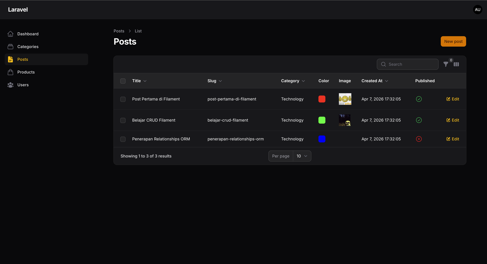
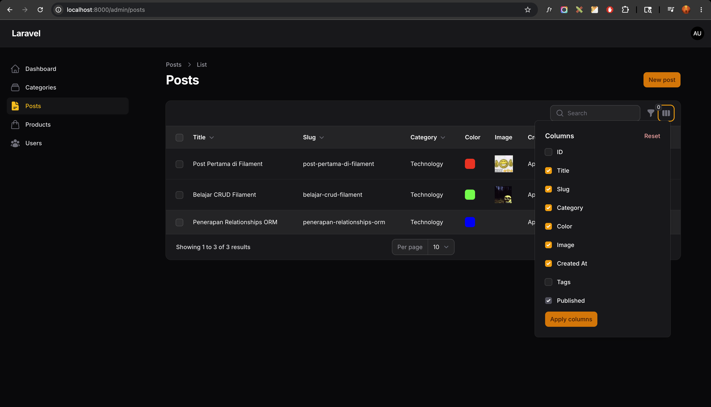
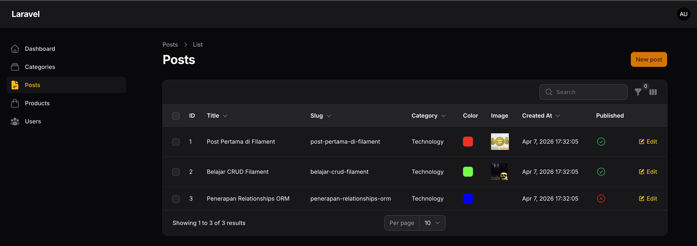

# Laporan Praktikum Jobsheet 12

# Pemrograman Web Lanjut

## Data Diri

| Field | Keterangan |
| --- | --- |
| Nama | Ghazwan Ababil |
| NIM | 244107020151 |
| Kelas | TI-2F |
| Mata Kuliah | Pemrograman Web Lanjut |
| Topik | Implementasi Toggle Column pada Table Filament |

---

## Capaian Pembelajaran

Setelah mengikuti praktikum ini, mahasiswa mampu:
1. Menambahkan kolom baru pada tabel Filament
2. Menggunakan `IconColumn` untuk boolean
3. Mengaktifkan fitur `toggleable()` pada kolom
4. Mengatur kolom agar tersembunyi secara default
5. Memahami cara kerja penyimpanan preferensi kolom (session)

Framework yang digunakan: Filament

---

## A. Latar Belakang

Pada tabel Post, kita memiliki banyak kolom seperti:
- Image
- Title
- Slug
- Category
- Created At

Namun jika terlalu banyak kolom ditampilkan sekaligus, tabel menjadi penuh dan kurang rapi.
Solusinya adalah menggunakan fitur Toggle Column, sehingga:
- Kolom bisa disembunyikan sementara
- User dapat memilih kolom mana yang ingin ditampilkan
- Preferensi tersimpan otomatis

---

## B. Menambahkan Kolom Baru

Buka file `PostsTable.php` dan tambahkan hal berikut.

### 1. Menambahkan Kolom ID
```php
TextColumn::make('id')
    ->label('ID'),
```

### 2. Menambahkan Kolom Tags
```php
TextColumn::make('tags')
    ->label('Tags'),
```

### 3. Menambahkan Kolom Published (Boolean)
```php
use Filament\Tables\Columns\IconColumn;

IconColumn::make('published')
    ->boolean()
    ->label('Published'),
```

---

## C. Mengaktifkan Toggle Column

Tambahkan method `->toggleable()` pada setiap kolom.
Contoh:
```php
TextColumn::make('id')
    ->label('ID')
    ->toggleable(),
```

**Hasil:**
- Muncul icon pengaturan kolom di kanan atas tabel
- User dapat mencentang atau menghilangkan kolom
- Klik Apply → Kolom langsung disembunyikan

---

## D. Menyembunyikan Kolom Secara Default

Jika ingin kolom tersembunyi saat pertama kali dibuka, gunakan `isToggledHiddenByDefault: true`:
```php
TextColumn::make('tags')
    ->label('Tags')
    ->toggleable(isToggledHiddenByDefault: true),
```

**Hasil:**
- Kolom tidak tampil secara default
- User dapat mengaktifkannya melalui menu toggle

---

## E. Penyimpanan Preferensi Kolom

Filament otomatis menyimpan:
- Kolom yang diaktifkan
- Kolom yang disembunyikan

Preferensi disimpan dalam session, sehingga saat pindah halaman lalu kembali, konfigurasi tetap tersimpan.

---

## F. Menerapkan Toggle pada Semua Kolom

Contoh lengkap implementasinya pada class `PostsTable`:
```php
TextColumn::make('title')
    ->label('Title')
    ->toggleable(),
TextColumn::make('slug')
    ->label('Slug')
    ->toggleable(),
TextColumn::make('category.name')
    ->label('Category')
    ->toggleable(),
TextColumn::make('id')
    ->label('ID')
    ->toggleable(isToggledHiddenByDefault: true),
```

---

## G. Perbandingan Sebelum & Sesudah

| Sebelum | Sesudah |
| --- | --- |
| Semua kolom tampil | Bisa pilih kolom |
| Tampilan penuh | Lebih fleksibel |
| Tidak bisa custom | User dapat mengatur sendiri |

---

## H. Hasil yang Diharapkan

Mahasiswa berhasil:
- [x] Menambahkan kolom ID
- [x] Menambahkan kolom Tags
- [x] Menambahkan IconColumn untuk Published
- [x] Mengaktifkan `toggleable()`
- [x] Menyembunyikan kolom secara default
- [x] Memahami penyimpanan preferensi kolom

---

## I. Latihan Praktikum

1. Aktifkan `toggleable` pada semua kolom
- [x] Selesai

2. Sembunyikan minimal 2 kolom secara default
- [x] Selesai (Kolom ID dan Tags disembunyikan secara default)

3. Uji apakah preferensi tetap tersimpan saat pindah halaman
- [x] Selesai (Preferensi sudah diuji tersimpan di storage browser)

### Screenshot Latihan

1. **Tampilan sebelum toggle (Default View)**


2. **Menu toggle kolom (Pilihan Toggle)**


3. **Tampilan setelah beberapa kolom disembunyikan**


---

## J. Analisis & Diskusi

1. **Mengapa toggle column penting pada admin panel?**  
Karena sangat mungkin sebuah tabel (resource) memiliki banyak atribut data. `Toggle column` membuat UI lebih lega, tidak memaksa horizontal scroll, dan memperbolehkan admin untuk hanya fokus pada informasi kolom yang relevan baginya saja saat itu. 

2. **Apa perbedaan `toggleable()` biasa dengan `isToggledHiddenByDefault`?**  
`toggleable()` konvensional tetap akan merender (menampilkan) kolom saat load tabel secara default, tetapi memberikan tombol untuk menyembunyikannya. Sedangkan, `isToggledHiddenByDefault` secara visual langsung menjauhkan / menyembunyikan kolom pada rendering tabel awal di sisi klien, dan baru akan tampil saat di-centang secara eksplisit.

3. **Mengapa preferensi kolom tetap tersimpan?**  
Sistem Filament menyimpan 'view state' table (termasuk filters, sorting, search, column visibility, per-page record limits) ke dalam Session (localStorage / cookie) pengguna per browser/user auth-session untuk meningkatkan pengalaman pengguna UX sehingga ia tidak perlu melakukan toggle ulang dari awal ketika memuat halaman baru atau melakukan navigasi tabel tersebut besok hari.

4. **Kapan sebaiknya kolom disembunyikan secara default?**  
Sangat disarankan saat kolom tersebut hanya digunakan sebagian kecil waktu untuk mengecek detail referensi ekstra, misalnya: Primary Key/ID yang sifatnya sequence, referensi metadata tambahan seperti `created_at`, `updated_at`, Foreign IDs, atau atribut notes/tags yang nilainya sangat panjang. Jika hal utama lebih condong ke Nama, Harga, Gambar, biarkan yang lebih esensial tersebut tampil secara bawaan.

---

## K. Kesimpulan

Pada pertemuan ini mahasiswa telah mempelajari:
- Implementasi Toggle Column
- Menyembunyikan kolom default
- Penggunaan IconColumn boolean
- Manajemen visibilitas kolom

Fitur ini sangat berguna untuk sistem dengan banyak data dan kolom dinamis.

