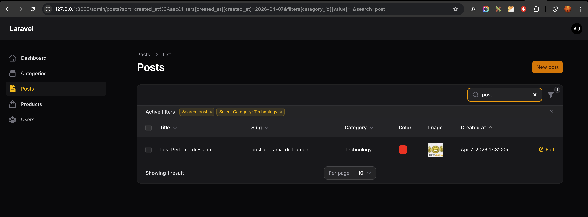
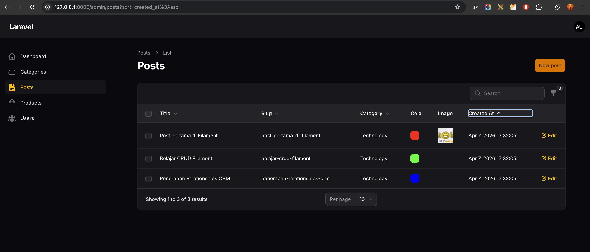
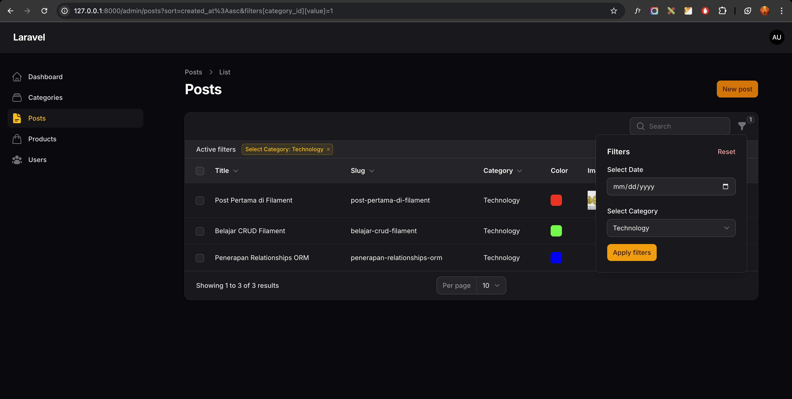
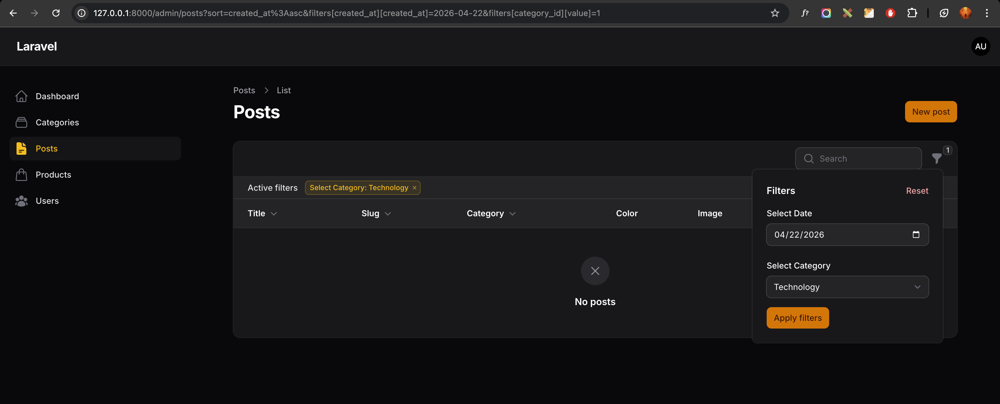

# Laporan Praktikum Jobsheet 8 (Pertemuan 11)

# Pemrograman Web Lanjut

## Data Diri

| Field | Keterangan |
| --- | --- |
| Nama | Ghazwan Ababil |
| NIM | 244107020151 |
| Kelas | TI-2F |
| Mata Kuliah | Pemrograman Web Lanjut |
| Topik | Implementasi Search and Filter pada Table Filament |

---

## Capaian Pembelajaran

Setelah mengikuti praktikum ini, mahasiswa mampu:
1. Menambahkan fitur Search pada tabel.
2. Menggunakan method `searchable()`.
3. Membuat filter berdasarkan tanggal (Date Filter).
4. Membuat filter berdasarkan relasi (Select Filter).
5. Menambahkan query custom pada filter.
6. Menggabungkan fitur Search dan Filter secara bersamaan.

Framework yang digunakan: Filament.

---

## A. Latar Belakang

Pada pertemuan sebelumnya tabel Post sudah memiliki sorting.
Namun ketika data semakin banyak, pengguna membutuhkan:
- pencarian teks (title, slug, category),
- filter berdasarkan tanggal,
- filter berdasarkan kategori.

Filament menyediakan fitur Search dan Filter dengan implementasi sederhana pada `PostsTable.php`.

---

## B. Menambahkan Search pada Kolom

File yang diubah:
- app/Filament/Resources/Posts/Tables/PostsTable.php

Search diaktifkan pada 3 kolom:
1. `title`
2. `slug`
3. `category.name` (relasi)

Contoh implementasi:

```php
TextColumn::make('title')
    ->searchable()
    ->sortable();

TextColumn::make('slug')
    ->searchable()
    ->sortable();

TextColumn::make('category.name')
    ->label('Category')
    ->searchable()
    ->sortable();
```

Hasil:
- Search bar muncul otomatis di atas tabel.
- Pencarian berjalan real-time berdasarkan title, slug, dan category.

---

## C. Membuat Filter Berdasarkan Tanggal

Import yang digunakan:

```php
use Filament\Tables\Filters\Filter;
use Filament\Forms\Components\DatePicker;
```

Filter `created_at` ditambahkan dengan DatePicker:

```php
Filter::make('created_at')
    ->label('Creation Date')
    ->schema([
        DatePicker::make('created_at')
            ->label('Select Date'),
    ])
```

Agar filter bekerja, ditambahkan query custom:

```php
->query(function ($query, array $data) {
    return $query->when(
        $data['created_at'] ?? null,
        fn ($query, $date) => $query->whereDate('created_at', $date),
    );
})
```

---

## D. Membuat Filter Berdasarkan Relasi (Kategori)

Import yang digunakan:

```php
use Filament\Tables\Filters\SelectFilter;
```

Filter kategori ditambahkan:

```php
SelectFilter::make('category_id')
    ->label('Select Category')
    ->relationship('category', 'name')
    ->preload()
```

Hasil:
- Dropdown kategori muncul pada panel filter.
- Data tabel terfilter sesuai kategori yang dipilih.

---

## E. Perbandingan Search vs Filter

| Search | Filter |
| --- | --- |
| Untuk teks | Untuk kondisi spesifik |
| Real-time | Berdasarkan form input |
| Cocok title/slug/category | Cocok tanggal dan relasi |

---

## F. Hasil yang Diharapkan

Target praktikum yang tercapai:
- Search pada Title aktif.
- Search pada Slug aktif.
- Search pada Category aktif.
- Filter tanggal (`created_at`) aktif.
- Filter kategori (relasi) aktif.
- Query custom `whereDate()` aktif.
- Search dan Filter bisa dipakai bersamaan.

---

## G. Latihan Praktikum

1. Aktifkan search pada minimal 3 kolom
- [x] Selesai (title, slug, category.name)

2. Buat filter tanggal Created At
- [x] Selesai

3. Buat filter kategori menggunakan SelectFilter
- [x] Selesai

4. Uji kombinasi Search + Filter
- [x] Selesai

5. Screenshot:
- [x] Search Title (placeholder)
- [x] Filter Tanggal (placeholder)
- [x] Filter Kategori (placeholder)
- [x] Search + Filter Combined (placeholder)

---

## H. Analisis and Diskusi

1. Mengapa search tidak cocok untuk filter tanggal?
Karena search berbasis pencocokan teks bebas, sedangkan tanggal butuh kecocokan nilai tanggal yang presisi.

2. Apa fungsi `relationship()` pada SelectFilter?
Untuk menghubungkan filter ke relasi model, sehingga opsi diambil dari tabel relasi (misalnya category name).

3. Mengapa perlu `whereDate()` pada query filter?
Agar pembandingan hanya pada bagian tanggal tanpa terpengaruh jam/menit/detik dari kolom datetime.

4. Apa perbedaan `searchable()` dan `filters()`?
`searchable()` untuk pencarian teks langsung di search bar, sedangkan `filters()` untuk kondisi filter terstruktur lewat form input.

---

## I. Lampiran Screenshot (Placeholder)

### 1. Search Title



### 2. Filter Tanggal



### 3. Filter Kategori



### 4. Search + Filter Combined



---

## J. Kesimpulan

Pada pertemuan ini mahasiswa telah mempelajari:
- Implementasi Search pada table Filament.
- Implementasi Filter berbasis DatePicker.
- Implementasi Filter berbasis relasi dengan SelectFilter.
- Custom query filtering (`whereDate()`).
- Penggabungan Search dan Filter dalam satu tabel.

Dengan kombinasi ini, manajemen data Post menjadi lebih cepat, tepat, dan efisien saat jumlah data meningkat.
