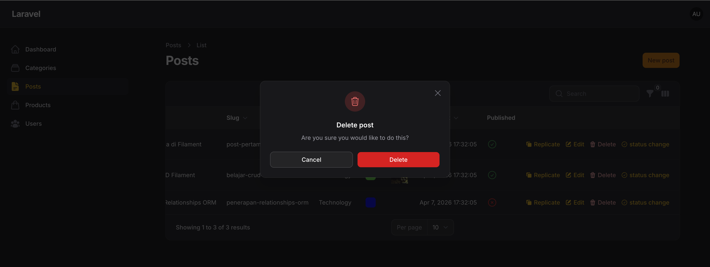
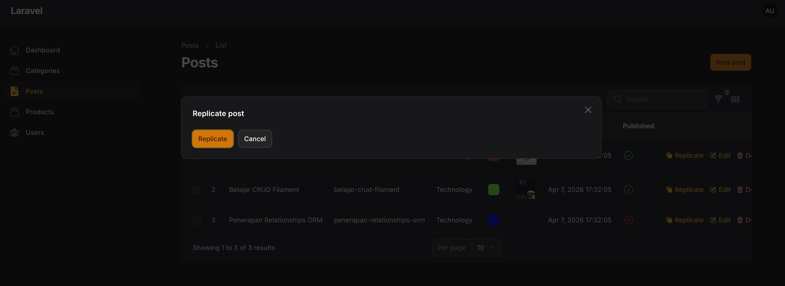
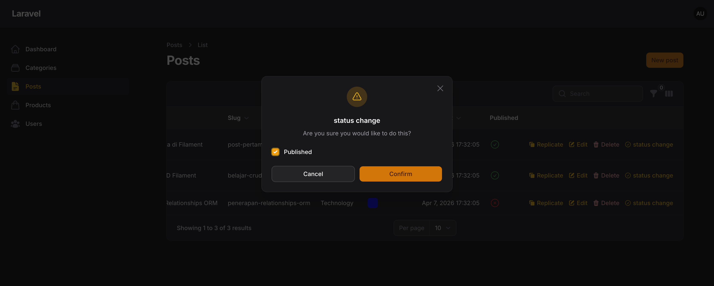

# Laporan Praktikum Jobsheet 13

# Pemrograman Web Lanjut

## Data Diri

| Field | Keterangan |
| --- | --- |
| Nama | Ghazwan Ababil |
| NIM | 244107020151 |
| Kelas | TI-2F |
| Mata Kuliah | Pemrograman Web Lanjut |
| Topik | Implementasi Table Actions & Custom Action di Filament |

---

## Capaian Pembelajaran

Setelah mengikuti praktikum ini, mahasiswa mampu:
1. Menambahkan Record Actions pada tabel Filament
2. Menggunakan predefined actions (Edit, Delete, Replicate)
3. Membuat custom action pada tabel
4. Mengupdate data langsung dari tabel tanpa masuk ke halaman edit
5. Menambahkan label dan icon pada action
6. Memahami konsep callback/action function pada Filament

**Framework yang digunakan:** Filament

---

## A. Latar Belakang

Pada tabel Post, secara default hanya terdapat tombol:
- ✏ Edit

Sedangkan tombol Delete tersedia di halaman edit.
Agar lebih efisien, kita dapat:
- Menambahkan tombol Delete langsung di tabel
- Menambahkan tombol Replicate (Copy Data)
- Membuat tombol custom (misalnya ubah status Publish/Unpublish)

---

## B. Menambahkan Delete Action

Buka file `PostsTable.php` dan cari bagian `->recordActions([])`.

Dari yang semula hanya berisi `EditAction::make()`, ditambahkan action hapus data:
```php
use Filament\Tables\Actions\DeleteAction;

->recordActions([
    EditAction::make(),
    DeleteAction::make(),
])
```

**Hasil:**
- Tombol Delete muncul di tabel
- Saat diklik muncul confirmation dialog
- Data terhapus tanpa masuk ke halaman edit

---

## C. Menambahkan Replicate (Copy) Action

Filament menyediakan action bawaan untuk menduplikasi data:
```php
use Filament\Tables\Actions\ReplicateAction;

->recordActions([
    ReplicateAction::make(),
    EditAction::make(),
    DeleteAction::make(),
])
```

**Hasil:**
- Tombol Replicate muncul
- Saat diklik → record baru dibuat dengan data yang sama

---

## D. Daftar Predefined Actions di Filament

Beberapa action bawaan:

| Action | Fungsi |
| --- | --- |
| **Create** | Membuat data |
| **Edit** | Mengedit data |
| **View** | Melihat detail |
| **Delete** | Menghapus |
| **Replicate** | Menyalin data |
| **ForceDelete** | Hapus permanen |
| **Restore** | Restore data soft delete |
| **Import** | Import data |
| **Export** | Export data |

---

## E. Membuat Custom Action (Ubah Status Publish)

Misalnya ingin mengubah status published langsung dari tabel tanpa masuk ke edit. Kita melakukan kustomisasi:

### 1. Tambahkan Custom Action & Icon
```php
use Filament\Tables\Actions\Action;

Action::make('status')
    ->label('status change')
    ->icon('heroicon-o-check-circle')
```

### 2. Tambahkan Form Input pada Action
Gunakan schema:
```php
use Filament\Forms\Components\Checkbox;

->schema([
    Checkbox::make('published')
        ->default(fn($record): bool => (bool) $record->published),
])
```

### 3. Tambahkan Logic untuk Update Data
```php
->action(function ($record, array $data) {
    $record->update(['published' => $data['published']]);
})
```

---

## F. Contoh Lengkap Custom Action

Berikut adalah kumpulan `recordActions()` secara menyeluruh:

```php
->recordActions([
    ReplicateAction::make(),
    EditAction::make(),
    DeleteAction::make(),
    Action::make('status')
        ->label('status change')
        ->icon('heroicon-o-check-circle')
        ->requiresConfirmation() // Fitur Tambahan: Menambahkan Konfirmasi
        ->schema([
            Checkbox::make('published')
                ->default(fn($record): bool => $record->published),
        ])
        ->action(function ($record, array $data) {
            $record->update(['published' => $data['published']]);
        }),
])
```

---

## G. Fitur Tambahan Action

Filament juga menyediakan opsi tambahan yang sangat fleksibel:
- `requiresConfirmation()` → menambahkan konfirmasi
- `color()` → ubah warna tombol
- `visible()` → tampil berdasarkan kondisi
- `url()` → redirect ke halaman lain
- `openUrlInNewTab()` → buka di tab baru

---

## H. Hasil yang Diharapkan

Mahasiswa berhasil:
- [x] Menambahkan DeleteAction
- [x] Menambahkan ReplicateAction
- [x] Membuat Custom Action Status
- [x] Mengupdate data langsung dari tabel
- [x] Menambahkan icon dan label

---

## I. Latihan Praktikum

1. Tambahkan Delete & Replicate action.
- [x] Selesai
2. Buat custom action untuk toggle publish/unpublish.
- [x] Selesai
3. Tambahkan icon berbeda untuk tiap action.
- [x] Selesai
4. Tambahkan confirmation pada custom action.
- [x] Selesai
5. Screenshot kegiatan:
- [x] Selesai disertakan pada lampiran

### Screenshot Latihan (Placeholder)

1. **Delete button di tabel**


2. **Replicate action**


3. **Custom status action**


---

## J. Analisis & Diskusi

1. **Mengapa action di tabel lebih efisien dibanding halaman edit?**  
Aksi pada struktur baris data tabel memangkas *user journey* karena tidak ada transisi page redirect bolak-balik menuju view Edit, melainkan action tersebut langsung dirender via livewire/modal secara in-place sehingga terasa asinkronus dan super responsif.

2. **Apa perbedaan predefined action dan custom action?**  
Predefined actions (seperti DeleteAction/EditAction) ditawarkan secara _out-of-the-box_ karena merupakan aktivitas CRUD standar, Filament telah menaruh fungsional DB backend logicnya dibelakang layar. Sedangkan custom actions, developer-lah yang mendesain proses logic fungsional database dari inputan formnya.

3. **Bagaimana cara menambahkan validasi dalam custom action?**  
Kita bisa menaruh _chaining method_ di dalam array schema saat kita mendeklarasikan elemen form field. Contoh: `TextInput::make('name')->required()->maxLength(255)`.

4. **Kapan kita menggunakan Replicate?**  
Bermanfaat ketika kita sedang mengerjakan data yang pola nilai kolom inputnya bersifat general/mirip antara iterasi item. Dengan Replicate, admin tak perlu mengetik data awal pada field Edit berulang-ulang dari titik nol.

---

## K. Kesimpulan

Pada pertemuan ini mahasiswa telah mempelajari:
- Implementasi Table Actions
- Menginjeksi fungsi *Delete* & *Replicate* bawaan (predefined) Filament ke tabel
- Membuat Custom Action interaktif yang mengusung modal form
- Memperbarui interaksi data secara reaktif dan efisien langsung dari interface tabel.

Fitur actions memberikan kontrol panel admin fungsionalitas UI yang kuat dan *fluid* yang mempermudah UX secara ekstrim.

