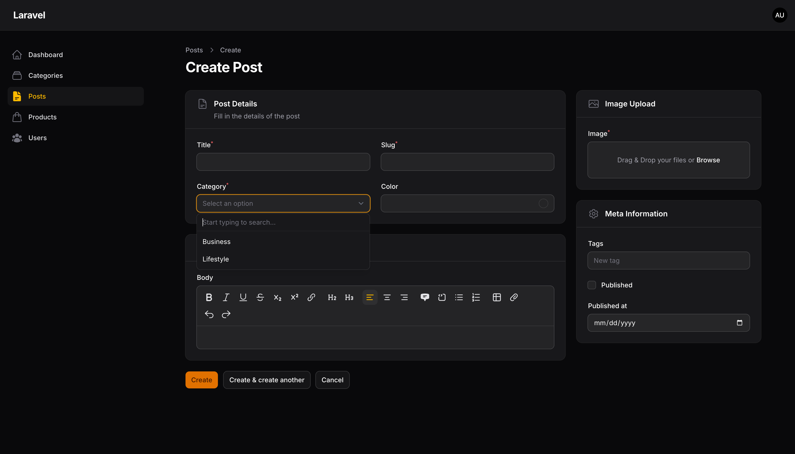
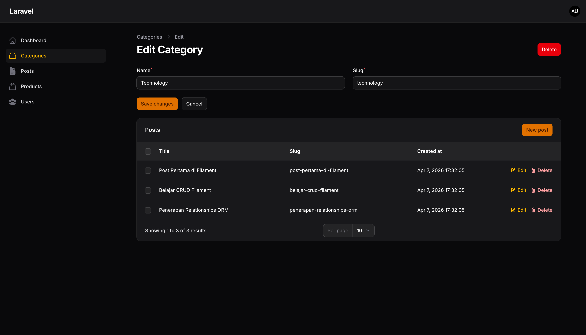
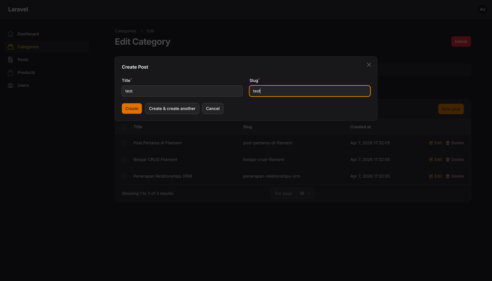

# Laporan Praktikum Jobsheet 14

# Pemrograman Web Lanjut

## Data Diri

| Field | Keterangan |
| --- | --- |
| Nama | Ghazwan Ababil |
| NIM | 244107020151 |
| Kelas | TI-2F |
| Mata Kuliah | Pemrograman Web Lanjut |
| Topik | Implementasi Relation pada Filament (HasMany) |

---

## Capaian Pembelajaran

Setelah mengikuti praktikum ini, mahasiswa mampu:
1. Memahami konsep relationship pada Laravel dan Filament
2. Menggunakan method `relationship()` pada form Filament
3. Mengimplementasikan searchable relationship dropdown
4. Menampilkan data relasi pada tabel Filament
5. Membuat Relationship Manager
6. Mengelola relasi HasMany pada Filament Admin Panel

**Framework yang digunakan:** Filament, Laravel

---

## A. Latar Belakang

Dalam aplikasi web, sering ditemukan hubungan antar tabel database.  
Contoh kasus:
- Satu Category memiliki banyak Post
- Satu Post hanya memiliki satu Category

Relasi ini disebut:
- Category → **HasMany** → Post
- Post → **BelongsTo** → Category

Pada Filament, relationship dapat digunakan untuk:
- Mengisi dropdown otomatis
- Menampilkan data relasi
- Mengelola data relasi langsung dari resource

---

## B. Relasi Category dan Post

Struktur database sederhana:
- `categories`: id, name, slug
- `posts`: id, title, slug, category_id  

Relasi: **Category → HasMany → Post**

---

## C. Implementasi Relationship pada Form

Pada tabel PostForm (`app/Filament/Resources/Posts/Schemas/PostForm.php`), opsi dropdown kategori dapat memanfaatkan *relationship method*.

| Parameter | Fungsi |
| --- | --- |
| `category` | nama relasi pada model |
| `name` | field yang ditampilkan |

---

## D. Membuat Dropdown Searchable

Jika kategori sangat banyak, gunakan fitur pencarian:

```php
Select::make('category_id')
    ->relationship('category','name')
    ->searchable()
```

**Hasil Dropdown Kategori:**
- Bisa dicari
- Lebih cepat untuk dataset besar
- Tidak perlu memuat semua data sekaligus

---

## E. Relationship pada Model

Pastikan relasi sudah dibuat pada model.

**Model Post**
```php
public function category()
{
    return $this->belongsTo(Category::class);
}
```

**Model Category**
```php
public function posts()
{
    return $this->hasMany(Post::class);
}
```

---

## F. Menampilkan Data Relasi pada Table

Pada Post Table (`app/Filament/Resources/Posts/Tables/PostsTable.php`):
```php
TextColumn::make('category.name')
```

**Hasil:**
Tabel akan menampilkan nama kategori, seperti "Laravel" atau "PHP" ketimbang melainkan ID relasionalnya.

---

## G. Membuat Relationship Manager

Filament menyediakan fitur Relationship Manager untuk mengelola relasi langsung dari resource *Category*.

**Jalankan Command**
```bash
php artisan make:filament-relation-manager CategoryResource posts title
```
Atau tanpa *interactive prompt* bagi yang tidak ingin repot.

**File yang Dibuat**
```text
CategoryResource
└── RelationManagers
    └── PostsRelationManager.php
```

---

## H. Menghubungkan Relationship Manager

Buka: `CategoryResource.php` dan tambahkan ke dalam kumpulan relation array:

```php
public static function getRelations(): array
{
    return [
        PostsRelationManager::class,
    ];
}
```
*Pastikan namespace sudah di-_import_ dengan benar.*

---

## I. Hasil Relationship Manager

Saat membuka Edit Category, akan muncul tabel Post yang berelasi di bawah rincian record kategori.

Fitur yang tersedia pada tabel relasi tersebut:
- View Post
- Create Post
- Edit Post
- Delete Post

---

## J. Menambahkan Kolom pada Relationship Table

Buka *PostsRelationManager.php*, modifikasi array `columns`:
```php
TextColumn::make('title'),
TextColumn::make('slug'),
TextColumn::make('created_at')->dateTime(),
```

**Hasil:**
Tabel Post di Category akan menampilkan kolom *Title*, *Slug*, dan *Created At*.

---

## K. Membuat Form Create Post pada Relationship

Pada *PostsRelationManager.php* modifikasi array schema di dalam  `form()`:
```php
TextInput::make('title')->required()->maxLength(255),
TextInput::make('slug')->required()->maxLength(255),
```

Saat membuat post baru dari kategori (*RelationManager view*):
- `category_id` otomatis terisi
- Tidak perlu memilih kategori lagi

---

## L. Keuntungan Menggunakan Relationship Manager

| Fitur | Manfaat |
| --- | --- |
| Manajemen relasi | Data relasi lebih mudah dikelola |
| CRUD langsung | Tidak perlu berpindah halaman |
| Otomatis isi foreign key | Mengurangi kesalahan input |
| Terintegrasi dengan resource | UI lebih konsisten |

---

## M. Latihan Praktikum

1. Buat relasi Category → Posts
- [x] Selesai
2. Implementasikan relationship dropdown pada Post Form
- [x] Selesai
3. Tambahkan fitur searchable()
- [x] Selesai
4. Tampilkan kategori pada Post Table
- [x] Selesai
5. Buat Relationship Manager pada Category
- [x] Selesai
6. Tambahkan kolom tambahan pada tabel relasi
- [x] Selesai

**Screenshot yang dikumpulkan (Placeholder):**

### 1. Dropdown kategori pada Post Form


### 2. Tabel Post dengan kategori


### 3. Create Post dari Category


--- 

## N. Analisis & Diskusi

1. **Apa perbedaan relationship() dengan options()?**  
Method `options()` mengharuskan kita menangani query resolusi _key-value_ dari sumber data database secara mandiri (misal: `Category::all()->pluck(...)`), sedangkan method `relationship('model', 'label')` dikerjakan oleh Filament yang secara fungsional dinamis dan _lazy loadable_ sehingga jauh lebih *scalable* (mudah dipadukan dengan search query database) dan lebih bersih.

2. **Mengapa searchable penting untuk dataset besar?**  
Karena ketika menggunakan form select box pada dataset ribuan (misalnya 10.000 list opsi), memuat semua node text ke dalam DOM HTML halaman akan membuat browser macet (lag) dan memberatkan lalu lintas data dari server. Searchable _Filament relationship_ menggunakan perpaduan query AJAX (*lazy loading*) supaya opsi cuma akan dilempar ke client saat ada term text yang dicari.

3. **Apa fungsi Relationship Manager pada Filament?**  
Sebagai UI _nested tab_ interaktif yang dipasang pas di bawah suatu detail record data sumber (contoh tabel relasi *Category*). Di dalamnya admin bisa mengontrol (CRUD) data child/tabel relasi HasMany terkait (contoh: *Post*) tanpa harus pindah page/melewati form ID parent secara manual karena Foreign Key akan otomatis _terkait_.

4. **Kapan menggunakan HasMany dan BelongsTo?**  
Gunakan `HasMany` di table "Parent" (Kategori) untuk menunjukan ia mewadahi lebih dari satu records table "Child".  
Gunakan `BelongsTo` di table "Child" (Post) untuk menunjukan bahwa setiap entri baris miliknya mendompleng kepada satu ID unik di tabel spesifik "Parent".

---

## O. Kesimpulan

Pada praktikum ini mahasiswa telah mempelajari:
- Konsep relationship pada Laravel.
- Implementasi relationship pada form _Select_ Filament & dropdown searchable.
- Penggunaan Relationship Manager, yakni *PostsRelationManager*.
- Pengelolaan data relasi bersarang secarra _in-page_ (pada page detail category admin panel).
