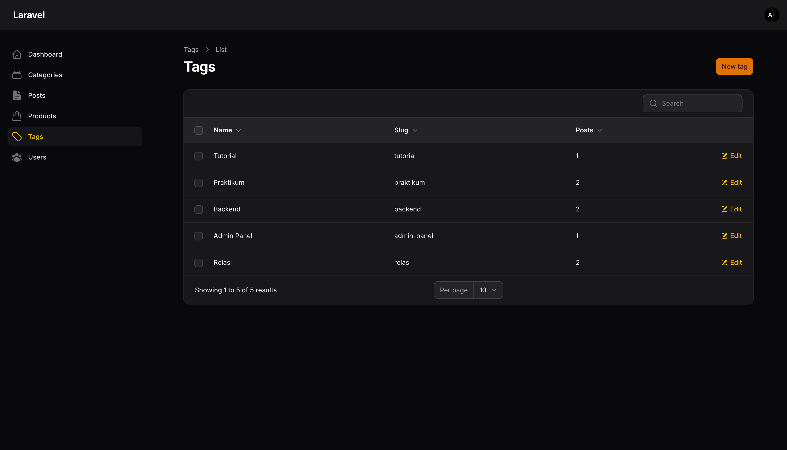
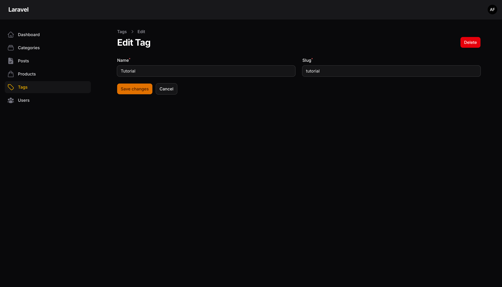
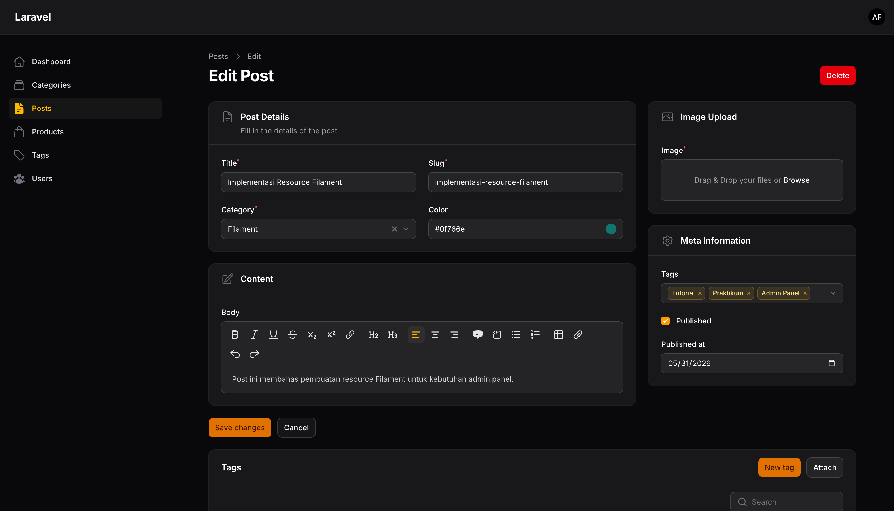
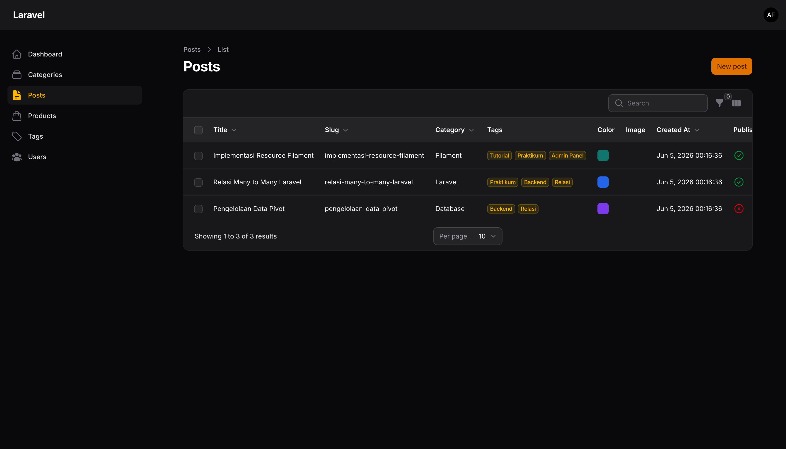
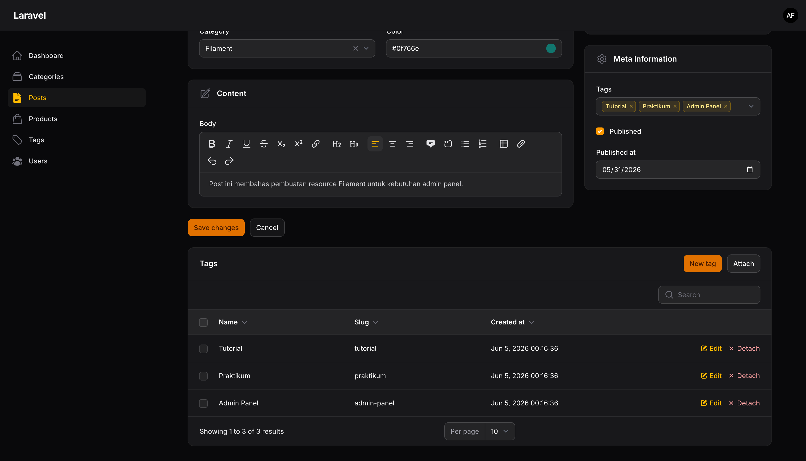

# Laporan Praktikum Jobsheet 15

# Pemrograman Web Lanjut

## Data Diri

| Field | Keterangan |
| --- | --- |
| Nama | Ghazwan Ababil |
| NIM | 244107020151 |
| Kelas | TI-2F |
| Mata Kuliah | Pemrograman Web Lanjut |
| Topik | Implementasi Many-to-Many Relationship pada Filament |

---

## Capaian Pembelajaran

Setelah mengikuti praktikum ini, mahasiswa mampu:

1. Memahami konsep relasi many-to-many pada Laravel.
2. Membuat tabel pivot untuk menghubungkan dua model.
3. Mengimplementasikan relasi `belongsToMany()` pada model.
4. Menggunakan `relationship()` dengan mode multiple pada form Filament.
5. Menampilkan data relasi many-to-many pada tabel Filament.
6. Mengelola relasi many-to-many melalui Relationship Manager.

**Framework yang digunakan:** Laravel dan Filament

---

## A. Latar Belakang

Pada praktikum sebelumnya, relasi yang digunakan adalah relasi one-to-many antara `Category` dan `Post`.
Pada jobsheet 15, relasi diperluas menjadi many-to-many dengan contoh kasus:

- Satu `Post` dapat memiliki banyak `Tag`.
- Satu `Tag` dapat digunakan oleh banyak `Post`.

Relasi tersebut membutuhkan tabel pivot untuk menyimpan pasangan data antara post dan tag.

---

## B. Struktur Relasi

Struktur database yang digunakan:

| Tabel | Fungsi |
| --- | --- |
| `posts` | Menyimpan data artikel/post |
| `tags` | Menyimpan data tag |
| `post_tag` | Tabel pivot untuk menghubungkan `posts` dan `tags` |

Relasi yang dibuat:

```php
// App\Models\Post
public function tags()
{
    return $this->belongsToMany(Tag::class)->withTimestamps();
}
```

```php
// App\Models\Tag
public function posts()
{
    return $this->belongsToMany(Post::class)->withTimestamps();
}
```

---

## C. Implementasi Database

Migration baru yang ditambahkan:

```text
database/migrations/2026_06_05_000000_create_tags_table.php
database/migrations/2026_06_05_000001_create_post_tag_table.php
```

Tabel `tags` memiliki kolom:

- `id`
- `name`
- `slug`
- `created_at`
- `updated_at`

Tabel `post_tag` memiliki kolom:

- `id`
- `post_id`
- `tag_id`
- `created_at`
- `updated_at`

Pasangan `post_id` dan `tag_id` dibuat unik agar satu tag tidak terhubung dua kali pada post yang sama.

---

## D. Model Tag

Model baru yang dibuat:

```text
app/Models/Tag.php
```

Model ini memiliki `$fillable` untuk `name` dan `slug`, serta relasi `posts()` untuk menghubungkan tag ke banyak post.

---

## E. Form Post dengan Multi Select Tags

Pada file:

```text
app/Filament/Resources/Posts/Schemas/PostForm.php
```

Input tag dibuat menggunakan `Select` relasi:

```php
Select::make('tags')
    ->relationship('tags', 'name')
    ->multiple()
    ->searchable()
    ->preload()
```

Hasilnya:

- User dapat memilih lebih dari satu tag untuk satu post.
- Data disimpan ke tabel pivot `post_tag`.
- Opsi tag dapat dicari melalui fitur searchable.

---

## F. Table Post dengan Kolom Tags

Pada file:

```text
app/Filament/Resources/Posts/Tables/PostsTable.php
```

Kolom tag ditampilkan dengan:

```php
TextColumn::make('tags.name')
    ->label('Tags')
    ->badge()
```

Filter tag juga ditambahkan agar post dapat difilter berdasarkan tag yang dipilih.

---

## G. Resource Tag

Resource Filament baru yang dibuat:

```text
app/Filament/Resources/Tags/TagResource.php
```

File pendukung:

```text
app/Filament/Resources/Tags/Schemas/TagForm.php
app/Filament/Resources/Tags/Tables/TagsTable.php
app/Filament/Resources/Tags/Pages/ListTags.php
app/Filament/Resources/Tags/Pages/CreateTag.php
app/Filament/Resources/Tags/Pages/EditTag.php
```

Resource ini digunakan untuk membuat, mengubah, dan menghapus data tag dari admin panel Filament.

---

## H. Relationship Manager Tags pada Post

Relationship Manager dibuat pada:

```text
app/Filament/Resources/Posts/RelationManagers/TagsRelationManager.php
```

Kemudian dihubungkan ke `PostResource`:

```php
public static function getRelations(): array
{
    return [
        TagsRelationManager::class,
    ];
}
```

Fitur yang tersedia:

- Membuat tag baru dari halaman edit post.
- Attach tag yang sudah ada ke post.
- Edit data tag.
- Detach tag dari post.
- Detach tag secara bulk.

---

## I. Latihan Praktikum

- [x] Membuat model `Tag`.
- [x] Membuat migration tabel `tags`.
- [x] Membuat migration tabel pivot `post_tag`.
- [x] Menambahkan relasi `belongsToMany()` pada model `Post`.
- [x] Menambahkan relasi `belongsToMany()` pada model `Tag`.
- [x] Mengubah form Post agar dapat memilih banyak tag.
- [x] Menampilkan tag pada table Post.
- [x] Membuat resource Tag pada Filament.
- [x] Membuat Relationship Manager Tags pada Post.

---

## J. Screenshot Praktikum

Screenshot berikut masih berupa placeholder dan dapat diganti setelah pengujian UI dilakukan melalui browser.

### 1. Menu Tags pada sidebar Filament



### 2. Form create/edit Tag



### 3. Multi select tags pada form Post



### 4. Kolom tags pada table Post



### 5. Relationship Manager Tags pada edit Post



---

## K. Analisis dan Diskusi

1. **Mengapa relasi many-to-many membutuhkan tabel pivot?**

   Karena satu record dari tabel pertama dapat terhubung ke banyak record tabel kedua, dan sebaliknya. Tabel pivot menyimpan pasangan foreign key dari kedua tabel tersebut.

2. **Apa perbedaan `hasMany()` dan `belongsToMany()`?**

   `hasMany()` digunakan ketika satu parent memiliki banyak child dengan foreign key langsung pada tabel child. `belongsToMany()` digunakan ketika kedua model saling memiliki banyak data melalui tabel pivot.

3. **Apa fungsi `multiple()` pada Select Filament?**

   `multiple()` mengubah select menjadi input multi pilihan sehingga satu post dapat memilih beberapa tag sekaligus.

4. **Mengapa menggunakan `AttachAction` dan `DetachAction`?**

   Pada relasi many-to-many, data yang dikelola bukan hanya record tag, tetapi juga hubungan antara post dan tag. `AttachAction` membuat relasi pada pivot, sedangkan `DetachAction` menghapus relasi dari pivot tanpa harus menghapus record tag.

---

## L. Kesimpulan

Pada jobsheet 15, aplikasi berhasil dikembangkan dari relasi one-to-many menjadi many-to-many. Implementasi dilakukan dengan menambahkan model `Tag`, tabel `tags`, tabel pivot `post_tag`, relasi `belongsToMany()` pada model, multi select tag pada form Post, kolom tag pada table Post, resource Tag, serta `TagsRelationManager` untuk mengelola relasi tag dari halaman edit Post.
