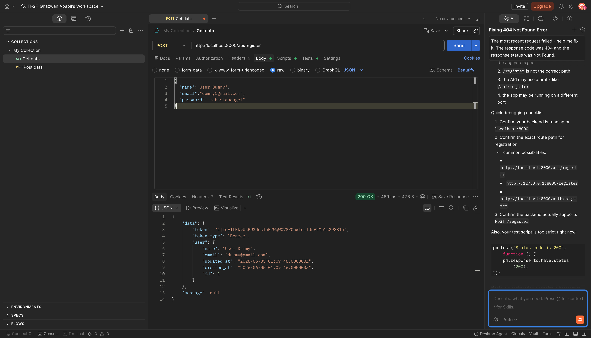
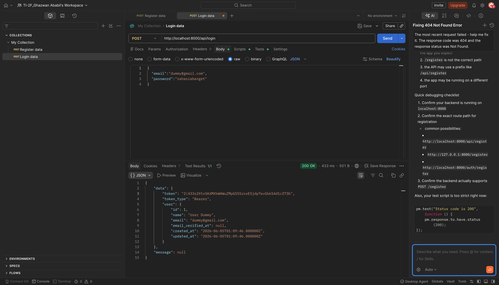
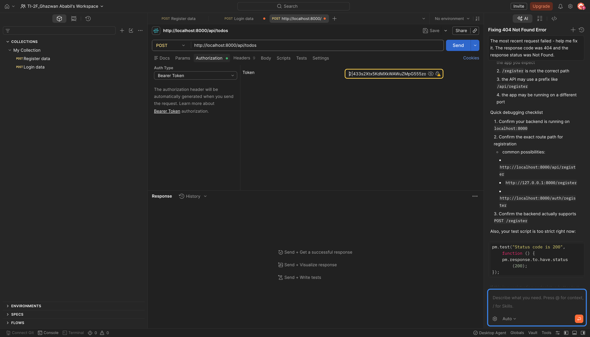
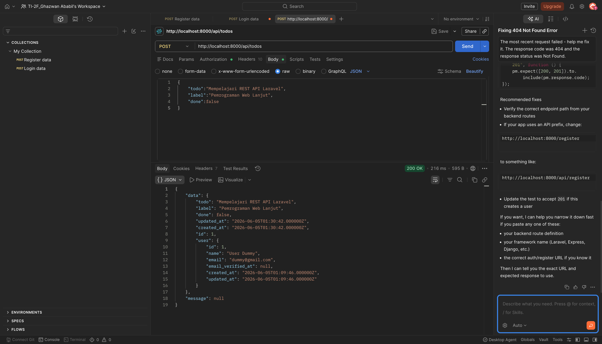
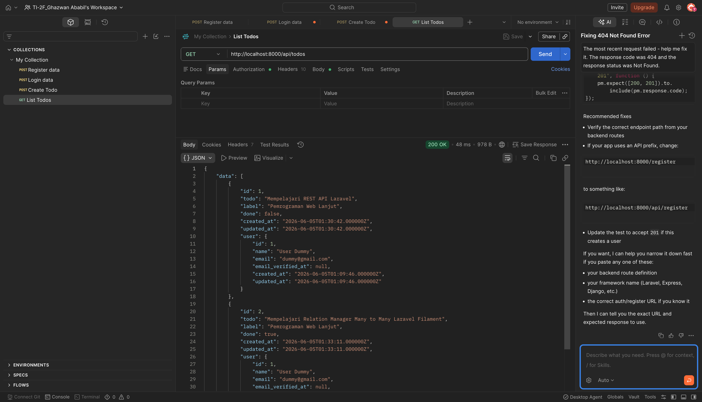
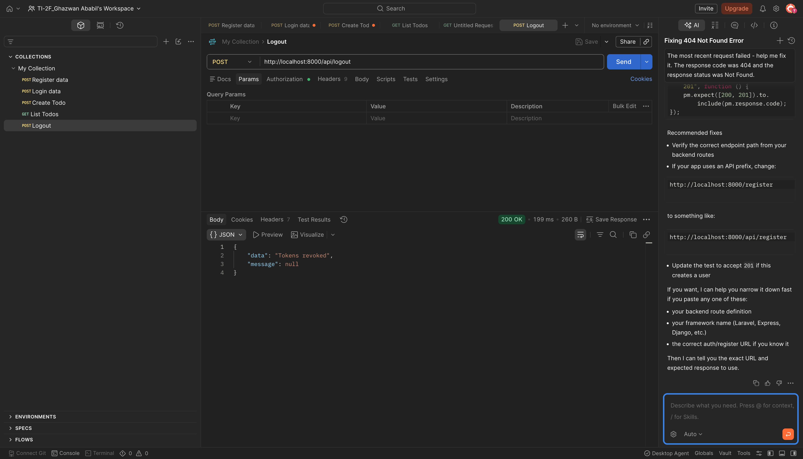

# Laporan Praktikum Jobsheet 16

# Pemrograman Web Lanjut

## Data Diri

| Field | Keterangan |
| --- | --- |
| Nama | Ghazwan Ababil |
| NIM | 244107020151 |
| Kelas | TI-2F |
| Mata Kuliah | Pemrograman Web Lanjut |
| Topik | RESTful API |

---

## Capaian Pembelajaran

Setelah mengikuti praktikum ini, mahasiswa mampu:

1. Memahami konsep RESTful API.
2. Membangun autentikasi token menggunakan Laravel Sanctum.
3. Membuat response JSON yang konsisten untuk API.
4. Membuat custom request untuk validasi API.
5. Membuat CRUD resource Todo melalui route API.
6. Menguji endpoint API menggunakan Postman atau HTTP client.

---

## A. Ringkasan Implementasi

Praktikum ini membangun RESTful API dengan dua fitur utama:

- Autentikasi token: register, login, dan logout.
- CRUD Todo: index, store, show, update, dan destroy.

Paket yang digunakan:

```bash
composer require laravel/sanctum
php artisan vendor:publish --provider="Laravel\Sanctum\SanctumServiceProvider"
```

---

## B. Struktur File

File penting yang ditambahkan atau diubah:

```text
app/Traits/ApiResponse.php
app/Http/Requests/ApiRequest.php
app/Http/Requests/RegisterRequest.php
app/Http/Requests/LoginRequest.php
app/Http/Requests/TodoRequest.php
app/Http/Controllers/Api/AuthController.php
app/Http/Controllers/Api/TodoController.php
app/Models/Todo.php
app/Models/User.php
routes/api.php
bootstrap/app.php
config/sanctum.php
database/migrations/2026_06_05_000000_create_todos_table.php
database/migrations/2026_06_05_004126_create_personal_access_tokens_table.php
```

---

## C. Format Response API

Trait `ApiResponse` digunakan untuk menyamakan format response API.

Response sukses:

```json
{
  "data": {},
  "message": null
}
```

Response error:

```json
{
  "errors": {},
  "message": null
}
```

---

## D. Autentikasi Token

Model `User` menggunakan trait `HasApiTokens` dari Laravel Sanctum.

Endpoint autentikasi:

| Method | Endpoint | Keterangan |
| --- | --- | --- |
| POST | `/api/register` | Registrasi user dan membuat token |
| POST | `/api/login` | Login user dan membuat token |
| POST | `/api/logout` | Menghapus semua token user aktif |

Endpoint logout dilindungi middleware:

```php
Route::middleware('auth:sanctum')->group(function () {
    Route::post('logout', [AuthController::class, 'logout']);
});
```

---

## E. CRUD Todo

Tabel `todos` memiliki kolom:

| Kolom | Keterangan |
| --- | --- |
| `id` | Primary key |
| `user_id` | Relasi ke user pemilik todo |
| `todo` | Isi todo |
| `label` | Label opsional |
| `done` | Status selesai |
| `created_at` | Waktu dibuat |
| `updated_at` | Waktu diperbarui |

Endpoint Todo:

| Method | Endpoint | Keterangan |
| --- | --- | --- |
| GET | `/api/todos` | Menampilkan todo milik user login |
| POST | `/api/todos` | Membuat todo baru |
| GET | `/api/todos/{todo}` | Menampilkan detail todo |
| PUT/PATCH | `/api/todos/{todo}` | Mengubah todo |
| DELETE | `/api/todos/{todo}` | Menghapus todo |

Semua endpoint Todo dilindungi `auth:sanctum`.

---

## F. Validasi Request

Custom request yang dibuat:

- `RegisterRequest`
- `LoginRequest`
- `TodoRequest`

`ApiRequest` dibuat sebagai base request agar validasi gagal dan authorization gagal tetap mengembalikan JSON.

Validasi `TodoRequest`:

```php
return [
    'todo' => 'required|string|max:255',
    'label' => 'nullable|string',
    'done' => 'nullable|boolean',
];
```

---

## G. Authorization Todo

User hanya dapat melihat, mengubah, atau menghapus todo miliknya sendiri.

Implementasi dilakukan pada:

- `TodoRequest::authorize()` untuk store/update.
- `TodoController::show()` dan `TodoController::destroy()` untuk pengecekan pemilik resource.

---

## H. Route API

Route API didefinisikan pada `routes/api.php`:

```php
Route::post('register', [AuthController::class, 'register']);
Route::post('login', [AuthController::class, 'login']);

Route::middleware('auth:sanctum')->group(function () {
    Route::post('logout', [AuthController::class, 'logout']);
    Route::apiResource('todos', TodoController::class);
});
```

`bootstrap/app.php` juga diubah agar Laravel memuat route API:

```php
->withRouting(
    web: __DIR__.'/../routes/web.php',
    api: __DIR__.'/../routes/api.php',
    commands: __DIR__.'/../routes/console.php',
    health: '/up',
)
```

---

## I. Pengujian

Pengujian otomatis ditambahkan pada:

```text
tests/Feature/RestApiTest.php
```

Skenario yang diuji:

- Register menghasilkan token.
- Login menghasilkan token.
- Logout menghapus token.
- User login dapat membuat, melihat, mengubah, dan menghapus todo.
- User tidak dapat mengakses todo milik user lain.

Perintah verifikasi:

```bash
php artisan test
```

---

## J. Screenshot Praktikum

Screenshot berikut masih placeholder dan dapat diganti dengan screenshot Postman setelah pengujian manual.

### 1. Register user



### 2. Login user



### 3. Bearer token authorization



### 4. Create Todo



### 5. List Todo



### 6. Logout user



---

## K. Kesimpulan

Jobsheet 16 berhasil mengimplementasikan RESTful API menggunakan Laravel dan Sanctum. API yang dibuat sudah mendukung autentikasi token, response JSON konsisten, validasi request khusus API, proteksi endpoint dengan middleware `auth:sanctum`, CRUD Todo berdasarkan user login, serta pengujian otomatis untuk memastikan alur utama berjalan.
