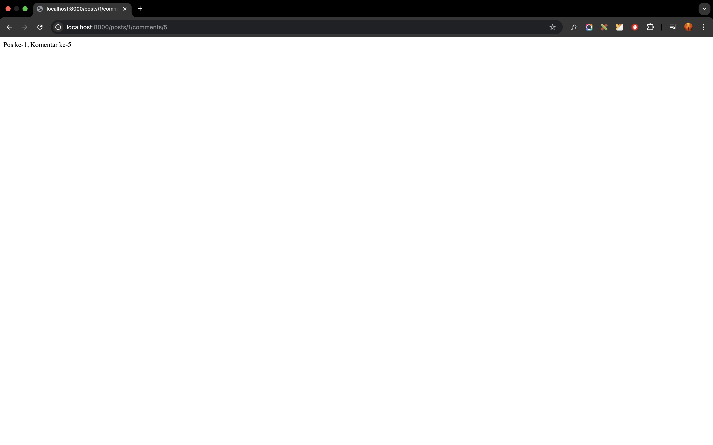
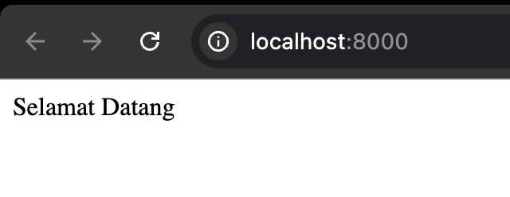
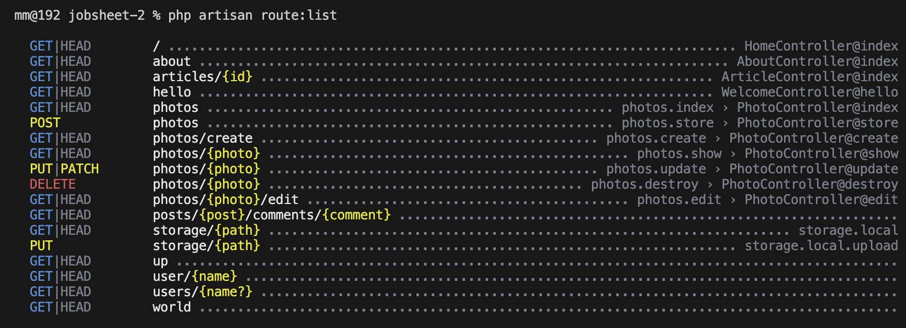
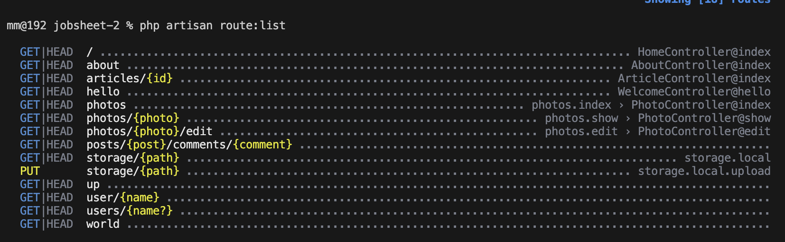
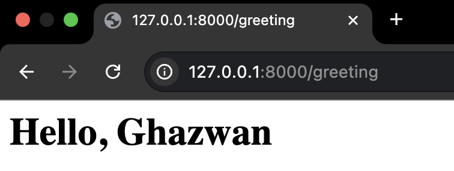
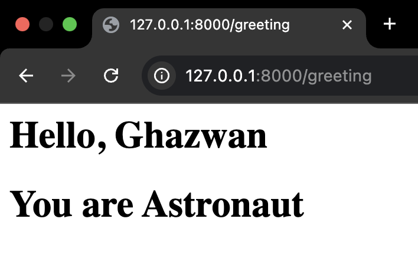
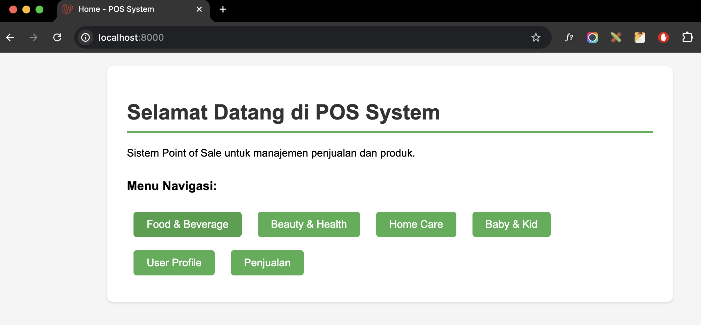
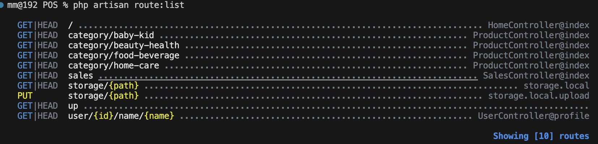

# Laporan Praktikum - Jobsheet 2
# Pemrograman Web Lanjut

**Nama:** Ghazwan Ababil
**NIM:** 244107020151  
**Kelas:** TI-2F

---

## Daftar Isi
- [Praktikum 1 - Routing](#praktikum-1---routing)
- [Praktikum 2 - Controller](#praktikum-2---controller)
- [Praktikum 3 - Views](#praktikum-3---views)
- [Soal Praktikum - POS Application](#soal-praktikum---pos-application)

---

## Praktikum 1 - Routing

### Tujuan
Mempelajari konsep routing pada Laravel untuk menangani HTTP request dan menampilkan response.

### Langkah-Langkah Praktikum

#### 1. Route Dasar `/hello` dan `/world`

Membuat dua route dasar dengan ketentuan:
- Route `/hello` menampilkan string "Hello World"
- Route `/world` menampilkan string "World"

**Code:**
```php
Route::get('/hello', function () {
    return 'Hello World';
});

Route::get('/world', function () {
    return 'World';
});
```

**Output:**


*Output route /hello*


*Output route /world*

---

#### 2. Route `/` dan `/about`

Membuat route untuk halaman home dan about:
- Route `/` menampilkan pesan "Selamat Datang"
- Route `/about` menampilkan NIM dan nama

**Code:**
```php
Route::get('/', function () {
    return 'Selamat Datang';
});

Route::get('/about', function () {
    return '244107020151'; // NIM Anda
});
```


*Output route /about*

---

#### 3. Route dengan Parameter `/user/{name}`

Membuat route yang menerima parameter dinamis:

**Code:**
```php
Route::get('/user/{name}', function ($name) {
    return 'Nama saya '.$name;
});
```


*Output route /user/{name}*

---

#### 4. Route dengan Multiple Parameters

Membuat route yang menerima lebih dari satu parameter:

**Code:**
```php
Route::get('/posts/{post}/comments/{comment}', function ($postId, $commentId) {
    return 'Pos ke-'.$postId." Komentar ke-: ".$commentId;
});
```


*Output route /posts/{post}/comments/{comment}*

---

#### 5. Route `/articles/{id}`

Membuat route untuk menampilkan artikel berdasarkan ID:

**Code:**
```php
Route::get('/articles/{id}', function ($id) {
    return "Halaman Artikel dengan ID $id";
});
```


*Output route /articles/{id}*

**Pengamatan:**
- Route berhasil menangkap parameter ID dari URL
- Output menampilkan ID artikel secara dinamis

---

#### 6. Optional Parameters

Membuat route dengan parameter opsional:

**Code:**
```php
// Dengan default value null
Route::get('/user/{name?}', function ($name=null) {
    return 'Nama saya '.$name;
});

// Dengan default value 'John'
Route::get('/user/{name?}', function ($name='John') {
    return 'Nama saya '.$name;
});
```


*Output route dengan optional parameter*

---

## Praktikum 2 - Controller

### Tujuan
Mempelajari konsep Controller pada Laravel untuk memisahkan logika bisnis dari routing.

### Langkah-Langkah Praktikum

#### 1. Membuat WelcomeController

Menggunakan artisan command untuk generate controller:

**Command:**
```bash
php artisan make:controller WelcomeController
```

**Struktur Controller:**
```php
<?php
namespace App\Http\Controllers;

use Illuminate\Http\Request;

class WelcomeController extends Controller
{
    //
}
```

---

#### 2. Menambahkan Action pada Controller

Menambahkan method `hello()` pada WelcomeController:

**Code:**
```php
<?php
namespace App\Http\Controllers;

use Illuminate\Http\Request;

class WelcomeController extends Controller
{
    public function hello()
    {
        return 'Hello World';
    }
}
```

**Route:**
```php
Route::get('/hello', [WelcomeController::class, 'hello']);
```

---

#### 3. PageController - Multiple Actions

Membuat PageController untuk menangani berbagai halaman:

**Command:**
```bash
php artisan make:controller PageController
```

**Code:**
```php
<?php
namespace App\Http\Controllers;

use Illuminate\Http\Request;

class PageController extends Controller
{
    public function index()
    {
        return 'Selamat Datang';
    }

    public function about()
    {
        return "Nama: Ghazwan Ababil \n NIM: 244107020151";
    }

    public function articles($id)
    {
        return "Halaman Artikel dengan ID $id";
    }
}
```

**Routes:**
```php
Route::get('/', [PageController::class, 'index']);
Route::get('/about', [PageController::class, 'about']);
Route::get('/articles/{id}', [PageController::class, 'articles']);
```
---

#### 4. Membuat Controller Home, About & Article

**Command:**
```bash
php artisan make:controller HomeController
php artisan make:controller AboutController
php artisan make:controller ArticleController
```

**Routes:**
```php
Route::get('/', [HomeController::class,'index']);
Route::get('/about', [AboutController::class,'index']);
Route::get('/articles/{id}', [ArticleController::class,'index']);
```

*Tampilan Home Dengan Controller*

---

#### 5. Resource Controller

Membuat Resource Controller untuk operasi CRUD:

**Command:**
```bash
php artisan make:controller PhotoController --resource
```

**Route:**
```php
use App\Http\Controllers\PhotoController;
Route::resource('photos', PhotoController::class);
```

**Cek Route List:**
```bash
php artisan route:list
```


*Daftar route yang digenerate oleh resource controller*

**Pengamatan:**
- Resource controller otomatis generate 7 method standar CRUD:
  - `index` - GET /photos
  - `create` - GET /photos/create
  - `store` - POST /photos
  - `show` - GET /photos/{photo}
  - `edit` - GET /photos/{photo}/edit
  - `update` - PUT/PATCH /photos/{photo}
  - `destroy` - DELETE /photos/{photo}

---

#### 6. Membatasi Resource Routes

Membatasi route yang digenerate menggunakan `only()` atau `except()`:

**Code:**
```php
// Hanya index dan show
Route::resource('photos', PhotoController::class)->only([
    'index', 'show'
]);

// Semua kecuali create, store, update, destroy
Route::resource('photos', PhotoController::class)->except([
    'create', 'store', 'update', 'destroy'
]);
```


*Route list setelah dibatasi dengan only/except*

---

## Praktikum 3 - Views

### Tujuan
Mempelajari cara membuat dan menggunakan Blade template pada Laravel untuk menampilkan halaman HTML.

### Langkah-Langkah Praktikum

#### 1. Membuat View Dasar

Membuat file `hello.blade.php` di direktori `resources/views/`:

**Code:**
```html
<!-- View pada resources/views/hello.blade.php -->
<html>
<body>
    <h1>Hello, {{ $name }}</h1>
</body>
</html>
```


*Output view hello.blade.php*

---

#### 2. View dalam Direktori (Dot Notation)

Membuat direktori `blog` dan memindahkan view ke dalamnya:

**Struktur:**
```
resources/
  views/
    blog/
      hello.blade.php
```

**Route:**
```php
Route::get('/greeting', function () {
    return view('blog.hello', ['name' => 'Ghazwan']);
});
```
---

#### 3. Menampilkan View dari Controller

Memindahkan logika view ke dalam controller:

**WelcomeController.php:**
```php
class WelcomeController extends Controller
{
    public function hello()
    {
        return "Hello World";
    }

    public function greeting()
    {
        return view('blog.hello', ['name' => 'Ghazwan']);
    }
}
```

**Route:**
```php
Route::get('/greeting', [WelcomeController::class, 'greeting']);
```

---

#### 4. Meneruskan Data dengan Method `with()`

**hello.blade.php:**
```html
<html>
<body>
    <h1>Hello, {{ $name }}</h1>
    <h1>You are {{ $occupation }}</h1>
</body>
</html>
```


*Output view dengan multiple data using with() method*

---

## Soal Praktikum - POS Application

### Tujuan
Membuat aplikasi Point of Sales (POS) dengan implementasi routing, controller, dan view yang telah dipelajari.

### Spesifikasi Aplikasi

| No | Halaman | Route | Keterangan |
|----|---------|-------|------------|
| 1 | Home | `/` | Halaman awal website |
| 2 | Products | `/category/food-beverage` | Daftar produk Food & Beverage |
|   |          | `/category/beauty-health` | Daftar produk Beauty & Health |
|   |          | `/category/home-care` | Daftar produk Home Care |
|   |          | `/category/baby-kid` | Daftar produk Baby & Kid |
| 3 | User | `/user/{id}/name/{name}` | Profil pengguna dengan parameter |
| 4 | Sales | `/sales` | Halaman transaksi penjualan |

---

### Implementasi

#### 1. Controllers

Membuat controller untuk setiap halaman:

**HomeController.php:**
```php
<?php
namespace App\Http\Controllers;

use Illuminate\Http\Request;

class HomeController extends Controller
{
    public function index()
    {
        return view('home');
    }
}
```

**ProductController.php:**
```php
<?php
namespace App\Http\Controllers;

use Illuminate\Http\Request;

class ProductController extends Controller
{
    public function index($category)
    {
        return view('products', ['category' => $category]);
    }
}
```

**UserController.php:**
```php
<?php
namespace App\Http\Controllers;

use Illuminate\Http\Request;

class UserController extends Controller
{
    public function profile($id, $name)
    {
        return view('user', ['id' => $id, 'name' => $name]);
    }
}
```

**SalesController.php:**
```php
<?php
namespace App\Http\Controllers;

use Illuminate\Http\Request;

class SalesController extends Controller
{
    public function index()
    {
        return view('sales');
    }
}
```
---

#### 2. Routes

**routes/web.php:**
```php
<?php

use App\Http\Controllers\HomeController;
use App\Http\Controllers\ProductController;
use App\Http\Controllers\UserController;
use App\Http\Controllers\SalesController;
use Illuminate\Support\Facades\Route;

// Halaman Home
Route::get('/', [HomeController::class, 'index']);

// Halaman Products dengan route prefix untuk berbagai kategori
Route::get('/category/food-beverage', [ProductController::class, 'index'])
    ->defaults('category', 'food-beverage');
Route::get('/category/beauty-health', [ProductController::class, 'index'])
    ->defaults('category', 'beauty-health');
Route::get('/category/home-care', [ProductController::class, 'index'])
    ->defaults('category', 'home-care');
Route::get('/category/baby-kid', [ProductController::class, 'index'])
    ->defaults('category', 'baby-kid');

// Halaman User dengan route parameter
Route::get('/user/{id}/name/{name}', [UserController::class, 'profile']);

// Halaman Penjualan
Route::get('/sales', [SalesController::class, 'index']);
```
---

#### 3. Views

**Salah satu tampilan Halaman**


*Halaman home dengan menu navigasi*

### Fitur-Fitur POS Application

1. **Halaman Home**
   - Menampilkan welcome message
   - Menu navigasi ke semua halaman
   - Styling dengan CSS modern

2. **Halaman Products**
   - Menampilkan daftar produk per kategori
   - Grid layout responsive
   - Breadcrumb navigation
   - Data produk sample untuk setiap kategori

3. **Halaman User Profile**
   - Menampilkan informasi user berdasarkan parameter
   - Format table untuk menampilkan data
   - User ID dan Name dinamis dari URL

4. **Halaman Sales**
   - Menampilkan daftar transaksi
   - Table dengan data penjualan
   - Status transaksi (Success/Pending)
   - Total penjualan

---

### Testing Routes

Untuk menguji semua route yang telah dibuat:

```bash
php artisan route:list
```


*Daftar semua route yang tersedia di POS application*

**Catatan:**
- Project PWL_2024 berisi implementasi Praktikum 1, 2, dan 3
- Project POS berisi implementasi Soal Praktikum
- Semua screenshot tersimpan di direktori `screenshot/`
