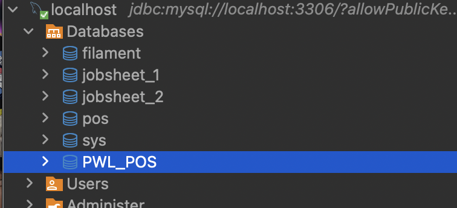
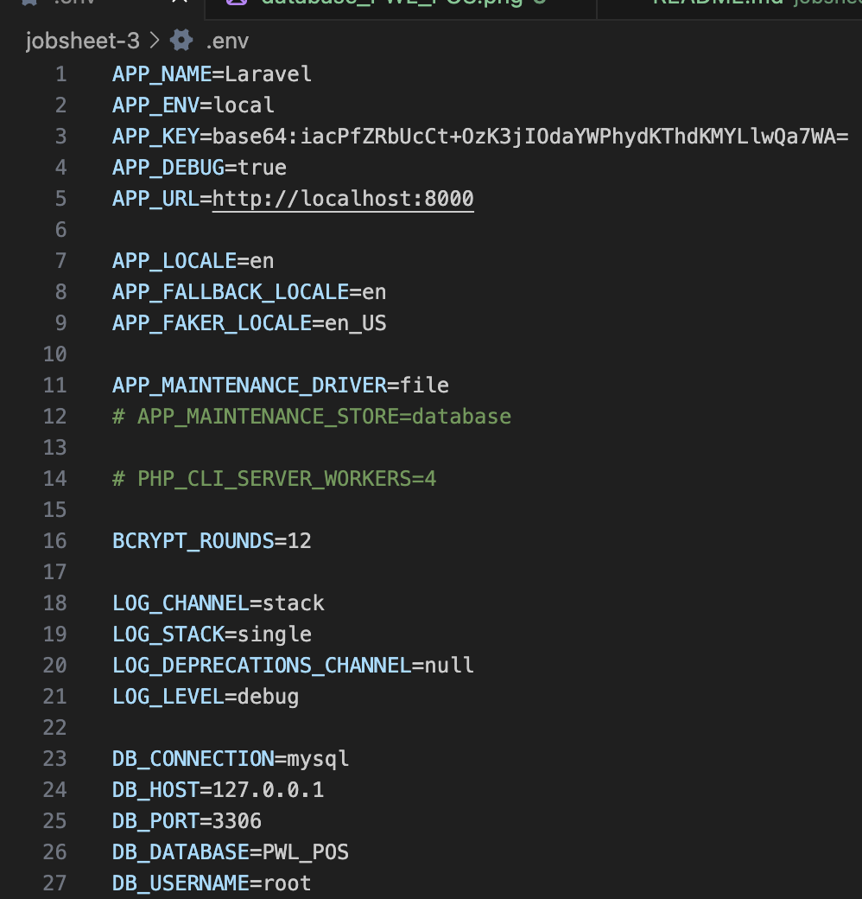
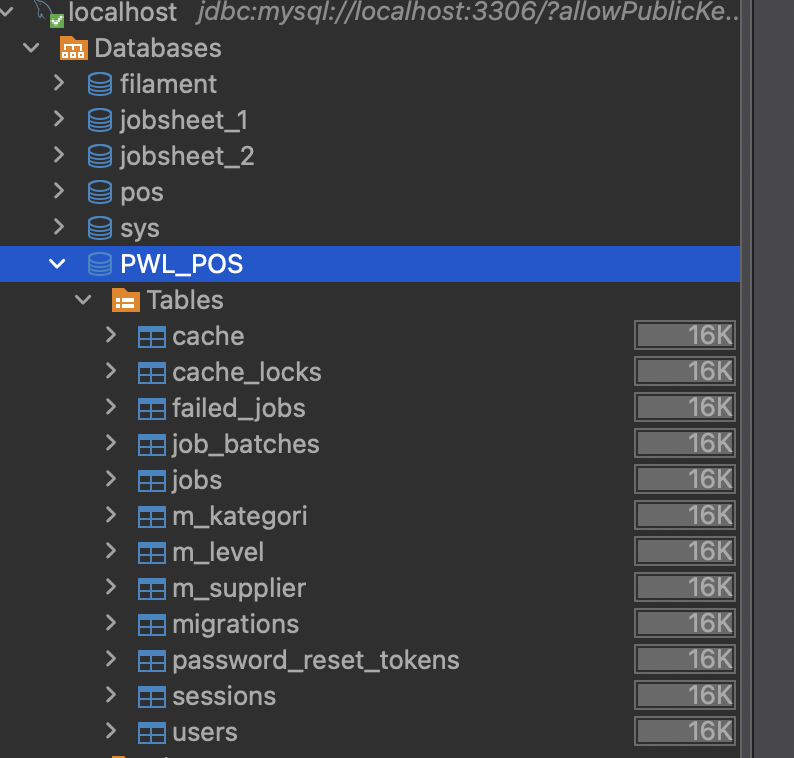
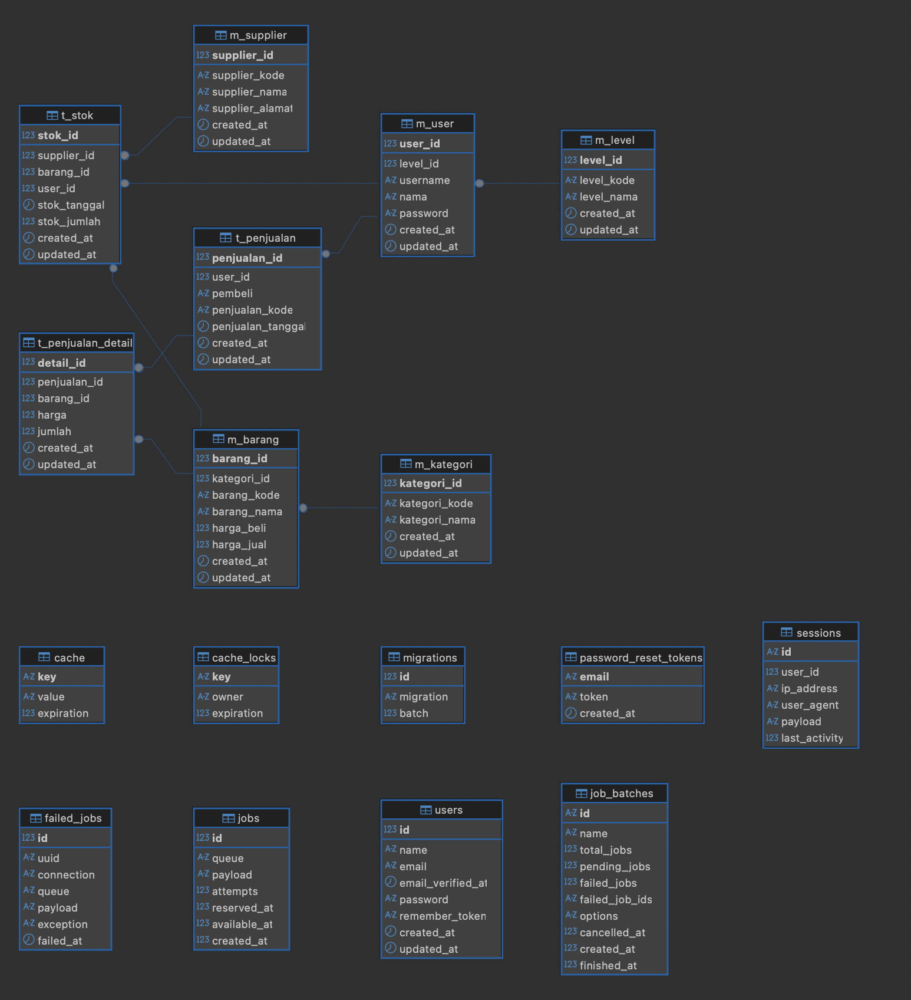
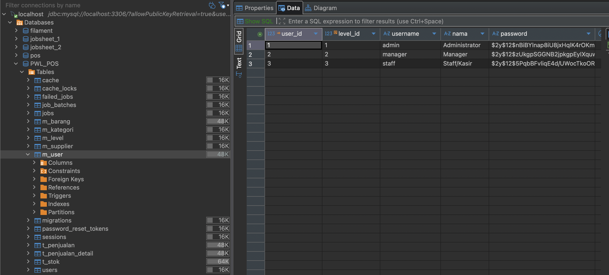
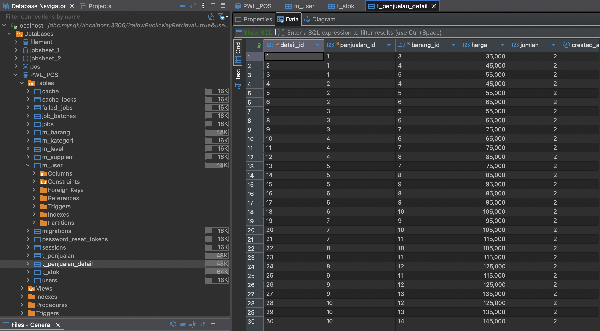

# Laporan Praktikum - Jobsheet 3
# Pemrograman Web Lanjut

**Nama:** Ghazwan Ababil  
**NIM:** 244107020151  
**Kelas:** TI-2F

---

## Praktikum 1 - Setup Lingkungan Kerja dan Database

### Tujuan
Menyiapkan database PWL_POS dan melakukan konfigurasi environment pada project Laravel.

### Langkah-Langkah Praktikum

#### 1. Membuat Database Baru

Buka aplikasi phpMyAdmin, lalu buat database baru dengan nama `PWL_POS`.


*Output membuat database PWL_POS*

---

#### 2. Membuka Project di VSCode

Buka aplikasi VSCode dan buka folder project yang sudah dibuat.

---

#### 3. Menyiapkan File Konfigurasi Environment

Salin (copy) file `.env.example` dan ubah namanya menjadi `.env`.

---

#### 4. Konfigurasi Application Key & Koneksi Database

Buka file `.env`, dan pastikan konfigurasi `APP_KEY` dan `DB_DATABASE`, `DB_USERNAME`, `DB_PASSWORD` sudah terisi nilai. Untuk generate application key, dapat menggunakan perintah berikut pada terminal:

**Command:**
```bash
php artisan key:generate
```

Sesuaikan konfigurasi database dengan database `PWL_POS` yang sudah dibuat.


*Output file .env setelah konfigurasi*

---

## Praktikum 2.1 - Pembuatan file migrasi tanpa relasi

### Tujuan
Membuat file migrasi untuk mengelola skema database secara terstruktur tanpa perlu menulis query SQL secara manual dan memfasilitasi teamwork.

### Langkah-Langkah Praktikum

#### 1. Membuat Migration untuk Tabel m_level

Membuat file migrasi baru khusus untuk tabel `m_level`.

**Command:**
```bash
php artisan make:migration create_m_level_table
```

#### 2. Modifikasi Skema Migration `m_level`

Modifikasi file migrasi yang dihasilkan (`database/migrations/..._create_m_level_table.php`) agar sesuai dengan desain database yang telah ditentukan.

**Code:**
```php
        Schema::create('m_level', function (Blueprint $table) {
            $table->id('level_id');
            $table->string('level_kode', 10);
            $table->string('level_nama', 100);
            $table->timestamps();
        });
```

#### 3. Menjalankan Migrasi

Menyimpan kode dan menjalankan perintah untuk melakukan migrasi skema ke tabel di dalam database.

**Command:**
```bash
php artisan migrate
```

#### 4. Mengecek Database

Mengecek menggunakan database tools pilihan (seperti phpMyAdmin pada MySQL atau ekstensi SQLite Viewer) untuk memastikan tabel sudah ter-generate.

---

#### 5. Membuat Migration untuk Tabel m_kategori dan m_supplier

Membuat file migrasi untuk tabel `m_kategori` dan `m_supplier` beserta memodifikasi file migrasi untuk mendefinisikan skema (keduanya tidak memiliki foreign key).

**Command:**
```bash
php artisan make:migration create_m_kategori_table
php artisan make:migration create_m_supplier_table
```

**Code (`m_kategori`):**
```php
        Schema::create('m_kategori', function (Blueprint $table) {
            $table->id('kategori_id');
            $table->string('kategori_kode', 10);
            $table->string('kategori_nama', 100);
            $table->timestamps();
        });
```

**Code (`m_supplier`):**
```php
        Schema::create('m_supplier', function (Blueprint $table) {
            $table->id('supplier_id');
            $table->string('supplier_kode', 10);
            $table->string('supplier_nama', 100);
            $table->string('supplier_alamat', 255);
            $table->timestamps();
        });
```

Kemudian jalankan migrasi kembali:
**Command:**
```bash
php artisan migrate
```


*Output seluruh tabel pada database tools (DBeaver)*

---

## Praktikum 2.2 - Pembuatan file migrasi dengan relasi

### Tujuan
Mengimplementasikan tabel-tabel di database (`m_user`, `m_barang`, `t_penjualan`, `t_stok`, `t_penjualan_detail`) yang memiliki relasi / *Foreign Key* menggunakan fitur Migration pada Laravel.

### Langkah-Langkah Praktikum

#### 1. Membuat dan Memodifikasi File Migrasi `m_user`

Pertama, file migrasi dibuat khusus untuk tabel `m_user`. Relasi dengan tabel `m_level` diatur pada skema menggunakan `foreign()`.

**Command:**
```bash
php artisan make:migration create_m_user_table
```

**Code (m_user):**
```php
        Schema::create('m_user', function (Blueprint $table) {
            $table->id('user_id');
            $table->unsignedBigInteger('level_id')->index();
            $table->string('username', 20)->unique();
            $table->string('nama', 100);
            $table->string('password');
            $table->timestamps();

            $table->foreign('level_id')->references('level_id')->on('m_level');
        });
```

Selanjutnya, migrasi dijalankan untuk mengaplikasikan skema ke database.

**Command:**
```bash
php artisan migrate
```

---

#### 2. Membuat dan Memodifikasi File Migrasi Tabel Relasi Lainnya

Membuat file migrasi untuk sisa tabel yang ada pada desain database, yaitu `m_barang`, `t_penjualan`, `t_stok`, dan `t_penjualan_detail`. 

**Command:**
```bash
php artisan make:migration create_m_barang_table
php artisan make:migration create_t_penjualan_table
php artisan make:migration create_t_stok_table
php artisan make:migration create_t_penjualan_detail_table
```

Modifikasi skema untuk mendefinisikan seluruh variabel dan *Foreign Key* pada fungsi `up()` di masing-masing file migrasi, sesuai dengan desain ERD atau skema gambar yang diberikan.

**Code (m_barang):**
```php
        Schema::create('m_barang', function (Blueprint $table) {
            $table->id('barang_id');
            $table->unsignedBigInteger('kategori_id')->index();
            $table->string('barang_kode', 10)->unique();
            $table->string('barang_nama', 100);
            $table->integer('harga_beli');
            $table->integer('harga_jual');
            $table->timestamps();

            $table->foreign('kategori_id')->references('kategori_id')->on('m_kategori');
        });
```

**Code (t_penjualan):**
```php
        Schema::create('t_penjualan', function (Blueprint $table) {
            $table->id('penjualan_id');
            $table->unsignedBigInteger('user_id')->index();
            $table->string('pembeli', 50);
            $table->string('penjualan_kode', 20)->unique();
            $table->dateTime('penjualan_tanggal');
            $table->timestamps();

            $table->foreign('user_id')->references('user_id')->on('m_user');
        });
```

**Code (t_stok):**
```php
        Schema::create('t_stok', function (Blueprint $table) {
            $table->id('stok_id');
            $table->unsignedBigInteger('supplier_id')->index();
            $table->unsignedBigInteger('barang_id')->index();
            $table->unsignedBigInteger('user_id')->index();
            $table->dateTime('stok_tanggal');
            $table->integer('stok_jumlah');
            $table->timestamps();

            $table->foreign('supplier_id')->references('supplier_id')->on('m_supplier');
            $table->foreign('barang_id')->references('barang_id')->on('m_barang');
            $table->foreign('user_id')->references('user_id')->on('m_user');
        });
```

**Code (t_penjualan_detail):**
```php
        Schema::create('t_penjualan_detail', function (Blueprint $table) {
            $table->id('detail_id');
            $table->unsignedBigInteger('penjualan_id')->index();
            $table->unsignedBigInteger('barang_id')->index();
            $table->integer('harga');
            $table->integer('jumlah');
            $table->timestamps();

            $table->foreign('penjualan_id')->references('penjualan_id')->on('t_penjualan');
            $table->foreign('barang_id')->references('barang_id')->on('m_barang');
        });
```

#### 3. Menjalankan Semua Migrasi Terbaru

Setelah seluruh skema ditetapkan, jalankan perintah migrasi. Laravel secara otomatis akan menjalankan migrasi sesuai dengan urutan pembuatan file sehingga *Foreign Key* bisa terikat dengan aman.

**Command:**
```bash
php artisan migrate
```

#### 4. Mengecek ERD / Relasi Tabel di Database Tools

Jika semua file migrasi sudah di jalankan, cek apakah database sudah meng-generate seluruh tabel dengan atribut relasinya pada database administrator / viewer.


*Output desainer relasi / tabel (ERD) dari DBMS client viewer*

---

## Praktikum 3 – Membuat File Seeder

### Tujuan
Menginput data awal dummmy ke dalam tabel database secara otomatis menggunakan fitur Seeder pada Laravel.

### Langkah-Langkah Praktikum

#### 1. Membuat dan Mengkonfigurasi File Seeder `m_level`

Membuat file seeder untuk menginisialisasi tabel `m_level` bernama `LevelSeeder`.

**Command:**
```bash
php artisan make:seeder LevelSeeder
```

Selanjutnya, untuk memasukkan data awal, modifikasi file tersebut di dalam function `run()`.

**Code:**
```php
        $data = [
            ['level_id' => 1, 'level_kode' => 'ADM', 'level_nama' => 'Administrator'],
            ['level_id' => 2, 'level_kode' => 'MNG', 'level_nama' => 'Manager'],
            ['level_id' => 3, 'level_kode' => 'STF', 'level_nama' => 'Staff/Kasir'],
        ];
        DB::table('m_level')->insert($data);
```

Jalankan perintah untuk mengeksekusi class `LevelSeeder`:
**Command:**
```bash
php artisan db:seed --class=LevelSeeder
```

Setelah `LevelSeeder` dijalankan dengan berhasil, cek tabel `m_level` di database tools untuk mengonfirmasi bahwa data berhasil disisipkan.


*Output data pada tabel m_level setelah eksekusi seeder*

---

#### 2. Membuat dan Mengkonfigurasi File Seeder `m_user`

Buat file seeder untuk tabel `m_user` dengan nama `UserSeeder`. Karena tabel ini mereferensikan `level_id`, data yang diinputkan perlu disesuaikan dengan ID dari `m_level` pada praktikum sebelumnya. 

**Command:**
```bash
php artisan make:seeder UserSeeder
```

Modifikasi isi data dari class `UserSeeder` seperti berikut. 

**Code:**
```php
        $data = [
            [
                'user_id' => 1,
                'level_id' => 1,
                'username' => 'admin',
                'nama' => 'Administrator',
                'password' => Hash::make('12345'), // class untuk mengenkripsi/hash password
            ],
            [
                'user_id' => 2,
                'level_id' => 2,
                'username' => 'manager',
                'nama' => 'Manager',
                'password' => Hash::make('12345'),
            ],
            [
                'user_id' => 3,
                'level_id' => 3,
                'username' => 'staff',
                'nama' => 'Staff/Kasir',
                'password' => Hash::make('12345'),
            ],
        ];
        DB::table('m_user')->insert($data);
```

Setelah itu, jalankan seeder menggunakan artisan command dan konfirmasi hasil insert baris pada database administrator / viewer.

**Command:**
```bash
php artisan db:seed --class=UserSeeder
```


*Output data pada tabel m_user setelah eksekusi seeder*

---

#### 3. Membuat Seeder untuk Tabel Referensi Lainnya

Lakukan hal yang sama untuk lima tabel (entitas) sisanya: `m_kategori`, `m_supplier`, `m_barang`, `t_stok`, dan `t_penjualan` serta `t_penjualan_detail`. Jangan lupa untuk memperhatikan ikatan referensi / *Foreign Key* nya.

**Command Pembuatan Seeder:**
```bash
php artisan make:seeder KategoriSeeder
php artisan make:seeder SupplierSeeder
php artisan make:seeder BarangSeeder
php artisan make:seeder StokSeeder
php artisan make:seeder PenjualanSeeder
php artisan make:seeder PenjualanDetailSeeder
```

Berikut spesifikasi / *constraint* pengisian datanya (tertera pada dokumentasi tugas):
- **KategoriSeeder**: 5 kategori barang
- **SupplierSeeder**: 3 supplier barang 
- **BarangSeeder**: 15 barang berbeda (5 barang/supplier) 
- **StokSeeder**: Stok untuk 15 barang
- **PenjualanSeeder**: 10 transaksi penjualan
- **PenjualanDetailSeeder**: 3 barang untuk setiap transaksi penjualan (30 Data)

Setelah seluruh modifikasi di `Database/Seeders` terselesaikan, jalankan `db:seed` untuk semua class terkait dan amati perubahan isinya dari sisi SQL viewer.


*Output data salah satu tabel setelah penambahan Seeder Database Client*

---