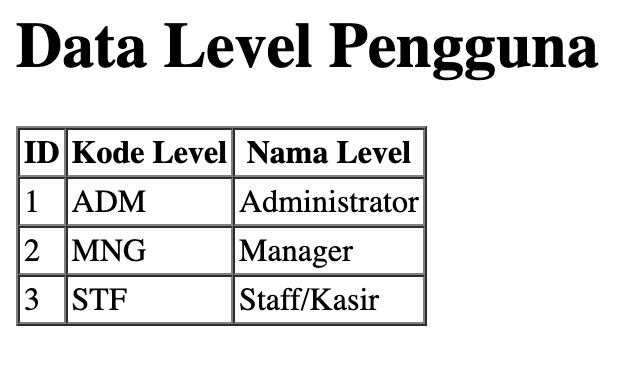
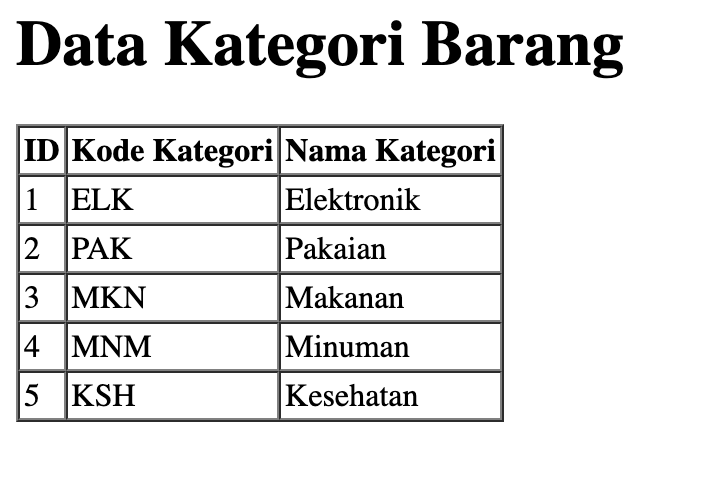
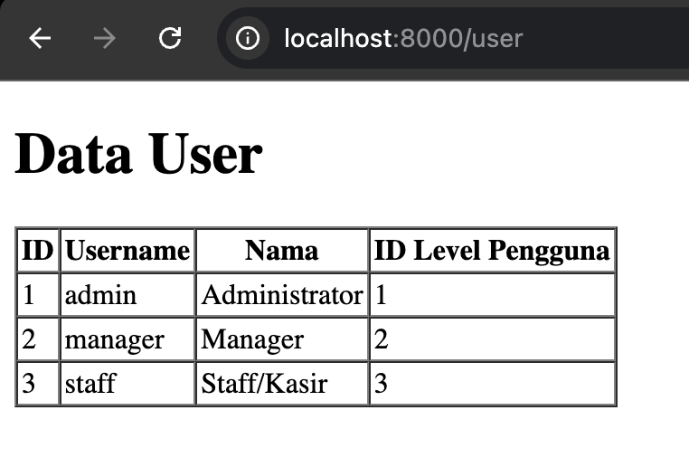
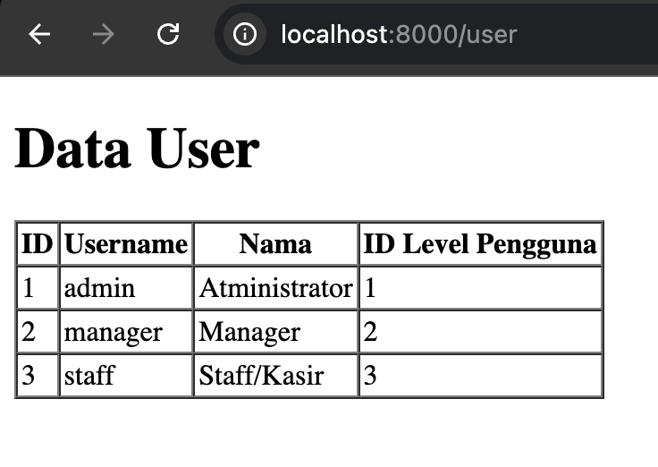

# Laporan Praktikum - Jobsheet 3
# Pemrograman Web Lanjut

**Nama:** Ghazwan Ababil  
**NIM:** 244107020151  
**Kelas:** TI-2F

---

## Daftar Isi
- [Praktikum 1 - Tahap Persiapan](#praktikum-1--tahap-persiapan)
- [Praktikum 2 - Pembuatan File Migration](#praktikum-2--pembuatan-file-migration)
  - [Praktikum 2.1 - Pembuatan file migrasi tanpa relasi (Tabel non-Foreign Key)](#praktikum-21---pembuatan-file-migrasi-tanpa-relasi-tabel-non-foreign-key)
  - [Praktikum 2.2 - Pembuatan file migrasi dengan relasi (Tabel Foreign Key)](#praktikum-22---pembuatan-file-migrasi-dengan-relasi-tabel-foreign-key)
- [Praktikum 3 - Membuat File Seeder](#praktikum-3--membuat-file-seeder)
- [Praktikum 4 - Praktikum DB Facade (Controller & View)](#praktikum-4--praktikum-db-facade-controller--view)
- [Praktikum 5 - Praktikum DB Query Builder](#praktikum-5--praktikum-db-query-builder)
- [Praktikum 6 - Praktikum Eloquent ORM](#praktikum-6--praktikum-eloquent-orm)
- [Penutup](#penutup)

---

## Praktikum 1 - Setup Lingkungan Kerja dan Database

### Tujuan
Menyiapkan database PWL_POS dan melakukan konfigurasi environment pada project Laravel.

### Langkah-Langkah Praktikum

#### 1. Membuat Database Baru

Buka aplikasi phpMyAdmin, lalu buat database baru dengan nama `PWL_POS`.


*Output membuat database PWL_POS*

---

#### 2. Membuka Project di VSCode

Buka aplikasi VSCode dan buka folder project yang sudah dibuat.

---

#### 3. Menyiapkan File Konfigurasi Environment

Salin (copy) file `.env.example` dan ubah namanya menjadi `.env`.

---

#### 4. Konfigurasi Application Key & Koneksi Database

Buka file `.env`, dan pastikan konfigurasi `APP_KEY` dan `DB_DATABASE`, `DB_USERNAME`, `DB_PASSWORD` sudah terisi nilai. Untuk generate application key, dapat menggunakan perintah berikut pada terminal:

**Command:**
```bash
php artisan key:generate
```

Sesuaikan konfigurasi database dengan database `PWL_POS` yang sudah dibuat.


*Output file .env setelah konfigurasi*

---

## Praktikum 2.1 - Pembuatan file migrasi tanpa relasi

### Tujuan
Membuat file migrasi untuk mengelola skema database secara terstruktur tanpa perlu menulis query SQL secara manual dan memfasilitasi teamwork.

### Langkah-Langkah Praktikum

#### 1. Membuat Migration untuk Tabel m_level

Membuat file migrasi baru khusus untuk tabel `m_level`.

**Command:**
```bash
php artisan make:migration create_m_level_table
```

#### 2. Modifikasi Skema Migration `m_level`

Modifikasi file migrasi yang dihasilkan (`database/migrations/..._create_m_level_table.php`) agar sesuai dengan desain database yang telah ditentukan.

**Code:**
```php
        Schema::create('m_level', function (Blueprint $table) {
            $table->id('level_id');
            $table->string('level_kode', 10);
            $table->string('level_nama', 100);
            $table->timestamps();
        });
```

#### 3. Menjalankan Migrasi

Menyimpan kode dan menjalankan perintah untuk melakukan migrasi skema ke tabel di dalam database.

**Command:**
```bash
php artisan migrate
```

#### 4. Mengecek Database

Mengecek menggunakan database tools pilihan (seperti phpMyAdmin pada MySQL atau ekstensi SQLite Viewer) untuk memastikan tabel sudah ter-generate.

---

#### 5. Membuat Migration untuk Tabel m_kategori dan m_supplier

Membuat file migrasi untuk tabel `m_kategori` dan `m_supplier` beserta memodifikasi file migrasi untuk mendefinisikan skema (keduanya tidak memiliki foreign key).

**Command:**
```bash
php artisan make:migration create_m_kategori_table
php artisan make:migration create_m_supplier_table
```

**Code (`m_kategori`):**
```php
        Schema::create('m_kategori', function (Blueprint $table) {
            $table->id('kategori_id');
            $table->string('kategori_kode', 10);
            $table->string('kategori_nama', 100);
            $table->timestamps();
        });
```

**Code (`m_supplier`):**
```php
        Schema::create('m_supplier', function (Blueprint $table) {
            $table->id('supplier_id');
            $table->string('supplier_kode', 10);
            $table->string('supplier_nama', 100);
            $table->string('supplier_alamat', 255);
            $table->timestamps();
        });
```

Kemudian jalankan migrasi kembali:
**Command:**
```bash
php artisan migrate
```


*Output seluruh tabel pada database tools (DBeaver)*

---

## Praktikum 2.2 - Pembuatan file migrasi dengan relasi

### Tujuan
Mengimplementasikan tabel-tabel di database (`m_user`, `m_barang`, `t_penjualan`, `t_stok`, `t_penjualan_detail`) yang memiliki relasi / *Foreign Key* menggunakan fitur Migration pada Laravel.

### Langkah-Langkah Praktikum

#### 1. Membuat dan Memodifikasi File Migrasi `m_user`

Pertama, file migrasi dibuat khusus untuk tabel `m_user`. Relasi dengan tabel `m_level` diatur pada skema menggunakan `foreign()`.

**Command:**
```bash
php artisan make:migration create_m_user_table
```

**Code (m_user):**
```php
        Schema::create('m_user', function (Blueprint $table) {
            $table->id('user_id');
            $table->unsignedBigInteger('level_id')->index();
            $table->string('username', 20)->unique();
            $table->string('nama', 100);
            $table->string('password');
            $table->timestamps();

            $table->foreign('level_id')->references('level_id')->on('m_level');
        });
```

Selanjutnya, migrasi dijalankan untuk mengaplikasikan skema ke database.

**Command:**
```bash
php artisan migrate
```

---

#### 2. Membuat dan Memodifikasi File Migrasi Tabel Relasi Lainnya

Membuat file migrasi untuk sisa tabel yang ada pada desain database, yaitu `m_barang`, `t_penjualan`, `t_stok`, dan `t_penjualan_detail`. 

**Command:**
```bash
php artisan make:migration create_m_barang_table
php artisan make:migration create_t_penjualan_table
php artisan make:migration create_t_stok_table
php artisan make:migration create_t_penjualan_detail_table
```

Modifikasi skema untuk mendefinisikan seluruh variabel dan *Foreign Key* pada fungsi `up()` di masing-masing file migrasi, sesuai dengan desain ERD atau skema gambar yang diberikan.

**Code (m_barang):**
```php
        Schema::create('m_barang', function (Blueprint $table) {
            $table->id('barang_id');
            $table->unsignedBigInteger('kategori_id')->index();
            $table->string('barang_kode', 10)->unique();
            $table->string('barang_nama', 100);
            $table->integer('harga_beli');
            $table->integer('harga_jual');
            $table->timestamps();

            $table->foreign('kategori_id')->references('kategori_id')->on('m_kategori');
        });
```

**Code (t_penjualan):**
```php
        Schema::create('t_penjualan', function (Blueprint $table) {
            $table->id('penjualan_id');
            $table->unsignedBigInteger('user_id')->index();
            $table->string('pembeli', 50);
            $table->string('penjualan_kode', 20)->unique();
            $table->dateTime('penjualan_tanggal');
            $table->timestamps();

            $table->foreign('user_id')->references('user_id')->on('m_user');
        });
```

**Code (t_stok):**
```php
        Schema::create('t_stok', function (Blueprint $table) {
            $table->id('stok_id');
            $table->unsignedBigInteger('supplier_id')->index();
            $table->unsignedBigInteger('barang_id')->index();
            $table->unsignedBigInteger('user_id')->index();
            $table->dateTime('stok_tanggal');
            $table->integer('stok_jumlah');
            $table->timestamps();

            $table->foreign('supplier_id')->references('supplier_id')->on('m_supplier');
            $table->foreign('barang_id')->references('barang_id')->on('m_barang');
            $table->foreign('user_id')->references('user_id')->on('m_user');
        });
```

**Code (t_penjualan_detail):**
```php
        Schema::create('t_penjualan_detail', function (Blueprint $table) {
            $table->id('detail_id');
            $table->unsignedBigInteger('penjualan_id')->index();
            $table->unsignedBigInteger('barang_id')->index();
            $table->integer('harga');
            $table->integer('jumlah');
            $table->timestamps();

            $table->foreign('penjualan_id')->references('penjualan_id')->on('t_penjualan');
            $table->foreign('barang_id')->references('barang_id')->on('m_barang');
        });
```

#### 3. Menjalankan Semua Migrasi Terbaru

Setelah seluruh skema ditetapkan, jalankan perintah migrasi. Laravel secara otomatis akan menjalankan migrasi sesuai dengan urutan pembuatan file sehingga *Foreign Key* bisa terikat dengan aman.

**Command:**
```bash
php artisan migrate
```

#### 4. Mengecek ERD / Relasi Tabel di Database Tools

Jika semua file migrasi sudah di jalankan, cek apakah database sudah meng-generate seluruh tabel dengan atribut relasinya pada database administrator / viewer.


*Output desainer relasi / tabel (ERD) dari DBMS client viewer*

---

## Praktikum 3 – Membuat File Seeder

### Tujuan
Menginput data awal dummmy ke dalam tabel database secara otomatis menggunakan fitur Seeder pada Laravel.

### Langkah-Langkah Praktikum

#### 1. Membuat dan Mengkonfigurasi File Seeder `m_level`

Membuat file seeder untuk menginisialisasi tabel `m_level` bernama `LevelSeeder`.

**Command:**
```bash
php artisan make:seeder LevelSeeder
```

Selanjutnya, untuk memasukkan data awal, modifikasi file tersebut di dalam function `run()`.

**Code:**
```php
        $data = [
            ['level_id' => 1, 'level_kode' => 'ADM', 'level_nama' => 'Administrator'],
            ['level_id' => 2, 'level_kode' => 'MNG', 'level_nama' => 'Manager'],
            ['level_id' => 3, 'level_kode' => 'STF', 'level_nama' => 'Staff/Kasir'],
        ];
        DB::table('m_level')->insert($data);
```

Jalankan perintah untuk mengeksekusi class `LevelSeeder`:
**Command:**
```bash
php artisan db:seed --class=LevelSeeder
```

Setelah `LevelSeeder` dijalankan dengan berhasil, cek tabel `m_level` di database tools untuk mengonfirmasi bahwa data berhasil disisipkan.


*Output data pada tabel m_level setelah eksekusi seeder*

---

#### 2. Membuat dan Mengkonfigurasi File Seeder `m_user`

Buat file seeder untuk tabel `m_user` dengan nama `UserSeeder`. Karena tabel ini mereferensikan `level_id`, data yang diinputkan perlu disesuaikan dengan ID dari `m_level` pada praktikum sebelumnya. 

**Command:**
```bash
php artisan make:seeder UserSeeder
```

Modifikasi isi data dari class `UserSeeder` seperti berikut. 

**Code:**
```php
        $data = [
            [
                'user_id' => 1,
                'level_id' => 1,
                'username' => 'admin',
                'nama' => 'Administrator',
                'password' => Hash::make('12345'), // class untuk mengenkripsi/hash password
            ],
            [
                'user_id' => 2,
                'level_id' => 2,
                'username' => 'manager',
                'nama' => 'Manager',
                'password' => Hash::make('12345'),
            ],
            [
                'user_id' => 3,
                'level_id' => 3,
                'username' => 'staff',
                'nama' => 'Staff/Kasir',
                'password' => Hash::make('12345'),
            ],
        ];
        DB::table('m_user')->insert($data);
```

Setelah itu, jalankan seeder menggunakan artisan command dan konfirmasi hasil insert baris pada database administrator / viewer.

**Command:**
```bash
php artisan db:seed --class=UserSeeder
```


*Output data pada tabel m_user setelah eksekusi seeder*

---

#### 3. Membuat Seeder untuk Tabel Referensi Lainnya

Lakukan hal yang sama untuk lima tabel (entitas) sisanya: `m_kategori`, `m_supplier`, `m_barang`, `t_stok`, dan `t_penjualan` serta `t_penjualan_detail`. Jangan lupa untuk memperhatikan ikatan referensi / *Foreign Key* nya.

**Command Pembuatan Seeder:**
```bash
php artisan make:seeder KategoriSeeder
php artisan make:seeder SupplierSeeder
php artisan make:seeder BarangSeeder
php artisan make:seeder StokSeeder
php artisan make:seeder PenjualanSeeder
php artisan make:seeder PenjualanDetailSeeder
```

Berikut spesifikasi / *constraint* pengisian datanya (tertera pada dokumentasi tugas):
- **KategoriSeeder**: 5 kategori barang
- **SupplierSeeder**: 3 supplier barang 
- **BarangSeeder**: 15 barang berbeda (5 barang/supplier) 
- **StokSeeder**: Stok untuk 15 barang
- **PenjualanSeeder**: 10 transaksi penjualan
- **PenjualanDetailSeeder**: 3 barang untuk setiap transaksi penjualan (30 Data)

Setelah seluruh modifikasi di `Database/Seeders` terselesaikan, jalankan `db:seed` untuk semua class terkait dan amati perubahan isinya dari sisi SQL viewer.


*Output data salah satu tabel setelah penambahan Seeder Database Client*

---

## Praktikum 4 – Praktikum DB Facade (Controller & View)

### Tujuan
Mengambil dan memanipulasi data dari database menggunakan mekanisme `DB Facade` bawaan Laravel untuk diolah di lapisan Controller maupun ditampilkan lewat lapisan View (`blade`).

### Langkah-Langkah Praktikum

#### 1. Membuat dan Mengkonfigurasi `LevelController`
Buat Controller untuk mengelola data pada tabel `m_level`.

**Command:**
```bash
php artisan make:controller LevelController
```

#### 2. Mendaftarkan Route
Setelah controller dibuat, routing perlu ditetapkan agar server tahu ketika user mengunjungi sebuah End-Point `URL`, fungsi mana yang harus ia eksekusi. Buka file pengaturan rute aplikasi di `routes/web.php` dan tambahkan hal berikut.

**Code:**
```php
use App\Http\Controllers\LevelController;

Route::get('/', function () {
    return view('welcome');
});

// Menambahkan route untuk level
Route::get('/level', [LevelController::class, 'index']);
```

#### 3. Mengimplementasikan Metode `index` 
Modifikasi file `app/Http/Controllers/LevelController.php`. Tambahkan fungsi `index()` yang menampung beragam kueri dasar (seperti `insert`, `update`, `delete` dari Facade `DB`), meski untuk sekarang bagian manipulasi data di-*comment-out* dan bagian pemanggilan `select` yang dibiarkan tereksekusi.

**Code:**
```php
<?php

namespace App\Http\Controllers;

use Illuminate\Http\Request;
use Illuminate\Support\Facades\DB;

class LevelController extends Controller
{
    public function index()
    {
        // DB::insert('insert into m_level(level_kode, level_nama, created_at) values(?, ?, ?)', ['CUS', 'Pelanggan', now()]);
        // return 'Insert data baru berhasil';

        // $row = DB::update('update m_level set level_nama = ? where level_kode = ?', ['Customer', 'CUS']);
        // return 'Update data berhasil. Jumlah data yang diupdate: ' . $row . ' baris';

        // $row = DB::delete('delete from m_level where level_kode = ?', ['CUS']);
        // return 'Delete data berhasil. Jumlah data yang dihapus: ' . $row . ' baris';

        $data = DB::select('select * from m_level');
        return view('level', ['data' => $data]);
    }
}
```

#### 4. Membuat View `level.blade.php`
Buat file *View* bernama `level.blade.php` di dalam direktori `resources/views`. File ini akan digunakan untuk merender (menampilkan) array data `$data` yang dikirim dari `LevelController`.

**Code:**
```html
<!DOCTYPE html>
<html>
<head>
    <title>Data Level Pengguna</title>
</head>
<body>
    <h1>Data Level Pengguna</h1>
    <table border="1" cellpadding="2" cellspacing="0">
        <tr>
            <th>ID</th>
            <th>Kode Level</th>
            <th>Nama Level</th>
        </tr>
        @foreach ($data as $d)
        <tr>
            <td>{{ $d->level_id }}</td>
            <td>{{ $d->level_kode }}</td>
            <td>{{ $d->level_nama }}</td>
        </tr>
        @endforeach
    </table>
</body>
</html>
```

#### 5. Menguji Hasilnya di Browser
Sekarang mari jalankan *Development Server* bawaan Laravel menggunakan Command-Line / Terminal.

**Command:**
```bash
php artisan serve
```

Kunjungi `http://127.0.0.1:8000/level` atau `localhost:8000/level` melalui *Web Browser*. Pastikan Output tabel yang ditarik dari basis data berhasil tertampil seluruhnya oleh view.


*Output rendering di browser pada URL `/level`*

---

## Praktikum 5 – Praktikum DB Query Builder

### Tujuan
Mengambil dan memanipulasi data dari database menggunakan metode `DB Query Builder` Laravel (contohnya `DB::table()`).

### Langkah-Langkah Praktikum

#### 1. Membuat `KategoriController`
Buat controller baru bernama `KategoriController` untuk mengelola data-data terkait kategori barang (`m_kategori`).

**Command:**
```bash
php artisan make:controller KategoriController
```

#### 2. Mendaftarkan Route
Daftarkan Route endpoint `/kategori` di dalam `routes/web.php` untuk memanggil fungsi `index` dari `KategoriController`.

**Code:**
```php
use App\Http\Controllers\LevelController;
use App\Http\Controllers\KategoriController;

Route::get('/', function () {
    return view('welcome');
});

Route::get('/level', [LevelController::class, 'index']);

// Menambahkan route untuk kategori
Route::get('/kategori', [KategoriController::class, 'index']);
```

#### 3. Mengimplementasikan Metode `index` 
Instruksi selanjutnya meminta kita memodifikasi file `app/Http/Controllers/KategoriController.php`. Tambahkan fungsi `index()` yang menampung kueri operasi manipulasi data (seperti `insert`, `update`, `delete` lewat *Query Builder* `DB::table()`). Biarkan kueri `get()` atau aksi pemanggilan datanya berjalan dan *comment-out* bagian modifikasi lainnya.

**Code:**
```php
<?php

namespace App\Http\Controllers;

use Illuminate\Http\Request;
use Illuminate\Support\Facades\DB;

class KategoriController extends Controller
{
    public function index()
    {
        /* $data = [
            'kategori_kode' => 'SNK',
            'kategori_nama' => 'Snack/Makanan Ringan',
            'created_at' => now()
        ];
        DB::table('m_kategori')->insert($data);
        return 'Insert data baru berhasil'; */

        // $row = DB::table('m_kategori')->where('kategori_kode', 'SNK')->update(['kategori_nama' => 'Camilan']);
        // return 'Update data berhasil. Jumlah data yang diupdate: ' . $row . ' baris';

        // $row = DB::table('m_kategori')->where('kategori_kode', 'SNK')->delete();
        // return 'Delete data berhasil. Jumlah data yang dihapus: ' . $row . ' baris';

        $data = DB::table('m_kategori')->get();
        return view('kategori', ['data' => $data]);
    }
}
```

#### 4. Membuat View `kategori.blade.php`
Buat file *View* bernama `kategori.blade.php` di dalam direktori `resources/views`. File ini akan digunakan untuk merender (menampilkan) array data object `$data` (`m_kategori`) yang dikirim dari `KategoriController`.

**Code:**
```html
<!DOCTYPE html>
<html>
<head>
    <title>Data Kategori Barang</title>
</head>
<body>
    <h1>Data Kategori Barang</h1>
    <table border="1" cellpadding="2" cellspacing="0">
        <tr>
            <th>ID</th>
            <th>Kode Kategori</th>
            <th>Nama Kategori</th>
        </tr>
        @foreach ($data as $d)
        <tr>
            <td>{{ $d->kategori_id }}</td>
            <td>{{ $d->kategori_kode }}</td>
            <td>{{ $d->kategori_nama }}</td>
        </tr>
        @endforeach
    </table>
</body>
</html>
```

#### 5. Menguji Hasilnya di Browser
Pastikan *Development Server* Laravel sedang berjalan. Jika belum, jalankan:

**Command:**
```bash
php artisan serve
```

Kunjungi alamat URL `http://127.0.0.1:8000/kategori`. Halaman akan menampilkan seluruh data kategori awal yang dimasukkan via Seeder yang diload secara dinamis.


*Output rendering di browser pada URL `/kategori`*

---

## Praktikum 6 – Praktikum Eloquent ORM

### Tujuan
Mengambil, menambahkan, dan memanipulasi data di database menggunakan paradigma berorientasi objek (OOP) di *Eloquent ORM* Laravel. Setiap tabel database akan direpresentasikan oleh satu "Model" class. 

### Langkah-Langkah Praktikum

#### 1. Membuat `UserModel`
Untuk dapat berinteraksi dengan database memakai Eloquent, buat Model untuk tabel `m_user` terlebih dahulu.

**Command:**
```bash
php artisan make:model UserModel
```

#### 2. Mengkonfigurasi Properti di `UserModel`
Secara default Eloquent mengasumsikan nama tabel memiliki bentuk jamak dari nama class (ex: `user_models`) dan *primary key* bernama `id`. Karena skema/tabel kita memakai penamaan kustom (ex: `m_user` dan `user_id`), kita harus *override* deklarasi ini di Model terkait. 

Buka `app/Models/UserModel.php` dan modifikasi seperti berikut:

**Code:**
```php
<?php

namespace App\Models;

use Illuminate\Database\Eloquent\Factories\HasFactory;
use Illuminate\Database\Eloquent\Model;

class UserModel extends Model
{
    use HasFactory;

    protected $table = 'm_user';        // Mendefinisikan nama tabel yang digunakan oleh model ini
    protected $primaryKey = 'user_id';  // Mendefinisikan primary key dari tabel yang digunakan
}
```

#### 3. Membuat `UserController` & Mendaftarkan Route
Ekskusi *business-logic* nantinya akan bersarang di *Controller*. Buat berkas baru:

**Command:**
```bash
php artisan make:controller UserController
```

Dan hubungkan *Endpoint/URI* ke aplikasi dengan memodifikasi `routes/web.php`:

**Code:**
```php
use App\Http\Controllers\LevelController;
use App\Http\Controllers\KategoriController;
use App\Http\Controllers\UserController;

// ...

Route::get('/user', [UserController::class, 'index']);
```

#### 4. Menampilkan Data menggunakan Eloquent (Fungsi `index`)
Buka `UserController.php` dan tambahkan fungsionalitas untuk mengambil seluruh (*all*) data user menggunakan class `UserModel`.

**Code:**
```php
<?php

namespace App\Http\Controllers;

use App\Models\UserModel;
use Illuminate\Http\Request;

class UserController extends Controller
{
    public function index()
    {
        // coba akses model UserModel
        $user = UserModel::all(); // ambil semua data dari tabel m_user
        return view('user', ['data' => $user]);
    }
}
```

#### 5. Membuat View `user.blade.php`
Untuk *merender* output dari data Object-Relational Eloquent `$user`, buat file `resources/views/user.blade.php`.

**Code:**
```html
<!DOCTYPE html>
<html>
<head>
    <title>Data User</title>
</head>
<body>
    <h1>Data User</h1>
    <table border="1" cellpadding="2" cellspacing="0">
        <tr>
            <th>ID</th>
            <th>Username</th>
            <th>Nama</th>
            <th>ID Level Pengguna</th>
        </tr>
        @foreach ($data as $d)
        <tr>
            <td>{{ $d->user_id }}</td>
            <td>{{ $d->username }}</td>
            <td>{{ $d->nama }}</td>
            <td>{{ $d->level_id }}</td>
        </tr>
        @endforeach
    </table>
</body>
</html>
```

Test route menggunakan server / browser, maka seluruh baris data User (`m_user`) dari basis data yang di-*retrieve* (ambil) secara objek berbasis *collection* akan tampil sempurna.


*Output rendering pengguna*

#### 6. Memanipulasi *Insert* & *Update* via Eloquent
Untuk menambahkan data `customer-1` (serta memperbarui datanya di percobaan selanjutnya), kita modifikasi fungsi dari `index()` di `UserController`.

***Penerapan Insert Data (`UserModel::insert`)***
**Code:**
```php
    public function index()
    {
        // tambah data user dengan Eloquent Model
        $data = [
            'username' => 'customer-1',
            'nama' => 'Pelanggan',
            'password' => Hash::make('12345'),
            'level_id' => 4 
        ];
        UserModel::insert($data); // tambahkan data ke tabel m_user

        // coba akses model UserModel
        $user = UserModel::all(); // ambil semua data dari tabel m_user
        return view('user', ['data' => $user]);
    }
```
*Catatan: Baris data `level_id = 4` perlu menambahkan data level keempat terlebih dahulu melalui seeder/migrasi/manual agar tidak menimpa masalah Referential Integrity pada Database karena ketika dijalankan skrip tersebut tidak ada data level keempat sehingga akan terjadi error*

***Penerapan Update Data***
**Code:**
```php
    public function index()
    {
        // update data user dengan Eloquent Model
        $data = [
            'nama' => 'Atministrator',
        ];
        UserModel::where('username', 'admin')->update($data); // update data user

        // coba akses model UserModel
        $user = UserModel::all(); // ambil semua data dari tabel m_user
        return view('user', ['data' => $user]);
    }
```

 
*Output rendering pengguna setelah update*

---

## Penutup

**1. Pada Praktikum 1 - Tahap 5, apakah fungsi dari `APP_KEY` pada file setting `.env` Laravel?**  
`APP_KEY` berfungsi sebagai kunci enkripsi string acak 32-karakter (jika menggunakan cipher `AES-256-CBC`) yang digunakan oleh backend Laravel untuk mengamankan data pengguna, cookies, sesi (sessions), manajemen kata sandi, hingga penandatanganan payload. Tanpa `APP_KEY` yang tervalidasi, session pengguna akan otomatis kedaluwarsa dan keamanan sistem terkompromi.

**2. Pada Praktikum 1, bagaimana kita men-generate nilai untuk `APP_KEY`?**  
Dengan menjalankan perintah Artisan berikut di Terminal CLI:
```bash
php artisan key:generate
```
Perintah ini otomatis mengisikan nilai *base64-encoded string* baru ke parameter `APP_KEY=` di dalam `.env`.

**3. Pada Praktikum 2.1 - Tahap 1, secara default Laravel memiliki berapa file migrasi? dan untuk apa saja file migrasi tersebut?**  
Secara default pada versi Laravel 11 dan 12, terdapat **3 buah file migrasi default**:
1. `0001_01_01_000000_create_users_table.php` = Mengurus skema pencatatan tabel kredensial pengguna (`users`), reset kata sandi (`password_reset_tokens`), dan pencatatan sesi login (`sessions`).
2. `0001_01_01_000001_create_cache_table.php` = Membuat tabel `cache` untuk menyimpan cache berbasis database serta tabel penguncian `cache_locks`.
3. `0001_01_01_000002_create_jobs_table.php` = Menangani skema tabel pemrosesan tugas *queue* (antrean), tabel *job batches*, serta log tugas yang gagal dieksekusi (`failed_jobs`).

**4. Secara default, file migrasi terdapat kode `$table->timestamps();`, apa tujuan/output dari fungsi tersebut?**  
Fungsi `$table->timestamps()` secara otomatis akan men-*generate* dua buah pilar kolom metadatam yaitu `created_at` (mencatat waktu kapan baris pertama kali dibuat) dan `updated_at` (mencatat waktu kapan baris tersebut terakhir kali dimodifikasi), keduanya bertipe `TIMESTAMP` atau `DATETIME`.

**5. Pada File Migrasi, terdapat fungsi `$table->id();` Tipe data apa yang dihasilkan dari fungsi tersebut?**  
Untuk DBMS seperti MySQL/MariaDB, `$table->id()` menghasilkan tipe data **`BIGINT(20) UNSIGNED`** yang secara otomatis dilengkapi sifat `AUTO_INCREMENT` dan diposisikan sebagai struktur `PRIMARY KEY`.

**6. Apa bedanya hasil migrasi pada table `m_level`, antara menggunakan `$table->id();` dengan menggunakan `$table->id('level_id');`?**  
- Penggunaan `$table->id();` akan membuat kolom Primary Key Auto-Increment dengan nama default `"id"`.
- Penggunaan `$table->id('level_id');` akan membuat perilaku Primary Key Auto-Increment yang identik, hanya saja nama *field/kolom* di database-nya diubah aliasnya spesifik menjadi `"level_id"`.

**7. Pada migration, Fungsi `->unique()` digunakan untuk apa?**  
Fungsi `->unique()` digunakan untuk menambahkan konstrain **UNIQUE Index** pada kolom tersebut, yang menjamin bahwa tidak boleh ada duplikasi data atau nilai yang sama persis (identik) di kolom itu pada lebih dari 1 baris record manapun.

**8. Pada Praktikum 2.2 - Tahap 2, kenapa kolom `level_id` pada tabel `m_user` menggunakan `$table->unsignedBigInteger('level_id')`, sedangkan kolom `level_id` pada tabel `m_level` menggunakan `$table->id('level_id')`?**  
Kolom `level_id` pada `m_user` dirancang sebagai **Foreign Key** yang akan merujuk kepada kolom asal di tabel `m_level`. 

Oleh karena metode `$table->id()` di tabel asal menghasilkan tipe `BIGINT UNSIGNED`, maka Foreign Key-nya *wajib absolut* disesuaikan properti tipe datanya dengan `$table->unsignedBigInteger('level_id')` agar struktur relasi Foreign Key bisa sukses terhubung (Referential Integrity). Akan error jika tipenya berbeda atau jika `m_user` memakai `id()` karena `id()` akan menetapkan Primary Key dan `AUTO_INCREMENT` yang tidak masuk akal diterapkan untuk Foreign Constraint.

**9. Pada Praktikum 3 - Tahap 6, apa tujuan dari Class `Hash`? dan apa maksud dari kode program `Hash::make('1234');`?**  
Class `Hash` adalah *Facade Configuration* di Laravel yang menyediakan implementasi algoritma *hashing* aman (secara default *Bcrypt* atau *Argon2*) untuk mengenkripsi rentetan string (seperti password). 

Kode `Hash::make('1234')` berarti kita mengenkripsi *plaintext* angka `"1234"` menjadi serangkaian teks tersandi panjang. Hal ini dilakukan karena kata sandi tidak boleh disimpan dalam bentuk aslinya di basis data demi alasan keamanan pencegahan kebocoran.

**10. Pada Praktikum 4 - Tahap 3/5/7, pada query builder terdapat tanda tanya (`?`), apa kegunaan dari tanda tanya (`?`) tersebut?**  
Tanda tanya (`?`) bertindak sebagai parameter *Placeholder Binding* dalam format Eksekusi Tersiapkan (*Prepared Statements*) PDO. Tujuannya adalah untuk memisahkan logika String Query SQL dengan nilai/value asli yang diletakkan pada Array terpisah (`['CUS', 'Pelanggan']`). Ini secara absolut menanggulangi celah kejahatan kerentanan **SQL Injection**, karena karakter berbahaya yang di-input otomatis di-escape oleh engine DB.

**11. Pada Praktikum 6 - Tahap 3, apa tujuan penulisan kode `protected $table = 'm_user';` dan `protected $primaryKey = 'user_id';`?**  
Secara default, jika kita hanya menulis kelas `UserModel`, Eloquent akan berasumsi bahwa ia harus mencari entitas ke dalam tabel bentuk *plural* snake_case bernama `user_models` dan melakukan pencarian indeks utama di field bernama `id`. 

- *Override* variabel `$table = 'm_user'` memaksa Eloquent untuk melakukan query pencarian tabel database bernama spesifik `m_user`.
- *Override* variabel `$primaryKey = 'user_id'` mengalihkan acuan Primary Key pencarian atau mutasi Eloquent (seperti `find()`, `save()`) untuk merujuk ke kolom `user_id` alih-alih mengekspektasikan kolom default `id` yang mana tidak kita deklarasikan.

**12. Menurut kalian, lebih mudah menggunakan mana dalam melakukan operasi CRUD ke database (DB Façade / Query Builder / Eloquent ORM)? jelaskan.**  
Dari ketiga metode, **Eloquent ORM** jauh lebih mudah dan direkomendasikan untuk digunakan dalam struktur skema skala besar.

**Alasannya:**
- Mengandalkan metodologi Pemrograman Berorientasi Objek (OOP) sepenuhnya sehingga syntax perlakuan basis data terasa natural seperti modifikasi properti kelas Object biasa di PHP dibandingkan merajut string SQL mentah.
- Pengaturan manipulasi tanggal (Timestamps) yang serba otomatis (tanpa perlu mengisi `created_at` secara manual).
- Implementasi relasi Foreign Key antar tabel menjadi sangat sederhana seperti memanggil fungsi properti (ex: `$user->level->nama_level`).
- Eloquent menyediakan sekumpulan metode sakti (seperti *Mutators/Accessors, Soft Deletes, Eager Loading*) yang sangat mempersingkat jumlah baris kode ketimbang menggunakan DB Facade atau Raw Query Builder.