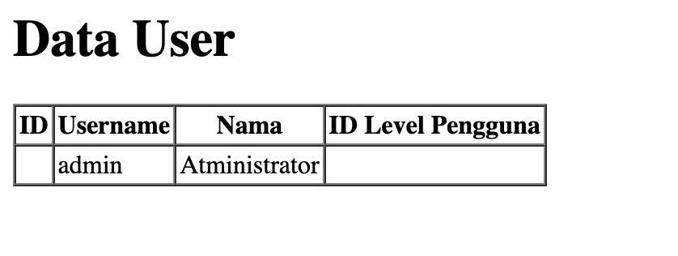
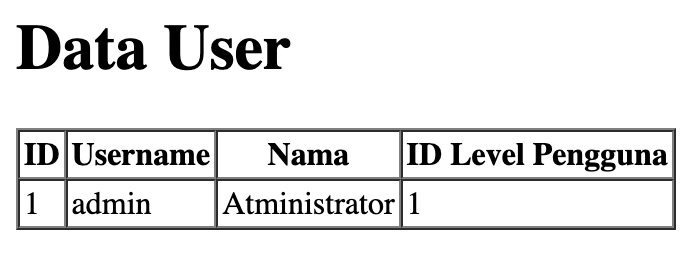

# Laporan Praktikum - Jobsheet 4
# Pemrograman Web Lanjut

**Nama:** Ghazwan Ababil  
**NIM:** 244107020151  
**Kelas:** TI-2F

---

## Daftar Isi
- [Praktikum 1 - Properti $fillable dan $guarded](#praktikum-1---properti-fillable-dan-guarded)
- [Praktikum 2.1 - Retrieving Single Models](#praktikum-21---retrieving-single-models)
- [Praktikum 2.2 - Not Found Exceptions](#praktikum-22---not-found-exceptions)

---

## Praktikum 1 - Properti $fillable dan $guarded

### Tujuan
Memahami cara menambahkan atribut (nama kolom) yang bisa kita isi ketika melakukan insert atau update ke database (Mass Assignment) menggunakan variabel `$fillable`.

### Langkah-Langkah Praktikum

#### 1. Menambahkan $fillable pada UserModel

Buka file model `UserModel.php` dan tambahkan properti `$fillable` untuk mengizinkan input ke kolom database.

**Code:**
```php
<?php

namespace App\Models;

use Illuminate\Database\Eloquent\Factories\HasFactory;
use Illuminate\Database\Eloquent\Model;

class UserModel extends Model
{
    use HasFactory;

    protected $table = 'm_user';        // Mendefinisikan nama tabel yang digunakan oleh model ini
    protected $primaryKey = 'user_id';  // Mendefinisikan primary key dari tabel yang digunakan
    
    protected $fillable = ['level_id', 'username', 'nama', 'password'];
}
```

#### 2. Menjalankan Create pada UserController

Buka file controller `UserController.php` dan ubah skrip pada fungsi `index()` untuk menambahkan data baru menggunakan `UserModel::create()`.

**Code:**
```php
<?php

namespace App\Http\Controllers;

use App\Models\UserModel;
use Illuminate\Support\Facades\Hash;
use Illuminate\Http\Request;

class UserController extends Controller
{
    public function index()
    {
        // tambah data user dengan Eloquent Model
        $data = [
            'level_id' => 2,
            'username' => 'manager_dua',
            'nama' => 'Manager 2',
            'password' => Hash::make('12345')
        ];
        UserModel::create($data); // tambahkan data ke tabel m_user
        
        $user = UserModel::all(); // ambil semua data dari tabel m_user
        return view('user', ['data' => $user]);
    }
}
```

Kode di atas akan mencoba menambahkan entri data user baru langsung ke database dengan memanfaatkan metode `create()` dari Eloquent.

#### 3. Update $fillable dan UserController untuk Simulasi Error

Ubah kembali file model `UserModel.php` pada bagian `$fillable` dengan **menghilangkan** `password`.

**Code:**
```php
<?php

namespace App\Models;

use Illuminate\Database\Eloquent\Factories\HasFactory;
use Illuminate\Database\Eloquent\Model;

class UserModel extends Model
{
    use HasFactory;

    protected $table = 'm_user';        // Mendefinisikan nama tabel yang digunakan oleh model ini
    protected $primaryKey = 'user_id';  // Mendefinisikan primary key dari tabel yang digunakan
    
    // password dihilangkan dari fillable
    protected $fillable = ['level_id', 'username', 'nama']; 
}
```

Ubah kembali method `index()` pada `UserController.php` dengan data baru (contohnya `manager_tiga`).

**Code:**
```php
    public function index()
    {
        // tambah data user dengan Eloquent Model
        $data = [
            'level_id' => 2,
            'username' => 'manager_tiga',
            'nama' => 'Manager 3',
            'password' => Hash::make('12345')
        ];
        UserModel::create($data); // tambahkan data ke tabel m_user
        
        $user = UserModel::all(); // ambil semua data dari tabel m_user
        return view('user', ['data' => $user]);
    }
```

**Penjelasan Singkat:**
Laravel melindungi aplikasi kita dari *Mass-Assignment Vulnerability*. Karena `password` dihapus dari `$fillable`, Eloquent akan membuang (mengabaikan) data `password` saat `UserModel::create($data)` dipanggil. Akibatnya, query SQL yang dikirim ke database tidak akan menyertakan `password`, dan database akan menolak Insert karena kolom `password` tidak memiliki default value dan bersifat *Required* (Mandatory / Not Null).

#### 4. Memperbaiki Error dan Menggunakan $fillable Kembali

Untuk memperbaiki error ini, kita harus menambahkan kembali `password` ke dalam properti `$fillable` di `UserModel.php`.

**Code (UserModel.php):**
```php
    protected $fillable = ['level_id', 'username', 'nama', 'password'];
```

**Code (UserController.php):**
```php
    public function index()
    {
        // tambah data user dengan Eloquent Model
        $data = [
            'level_id' => 2,
            'username' => 'manager_tiga',
            'nama' => 'Manager 3',
            'password' => Hash::make('12345')
        ];
        UserModel::create($data); // tambahkan data ke tabel m_user
        
        $user = UserModel::all(); // ambil semua data dari tabel m_user
        return view('user', ['data' => $user]);
    }
```

Setelah diperbaiki, ketika dijalankan pada browser, data `Manager 3` akan berhasil masuk.

 
*Output rendering pengguna setelah perbaikan Mass Assignment.*

---

## Praktikum 2.1 - Retrieving Single Models

### Tujuan
Mengambil data tunggal (satu baris data) dari basis data menggunakan metode `find()`, `first()`, dan `firstWhere()` dengan exception handling menggunakan `findOr` pada Eloquent ORM Laravel.

### Langkah-Langkah Praktikum

#### 1. Mengambil Single Data dengan `find`
Metode `find` digunakan untuk mengambil model Eloquent berdasarkan primary key-nya. Buka `UserController.php` dan modifikasi fungsinya. Pada `user.blade.php`, sesuaikan pemanggilan view karena struktur yang dikembalikan bukan lagi *array/collection*, melainkan *single object*.

**Code (UserController.php):**
```php
    public function index()
    {
        $user = UserModel::find(1);
        return view('user', ['data' => $user]);
    }
```

**Code (user.blade.php - Bagian Isi Tabel):**
```html
        <tr>
            <td>{{ $data->user_id }}</td>
            <td>{{ $data->username }}</td>
            <td>{{ $data->nama }}</td>
            <td>{{ $data->level_id }}</td>
        </tr>
```

**Penjelasan:** Pada percobaan ini, data dengan `user_id` bernilai 1 (yang diwakili oleh user `admin`) akan diambil dan ditampilkan pada layar tanpa memerlukan fungsi perulangan (iterasi) *foreach* di berkas `.blade.php`.

#### 2. Mengambil Single Data dengan `first`
Metode `first` mengambil baris (record) pertama hasil pencarian yang sesuai dengan kueri kondisi sebelum metode ini (berdasarkan *order*). Mengganti query di `UserController.php`:

**Code (UserController.php):**
```php
    public function index()
    {
        $user = UserModel::where('level_id', 1)->first();
        return view('user', ['data' => $user]);
    }
```
**Penjelasan:** Eloquent mencari seluruh tabel `m_user` dengan klausa limit kondisi `level_id = 1`. Di MySQL, ia akan mengembalikan deret teratas/pertama yang cocok dengan kondisi ini (pada database, kebetulan merupakan `admin`).  

#### 3. Mengambil Single Data dengan `firstWhere`
Metode `firstWhere` merupakan *syntactic sugar*/shortcut untuk pemanggilan klausa `where(...)->first()`. Metode ini bekerja sama persis namun lebih ringkas untuk dibaca programmer.

**Code (UserController.php):**
```php
    public function index()
    {
        $user = UserModel::firstWhere('level_id', 1);
        return view('user', ['data' => $user]);
    }
```
**Penjelasan:** Sama seperti Langkah 2, data pertama dengan kolom kondisi `level_id = 1` ditarik dan dikirimkan ke View untuk dirender.  

#### 4. Menangani Exception Menggunakan `findOr`
Metode `findOr` atau `firstOr` dieksekusi ketika data yang dicari tidak ada, sehingga memicu callback/closure function yang kita sertakan. Pada kasus ini, fungsi closure dieksekusi untuk memanggil `abort(404)`.

**Kasus A: Nilai Data Ditemukan (ID = 1)**
**Code (UserController.php):**
```php
    public function index()
    {
        $user = UserModel::findOr(1, ['username', 'nama'], function () {
            abort(404);
        });
        return view('user', ['data' => $user]);
    }
```
**Penjelasan:** Karena User dengan ID = 1 tersedia di database, fungsi berjalan layaknya `find()`, namun yang diambil hanyalah field `username` dan `nama`. Karenanya, `user_id` dan `level_id` pada tampilan tabel merender bentuk kosong karena datanya tersaring *(filtered select)* di level basis data.

 
*Output rendering pengguna setelah perbaikan Mass Assignment.*

**Kasus B: Nilai Data Tidak Ditemukan (ID = 20)**
**Code (UserController.php):**
```php
    public function index()
    {
        $user = UserModel::findOr(20, ['username', 'nama'], function () {
            abort(404);
        });
        return view('user', ['data' => $user]);
    }
```
**Penjelasan Singkat:** Ketika query mendeteksi tidak beradanya User dengan ID 20, Eloquent men-trigger *closure fallback* di parameter ketiga. Fungsi `abort(404)` langsung mematikan response web dan melempar halaman error `404 Not Found` built-in Laravel ke sisi browser client.

---

## Praktikum 2.2 - Not Found Exceptions

### Tujuan
Memahami cara Laravel *Eloquent ORM* menangani pencarian baris data yang gagal atau tidak ditemukan menggunakan varian kueri Exception (`findOrFail` dan `firstOrFail`). Alih-alih mengembalikan list array kosong, model ini akan melempar error HTTP `404 Not Found`.

### Langkah-Langkah Praktikum

#### 1. Menguji Pencarian Exception dengan `findOrFail`
Menjalankan pencarian instance model yang kita yakini bernilai ada (`id = 1`) pada basis data menggunakan `findOrFail()`.

**Code (UserController.php):**
```php
    public function index()
    {
        // $user = UserModel::findOr(1, ['username', 'nama'], function () {
        //     abort(404);
        // });

        $user = UserModel::findOrFail(1);
        return view('user', ['data' => $user]);
    }
```
**Penjelasan:** Sama seperti `find()`, parameter mencerminkan *Primary Key*. Karena baris ID kelas 1 tersedia di tabel `m_user`, eksekusi skrip ini di controller berjalan normal (*Success 200 OK*), merender tampilan tabel dengan isi data dari identitas Administrator. Metode `...OrFail` hanya melempar halaman Error Exception apabila data baris tersebut benar-benar kosong.


*Output rendering pengguna saat ID ditemukan pada pencarian findOrFail()*

#### 2. Mensimulasikan Kegagalan dengan `firstOrFail`
Pada simulasi kali ini, kita mengambil entitas skema dari parameter kolom string tertentu dengan *username* `manager9`. Asumsinya `manager9` tidak pernah didaftarkan pada Seeder database kita.

**Code (UserController.php):**
```php
    public function index()
    {
        // $user = UserModel::findOrFail(1);
        $user = UserModel::where('username', 'manager9')->firstOrFail();
        return view('user', ['data' => $user]);
    }
```
**Penjelasan:** Saat dijalankan, Laravel memicu error `Illuminate\Database\Eloquent\ModelNotFoundException` dan melemparkan respon halaman *Standard Laravel 404 Exception Not Found*.

Apabila kita menggunakan fungsi iterasi biasa `first()` dan bukannya `firstOrFail()`, backend aplikasi umumnya akan mengalami *Trying to get property of non-object* (error 500) pada blok view karena variable array yang ditarik bernilai `NULL`. Dengan memanfaatkan `OrFail()`, kita mendelegasikan status respon kesalahan standar REST API kepada pengguna secara aman tanpa merusak logic template.


*Output halaman error 404 dari web server Laravel atas ModelNotFoundException*

---