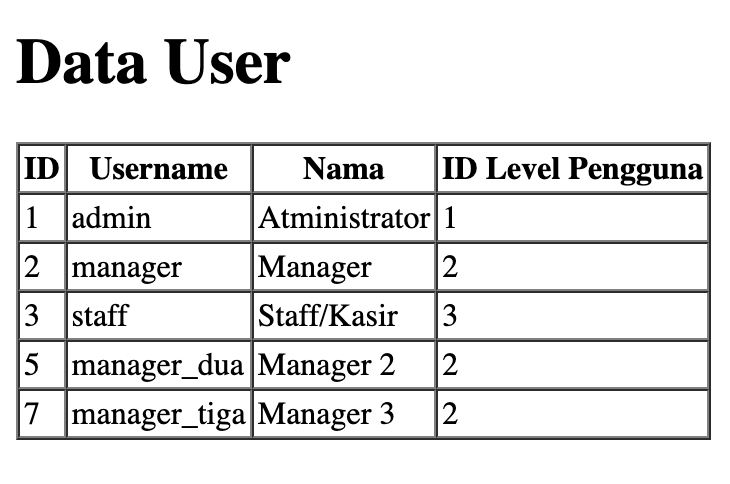

# Laporan Praktikum - Jobsheet 4
# Pemrograman Web Lanjut

**Nama:** Ghazwan Ababil  
**NIM:** 244107020151  
**Kelas:** TI-2F

---

## Daftar Isi
- [Praktikum 1 - Properti $fillable dan $guarded](#praktikum-1---properti-fillable-dan-guarded)

---

## Praktikum 1 - Properti $fillable dan $guarded

### Tujuan
Memahami cara menambahkan atribut (nama kolom) yang bisa kita isi ketika melakukan insert atau update ke database (Mass Assignment) menggunakan variabel `$fillable`.

### Langkah-Langkah Praktikum

#### 1. Menambahkan $fillable pada UserModel

Buka file model `UserModel.php` dan tambahkan properti `$fillable` untuk mengizinkan input ke kolom database.

**Code:**
```php
<?php

namespace App\Models;

use Illuminate\Database\Eloquent\Factories\HasFactory;
use Illuminate\Database\Eloquent\Model;

class UserModel extends Model
{
    use HasFactory;

    protected $table = 'm_user';        // Mendefinisikan nama tabel yang digunakan oleh model ini
    protected $primaryKey = 'user_id';  // Mendefinisikan primary key dari tabel yang digunakan
    
    protected $fillable = ['level_id', 'username', 'nama', 'password'];
}
```

#### 2. Menjalankan Create pada UserController

Buka file controller `UserController.php` dan ubah skrip pada fungsi `index()` untuk menambahkan data baru menggunakan `UserModel::create()`.

**Code:**
```php
<?php

namespace App\Http\Controllers;

use App\Models\UserModel;
use Illuminate\Support\Facades\Hash;
use Illuminate\Http\Request;

class UserController extends Controller
{
    public function index()
    {
        // tambah data user dengan Eloquent Model
        $data = [
            'level_id' => 2,
            'username' => 'manager_dua',
            'nama' => 'Manager 2',
            'password' => Hash::make('12345')
        ];
        UserModel::create($data); // tambahkan data ke tabel m_user
        
        $user = UserModel::all(); // ambil semua data dari tabel m_user
        return view('user', ['data' => $user]);
    }
}
```

Kode di atas akan mencoba menambahkan entri data user baru langsung ke database dengan memanfaatkan metode `create()` dari Eloquent.

#### 3. Update $fillable dan UserController untuk Simulasi Error

Ubah kembali file model `UserModel.php` pada bagian `$fillable` dengan **menghilangkan** `password`.

**Code:**
```php
<?php

namespace App\Models;

use Illuminate\Database\Eloquent\Factories\HasFactory;
use Illuminate\Database\Eloquent\Model;

class UserModel extends Model
{
    use HasFactory;

    protected $table = 'm_user';        // Mendefinisikan nama tabel yang digunakan oleh model ini
    protected $primaryKey = 'user_id';  // Mendefinisikan primary key dari tabel yang digunakan
    
    // password dihilangkan dari fillable
    protected $fillable = ['level_id', 'username', 'nama']; 
}
```

Ubah kembali method `index()` pada `UserController.php` dengan data baru (contohnya `manager_tiga`).

**Code:**
```php
    public function index()
    {
        // tambah data user dengan Eloquent Model
        $data = [
            'level_id' => 2,
            'username' => 'manager_tiga',
            'nama' => 'Manager 3',
            'password' => Hash::make('12345')
        ];
        UserModel::create($data); // tambahkan data ke tabel m_user
        
        $user = UserModel::all(); // ambil semua data dari tabel m_user
        return view('user', ['data' => $user]);
    }
```

**Penjelasan Singkat:**
Laravel melindungi aplikasi kita dari *Mass-Assignment Vulnerability*. Karena `password` dihapus dari `$fillable`, Eloquent akan membuang (mengabaikan) data `password` saat `UserModel::create($data)` dipanggil. Akibatnya, query SQL yang dikirim ke database tidak akan menyertakan `password`, dan database akan menolak Insert karena kolom `password` tidak memiliki default value dan bersifat *Required* (Mandatory / Not Null).

#### 4. Memperbaiki Error dan Menggunakan $fillable Kembali

Untuk memperbaiki error ini, kita harus menambahkan kembali `password` ke dalam properti `$fillable` di `UserModel.php`.

**Code (UserModel.php):**
```php
    protected $fillable = ['level_id', 'username', 'nama', 'password'];
```

**Code (UserController.php):**
```php
    public function index()
    {
        // tambah data user dengan Eloquent Model
        $data = [
            'level_id' => 2,
            'username' => 'manager_tiga',
            'nama' => 'Manager 3',
            'password' => Hash::make('12345')
        ];
        UserModel::create($data); // tambahkan data ke tabel m_user
        
        $user = UserModel::all(); // ambil semua data dari tabel m_user
        return view('user', ['data' => $user]);
    }
```

Setelah diperbaiki, ketika dijalankan pada browser, data `Manager 3` akan berhasil masuk.

 
*Output rendering pengguna setelah perbaikan Mass Assignment.*

---