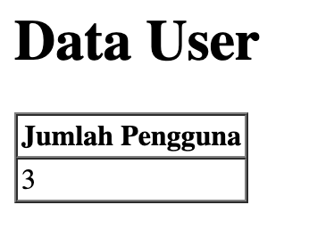
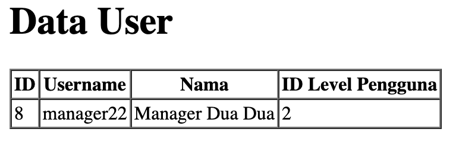
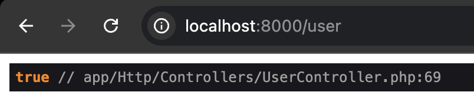

# Laporan Praktikum - Jobsheet 4
# Pemrograman Web Lanjut

**Nama:** Ghazwan Ababil  
**NIM:** 244107020151  
**Kelas:** TI-2F

---

## Daftar Isi
- [Praktikum 1 - Properti $fillable dan $guarded](#praktikum-1---properti-fillable-dan-guarded)
- [Praktikum 2.1 - Retrieving Single Models](#praktikum-21---retrieving-single-models)
- [Praktikum 2.2 - Not Found Exceptions](#praktikum-22---not-found-exceptions)
- [Praktikum 2.3 - Retrieving Aggregates](#praktikum-23---retrieving-aggregates)
- [Praktikum 2.4 - Retrieving or Creating Models](#praktikum-24---retrieving-or-creating-models)
- [Praktikum 2.5 - Attribute Changes](#praktikum-25---attribute-changes)

---

## Praktikum 1 - Properti $fillable dan $guarded

### Tujuan
Memahami cara menambahkan atribut (nama kolom) yang bisa kita isi ketika melakukan insert atau update ke database (Mass Assignment) menggunakan variabel `$fillable`.

### Langkah-Langkah Praktikum

#### 1. Menambahkan $fillable pada UserModel

Buka file model `UserModel.php` dan tambahkan properti `$fillable` untuk mengizinkan input ke kolom database.

**Code:**
```php
<?php

namespace App\Models;

use Illuminate\Database\Eloquent\Factories\HasFactory;
use Illuminate\Database\Eloquent\Model;

class UserModel extends Model
{
    use HasFactory;

    protected $table = 'm_user';        // Mendefinisikan nama tabel yang digunakan oleh model ini
    protected $primaryKey = 'user_id';  // Mendefinisikan primary key dari tabel yang digunakan
    
    protected $fillable = ['level_id', 'username', 'nama', 'password'];
}
```

#### 2. Menjalankan Create pada UserController

Buka file controller `UserController.php` dan ubah skrip pada fungsi `index()` untuk menambahkan data baru menggunakan `UserModel::create()`.

**Code:**
```php
<?php

namespace App\Http\Controllers;

use App\Models\UserModel;
use Illuminate\Support\Facades\Hash;
use Illuminate\Http\Request;

class UserController extends Controller
{
    public function index()
    {
        // tambah data user dengan Eloquent Model
        $data = [
            'level_id' => 2,
            'username' => 'manager_dua',
            'nama' => 'Manager 2',
            'password' => Hash::make('12345')
        ];
        UserModel::create($data); // tambahkan data ke tabel m_user
        
        $user = UserModel::all(); // ambil semua data dari tabel m_user
        return view('user', ['data' => $user]);
    }
}
```

Kode di atas akan mencoba menambahkan entri data user baru langsung ke database dengan memanfaatkan metode `create()` dari Eloquent.

#### 3. Update $fillable dan UserController untuk Simulasi Error

Ubah kembali file model `UserModel.php` pada bagian `$fillable` dengan **menghilangkan** `password`.

**Code:**
```php
<?php

namespace App\Models;

use Illuminate\Database\Eloquent\Factories\HasFactory;
use Illuminate\Database\Eloquent\Model;

class UserModel extends Model
{
    use HasFactory;

    protected $table = 'm_user';        // Mendefinisikan nama tabel yang digunakan oleh model ini
    protected $primaryKey = 'user_id';  // Mendefinisikan primary key dari tabel yang digunakan
    
    // password dihilangkan dari fillable
    protected $fillable = ['level_id', 'username', 'nama']; 
}
```

Ubah kembali method `index()` pada `UserController.php` dengan data baru (contohnya `manager_tiga`).

**Code:**
```php
    public function index()
    {
        // tambah data user dengan Eloquent Model
        $data = [
            'level_id' => 2,
            'username' => 'manager_tiga',
            'nama' => 'Manager 3',
            'password' => Hash::make('12345')
        ];
        UserModel::create($data); // tambahkan data ke tabel m_user
        
        $user = UserModel::all(); // ambil semua data dari tabel m_user
        return view('user', ['data' => $user]);
    }
```

**Penjelasan Singkat:**
Laravel melindungi aplikasi kita dari *Mass-Assignment Vulnerability*. Karena `password` dihapus dari `$fillable`, Eloquent akan membuang (mengabaikan) data `password` saat `UserModel::create($data)` dipanggil. Akibatnya, query SQL yang dikirim ke database tidak akan menyertakan `password`, dan database akan menolak Insert karena kolom `password` tidak memiliki default value dan bersifat *Required* (Mandatory / Not Null).

#### 4. Memperbaiki Error dan Menggunakan $fillable Kembali

Untuk memperbaiki error ini, kita harus menambahkan kembali `password` ke dalam properti `$fillable` di `UserModel.php`.

**Code (UserModel.php):**
```php
    protected $fillable = ['level_id', 'username', 'nama', 'password'];
```

**Code (UserController.php):**
```php
    public function index()
    {
        // tambah data user dengan Eloquent Model
        $data = [
            'level_id' => 2,
            'username' => 'manager_tiga',
            'nama' => 'Manager 3',
            'password' => Hash::make('12345')
        ];
        UserModel::create($data); // tambahkan data ke tabel m_user
        
        $user = UserModel::all(); // ambil semua data dari tabel m_user
        return view('user', ['data' => $user]);
    }
```

Setelah diperbaiki, ketika dijalankan pada browser, data `Manager 3` akan berhasil masuk.

 
*Output rendering pengguna setelah perbaikan Mass Assignment.*

---

## Praktikum 2.1 - Retrieving Single Models

### Tujuan
Mengambil data tunggal (satu baris data) dari basis data menggunakan metode `find()`, `first()`, dan `firstWhere()` dengan exception handling menggunakan `findOr` pada Eloquent ORM Laravel.

### Langkah-Langkah Praktikum

#### 1. Mengambil Single Data dengan `find`
Metode `find` digunakan untuk mengambil model Eloquent berdasarkan primary key-nya. Buka `UserController.php` dan modifikasi fungsinya. Pada `user.blade.php`, sesuaikan pemanggilan view karena struktur yang dikembalikan bukan lagi *array/collection*, melainkan *single object*.

**Code (UserController.php):**
```php
    public function index()
    {
        $user = UserModel::find(1);
        return view('user', ['data' => $user]);
    }
```

**Code (user.blade.php - Bagian Isi Tabel):**
```html
        <tr>
            <td>{{ $data->user_id }}</td>
            <td>{{ $data->username }}</td>
            <td>{{ $data->nama }}</td>
            <td>{{ $data->level_id }}</td>
        </tr>
```

**Penjelasan:** Pada percobaan ini, data dengan `user_id` bernilai 1 (yang diwakili oleh user `admin`) akan diambil dan ditampilkan pada layar tanpa memerlukan fungsi perulangan (iterasi) *foreach* di berkas `.blade.php`.

#### 2. Mengambil Single Data dengan `first`
Metode `first` mengambil baris (record) pertama hasil pencarian yang sesuai dengan kueri kondisi sebelum metode ini (berdasarkan *order*). Mengganti query di `UserController.php`:

**Code (UserController.php):**
```php
    public function index()
    {
        $user = UserModel::where('level_id', 1)->first();
        return view('user', ['data' => $user]);
    }
```
**Penjelasan:** Eloquent mencari seluruh tabel `m_user` dengan klausa limit kondisi `level_id = 1`. Di MySQL, ia akan mengembalikan deret teratas/pertama yang cocok dengan kondisi ini (pada database, kebetulan merupakan `admin`).  

#### 3. Mengambil Single Data dengan `firstWhere`
Metode `firstWhere` merupakan *syntactic sugar*/shortcut untuk pemanggilan klausa `where(...)->first()`. Metode ini bekerja sama persis namun lebih ringkas untuk dibaca programmer.

**Code (UserController.php):**
```php
    public function index()
    {
        $user = UserModel::firstWhere('level_id', 1);
        return view('user', ['data' => $user]);
    }
```
**Penjelasan:** Sama seperti Langkah 2, data pertama dengan kolom kondisi `level_id = 1` ditarik dan dikirimkan ke View untuk dirender.  

#### 4. Menangani Exception Menggunakan `findOr`
Metode `findOr` atau `firstOr` dieksekusi ketika data yang dicari tidak ada, sehingga memicu callback/closure function yang kita sertakan. Pada kasus ini, fungsi closure dieksekusi untuk memanggil `abort(404)`.

**Kasus A: Nilai Data Ditemukan (ID = 1)**
**Code (UserController.php):**
```php
    public function index()
    {
        $user = UserModel::findOr(1, ['username', 'nama'], function () {
            abort(404);
        });
        return view('user', ['data' => $user]);
    }
```
**Penjelasan:** Karena User dengan ID = 1 tersedia di database, fungsi berjalan layaknya `find()`, namun yang diambil hanyalah field `username` dan `nama`. Karenanya, `user_id` dan `level_id` pada tampilan tabel merender bentuk kosong karena datanya tersaring *(filtered select)* di level basis data.

 
*Output rendering pengguna setelah perbaikan Mass Assignment.*

**Kasus B: Nilai Data Tidak Ditemukan (ID = 20)**
**Code (UserController.php):**
```php
    public function index()
    {
        $user = UserModel::findOr(20, ['username', 'nama'], function () {
            abort(404);
        });
        return view('user', ['data' => $user]);
    }
```
**Penjelasan Singkat:** Ketika query mendeteksi tidak beradanya User dengan ID 20, Eloquent men-trigger *closure fallback* di parameter ketiga. Fungsi `abort(404)` langsung mematikan response web dan melempar halaman error `404 Not Found` built-in Laravel ke sisi browser client.

---

## Praktikum 2.2 - Not Found Exceptions

### Tujuan
Memahami cara Laravel *Eloquent ORM* menangani pencarian baris data yang gagal atau tidak ditemukan menggunakan varian kueri Exception (`findOrFail` dan `firstOrFail`). Alih-alih mengembalikan list array kosong, model ini akan melempar error HTTP `404 Not Found`.

### Langkah-Langkah Praktikum

#### 1. Menguji Pencarian Exception dengan `findOrFail`
Menjalankan pencarian instance model yang kita yakini bernilai ada (`id = 1`) pada basis data menggunakan `findOrFail()`.

**Code (UserController.php):**
```php
    public function index()
    {
        // $user = UserModel::findOr(1, ['username', 'nama'], function () {
        //     abort(404);
        // });

        $user = UserModel::findOrFail(1);
        return view('user', ['data' => $user]);
    }
```
**Penjelasan:** Sama seperti `find()`, parameter mencerminkan *Primary Key*. Karena baris ID kelas 1 tersedia di tabel `m_user`, eksekusi skrip ini di controller berjalan normal (*Success 200 OK*), merender tampilan tabel dengan isi data dari identitas Administrator. Metode `...OrFail` hanya melempar halaman Error Exception apabila data baris tersebut benar-benar kosong.


*Output rendering pengguna saat ID ditemukan pada pencarian findOrFail()*

#### 2. Mensimulasikan Kegagalan dengan `firstOrFail`
Pada simulasi kali ini, kita mengambil entitas skema dari parameter kolom string tertentu dengan *username* `manager9`. Asumsinya `manager9` tidak pernah didaftarkan pada Seeder database kita.

**Code (UserController.php):**
```php
    public function index()
    {
        // $user = UserModel::findOrFail(1);
        $user = UserModel::where('username', 'manager9')->firstOrFail();
        return view('user', ['data' => $user]);
    }
```
**Penjelasan:** Saat dijalankan, Laravel memicu error `Illuminate\Database\Eloquent\ModelNotFoundException` dan melemparkan respon halaman *Standard Laravel 404 Exception Not Found*.

Apabila kita menggunakan fungsi iterasi biasa `first()` dan bukannya `firstOrFail()`, backend aplikasi umumnya akan mengalami *Trying to get property of non-object* (error 500) pada blok view karena variable array yang ditarik bernilai `NULL`. Dengan memanfaatkan `OrFail()`, kita mendelegasikan status respon kesalahan standar REST API kepada pengguna secara aman tanpa merusak logic template.


*Output halaman error 404 dari web server Laravel atas ModelNotFoundException*

---

## Praktikum 2.3 - Retrieving Aggregates

### Tujuan
Menggunakan fungsi bawaan agregasi SQL melalui Eloquent (seperti `count`, `max`, `min`, `avg`, `sum`) guna mengambil data rekap analitik berbentuk angka/nilai konkrit (bukan berupa collection objek dari baris tabel). 

### Langkah-Langkah Praktikum

#### 1. Menguji Pencarian Aggregate dengan `count()`
Pada percobaan kali ini, kita akan menghitung jumlah pengguna yang memiliki role `level_id = 2` (Manager). Buka `UserController.php` dan update source kodenya menggunakan kueri metode `count()`.

**Code (UserController.php):**
```php
    public function index()
    {
        // $user = UserModel::where('username', 'manager9')->firstOrFail();
        $user = UserModel::where('level_id', 2)->count();
        // dd($user);
        return view('user', ['data' => $user]);
    }
```

Karena variabel agregat ini sekarang me-return skalar integer secara spesifik (hanya murni nilai angka total tanpa skema properties layaknya sebuah object), kita perlu menyesuaikan kembali views `user.blade.php` agar dapat me-render nilainya tanpa menimbulkan syntax error iterasi:

**Code (user.blade.php):**
```html
    <table border="1" cellpadding="2" cellspacing="0">
        <tr>
            <th>Jumlah Pengguna</th>
        </tr>
        <tr>
            <td>{{ $data }}</td>
        </tr>
    </table>
```

**Penjelasan:** *Method* `count()` merepresentasikan *Function Database* `COUNT()` yang berjalan di belakang layar. Karena kita memiliki 3 data entri yang memegang ID level manajer (contoh dari seeder dan tambahan baru `"manager_dua"` serta `"manager_tiga"`), angka **3** dicetak berkat query builder Eloquent.


*Output jumlah pengguna menggunakan fungsi count() pada method index()*

---

## Praktikum 2.4 - Retrieving or Creating Models

### Tujuan
Menggunakan metode pencarian *(retrieving)* yang sekaligus dipasangkan dengan skema inisiasi *(creating)* obyek Eloquent bernama `firstOrCreate` dan `firstOrNew`. Metode ini memudahkan kita melakukan validasi otomatis "Cari jika ada, Buat jika belum ada" tanpa melakukan percabangan `if (is_null($user))` secara manual. 

### Langkah-Langkah Praktikum

#### 1. Membuat Data Baru Menggunakan `firstOrCreate`
Pertama-tama kita melakukan perombakan kembali pada `user.blade.php` sehingga dapat menampilkan format tabel standar yang memanjang `foreach`/menampilkan properti Object Model tunggal (tidak lagi mencetak atribut Aggregate count tunggal).

Selanjutnya, di `UserController.php`, ujikan fungsi insert dan find berikut ini untuk membuat pengguna `manager22`.

**Code (UserController.php):**
```php
    public function index()
    {
        $user = UserModel::firstOrCreate(
            ['username' => 'manager22'],
            ['nama' => 'Manager Dua Dua', 'password' => Hash::make('12345'), 'level_id' => 2]
        );

        return view('user', ['data' => $user]);
    }
```
**Penjelasan:** Parameter pertama dari metode ini (`['username' => 'manager22']`) berperan sebagai kondisi klausa "Cari/Where". Karena data `manager22` belum ada di Database tabel `m_user`, sistem otomatis menyisipkan record *(Insert)* berbekal tambahan atribut dari parameter kedua (seperti `nama`, `password`, dan `level_id`) agar tidak melanggar aturan constraint MySQL. Setelah di-*create*, instance-nya divalidasi dan di-*return* sebagai Single Model dan ditampilkan ke Views.


*Output manager22 berhasil di-insert dari kueri firstOrCreate()*

<br>

*(Catatan:* Pengecekan *Error HTTP 500*: Apabila Anda menghapus atribut `password` di properti `$fillable` Model saat mengerjakan Praktikum 1 sebelumnya, silakan tambahkan kembali *tag* parameter `password` tersebut agar insert berjalan baik dan lolos pengecekan MassAssignmentVulnerability).*

#### 2. Mensimulasikan `firstOrCreate` Pada Data Eksisting 
Kini, kita coba memanggil *method* yang persis sama namun mengujikannya ke identitas kolom `username` yang diketahui telah eksis di database (seperti nilai record `manager` dari table seeder).

**Code (UserController.php):**
```php
    public function index()
    {
        $user = UserModel::firstOrCreate(
            ['username' => 'manager'],
            ['nama' => 'Manager', 'password' => Hash::make('12345'), 'level_id' => 2]
        );
        return view('user', ['data' => $user]);
    }
```

**Penjelasan Singkat:** Nilai param array kedua akan murni diabaikan. Eloquent berhasil menemukan instance User `manager` saat mencari klausulnya. Alhasil, yang dijalankan hanya query pembacaan data original *(Retrieve)* biasa dan me-return baris entitas manager dari ID 2.

#### 3. Membuat Basis Model Baru Menggunakan `firstOrNew`
Metode `firstOrNew` memiliki tujuan yang persis sama (mengambil data yang ada, atau membuat data baru), **tetapi jika record belum ditemukan, instance model yang baru tersebut TIDAK akan otomatis di-insert/disimpan ke dalam database**. Untuk dapat menulis ke tabel, pengguna harus memanggil metode `->save()` setelahnya.

**Code (UserController.php):**
```php
    public function index()
    {
        $user = UserModel::firstOrNew(
            ['username' => 'manager33'],
            ['nama' => 'Manager Tiga Tiga', 'password' => Hash::make('12345'), 'level_id' => 2]
        );
        $user->save();
        return view('user', ['data' => $user]);
    }
```

**Penjelasan Singkat:** `manager33` berhasil dipanggil karena belum ada pada tabel dan ia diinisialisasi terlebih dahulu ke instan virtual PHP. Kemudian model instance tersebut *di-apply* perubahannya ke database `m_user` dengan method `save()`.

#### 4. Mensimulasikan `firstOrNew` Pada Data Eksisting 
Metodologi pencarian saat `firstOrNew` diberikan kondisi query data yang sudah eksis di Database sama halnya dengan `firstOrCreate`.

**Code (UserController.php):**
```php
    public function index()
    {
        $user = UserModel::firstOrNew(
            ['username' => 'manager'],
            ['nama' => 'Manager', 'password' => Hash::make('12345'), 'level_id' => 2]
        );
        return view('user', ['data' => $user]);
    }
```
**Hasil:** Controller menampilkan data User eksisting dengan baris User ID=2 (manager), record tidak diduplikasikan maupun dimodifikasi valuenya pada struktur basis datanya.

---

## Praktikum 2.5 - Attribute Changes

### Tujuan
Menggunakan metode status flag bawaan objek model dari *Eloquent* yaitu `isDirty()`, `isClean()`, dan `wasChanged()` untuk memeriksa apakah atribut (field data) pada memori lokal saat ini telah diketik atau dimodifikasi sebelum/sesudah query `save()` dijalankan ke database.

### Langkah-Langkah Praktikum

Pada percobaan ini, kita akan membuat satu data user menggunakan `UserModel::create()`, memodifikasi value kolom `username`-nya secara *in-memory* menggunakan pengenal Objek (bukan query UPDATE), lalu mengecek state dari properti objek tersebut.

Buka file `UserController.php`, lalu buat baris percobaannya.

**Code (UserController.php):**
```php
    public function index()
    {
        $user = UserModel::create([
            'username' => 'manager11',
            'nama' => 'Manager11',
            'level_id' => 2,
            'password' => Hash::make('12345'),
        ]);

        $user->username = 'manager12';

        $user->isDirty(); // true
        $user->isDirty('username'); // true
        $user->isDirty('nama'); // false
        $user->isClean(); // false
        $user->isClean('username'); // false
        $user->isClean('nama'); // true

        $user->save();

        $user->isDirty(); // false
        $user->isClean(); // true
        $user->wasChanged(); // true
        $user->wasChanged('username'); // true
        $user->wasChanged(['username', 'level_id']); // true
        $user->wasChanged('nama'); // false
        dd($user->wasChanged(['nama', 'username']));

        return view('user', ['data' => $user]);
    }
```

**Penjelasan Tahapan Eksekusi Code:**

1. **Inisiasi & Perubahan (*Dirty State*):** Variabel *user* dibuat dan langsung di-insert ke tabel. Variabel tersebut berada pada memori RAM yang berisi instance Data dengan nilai awal. Programmer lalu menimpa field `username` dari `'manager11'` menjadi `'manager12'`. Karena *assignment* operasi di memori ini belum di-*save* ke DBMS, parameter flag `isDirty()` untuk keseluruhan tabel maupun kolom `username` akan mengembalikan `TRUE` (data kotor/berubah di memori). Hal yang sama berlaku pada `isClean('username')` yang otomatis menjadi `FALSE` (kebalikan dari metode *Dirty*). Parameter tidak disentuh seperti `'nama'` memegang angka mutlak bawaannya sehingga nilainya *Clean* (`isClean('nama') = TRUE`).
2. **Commiting to Model (`save()`):** Ketika state yang *kotor* tadi (`manager12`) dikonfirmasikan oleh driver PDO melalui *method* `$user->save()`, perubahan tersebut dibekukan (dimasukkan permanent) ke dalam tabel `m_user`.
3. **Paska Implementasi (`wasChanged`):** Seusai instance tersimpan utuh, state `isDirty()` kembali bernilai `FALSE` dan `isClean()` berefresh otomatis menjadi `TRUE`! Lalu, demi mencaritahu history / log perubahan apa saja yang telah memodifikasi instance Database tersebut selama eksekusi controller berjalan, fungsi detektor `wasChanged()` menahan history-nya (Contoh: `wasChanged('username') = TRUE` karena memang dirubah satu cycle ke belakang; dan sebaliknya untuk `nama`).


---