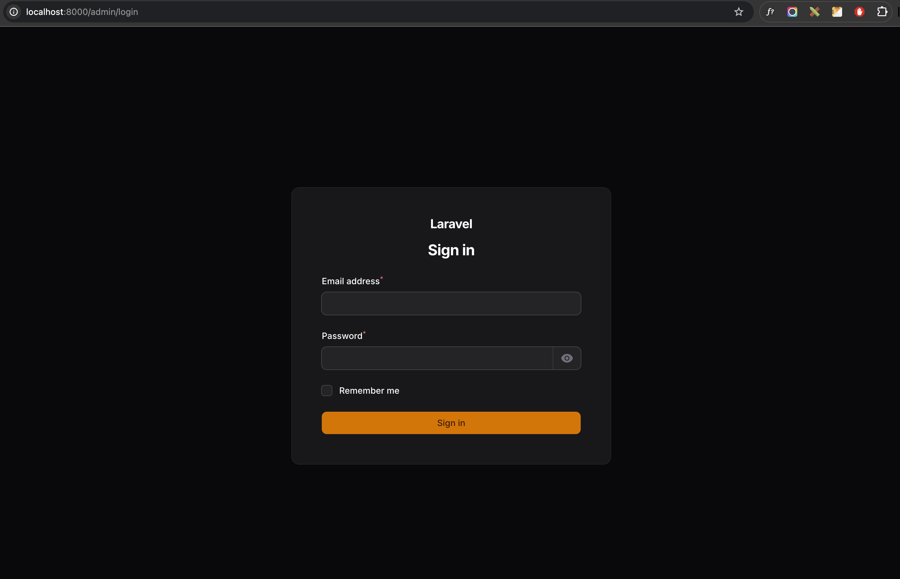
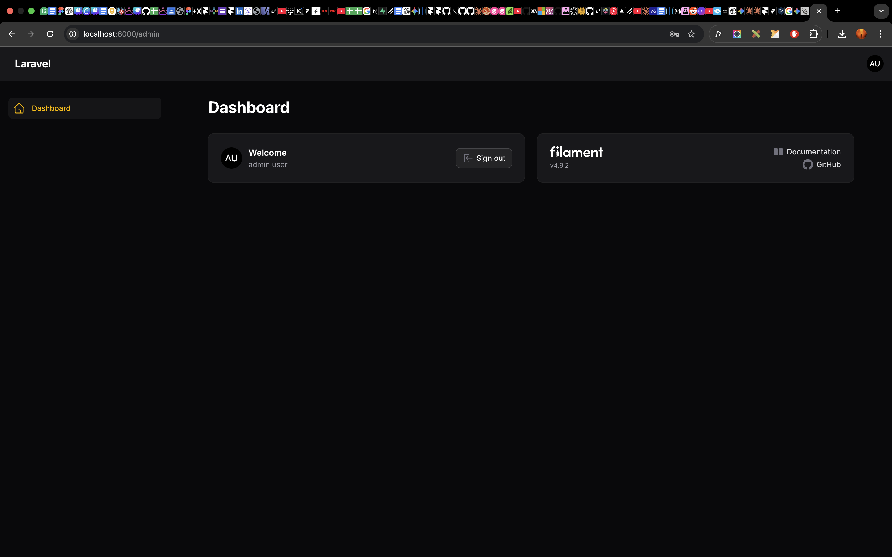
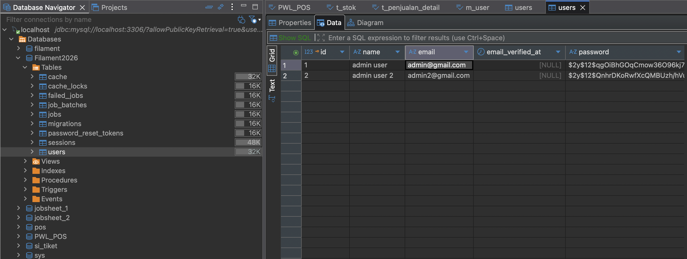

# Laporan Praktikum Jobsheet 5
# Pemrograman Web Lanjut

## Data Diri

| Field | Keterangan |
|-------|------------|
| Nama | Ghazwan Ababil |
| NIM | 244107020151 |
| Kelas | TI-2F |
| Mata Kuliah | Pemrograman Web Lanjut |
| Topik | Instalasi dan Setup Filament PHP v4 |

---

## Tujuan Pembelajaran

Setelah menyelesaikan praktikum ini, mahasiswa mampu:

1. Menjelaskan konsep dasar Filament PHP.
2. Menyebutkan requirement Filament v4.
3. Membuat project Laravel baru.
4. Menginstall dan mengkonfigurasi Filament v4.
5. Membuat user admin Filament.
6. Menjalankan dan mengakses admin panel.

---

## A. Pengenalan Filament PHP

Filament adalah framework UI open-source berbasis Laravel untuk membangun admin panel secara cepat dan elegan.

Filament dibangun menggunakan:

1. Laravel
2. Livewire
3. Alpine.js
4. Tailwind CSS

Website resmi: https://filamentphp.com

---

## B. Requirement Sistem

| Software | Versi Minimum |
|----------|----------------|
| PHP | >= 8.2 |
| Laravel | >= 11 |
| Tailwind CSS | >= 4.0 |
| Database | MySQL / SQLite |

---

## C. Langkah Praktikum

### Langkah 1 - Membuat Project Laravel Baru

Project dibuat dengan perintah:

```bash
laravel new jobsheet-5 --no-interaction --no-authentication --pest --database=sqlite --npm
```

Catatan:

1. Praktikum meminta nama project disesuaikan menjadi jobsheet-5, dan sudah diterapkan.
2. Installer Laravel global pada lingkungan ini menghasilkan Laravel 13.x (tetap kompatibel untuk instalasi Filament v4).

### Langkah 2 - Konfigurasi Database MySQL

File env dikonfigurasi menjadi MySQL:

```env
DB_CONNECTION=mysql
DB_HOST=127.0.0.1
DB_PORT=3306
DB_DATABASE=Filament2026
DB_USERNAME=root
DB_PASSWORD=********
```

Kemudian migrasi dijalankan:

```bash
php artisan migrate
```

Status akhir: migrasi sukses dan struktur tabel siap digunakan.

### Langkah 3 - Install Filament v4

Instalasi package Filament:

```bash
composer require filament/filament:"^4.0"
```

Instalasi Panel Builder:

```bash
php artisan filament:install --panels --no-interaction
```

Hasil instalasi:

1. Provider panel admin berhasil dibuat pada app/Providers/Filament/AdminPanelProvider.php.
2. Provider terdaftar di bootstrap/providers.php.
3. Asset Filament berhasil dipublish.

### Langkah 4 - Membuat User Admin

User admin dibuat dengan command:

```bash
php artisan make:filament-user --name="admin user" --email="admin@gmail.com" --password="123456" --panel=admin --no-interaction
```

Status akhir: user admin berhasil dibuat dan dapat login ke panel.

### Langkah 5 - Menjalankan Aplikasi

Menjalankan server:

```bash
php artisan serve
```

Akses panel admin:

http://localhost:8000/admin/login

Akun login:

1. Email: admin@gmail.com
2. Password: 123456
3. Email: admin2@gmail.com
4. Password: 12345678

---

## D. Hasil yang Diharapkan

Hasil yang diperoleh setelah praktikum:

1. Halaman login Filament dapat diakses.
2. Dashboard admin Filament dapat dibuka setelah login.
3. Dark mode tersedia sebagai fitur bawaan Filament.
4. Data user tersimpan di database MySQL.

Route admin terverifikasi:

1. GET /admin
2. GET /admin/login
3. POST /admin/logout

---

## E. Analisis dan Diskusi

### 1) Apa kelebihan Filament dibanding membuat admin panel manual?

Filament mempercepat pengembangan karena komponen admin panel sudah siap pakai (form, table, filter, action, authentication). Developer fokus ke logic bisnis tanpa membangun UI admin dari nol.

### 2) Mengapa Filament menggunakan Livewire?

Livewire memungkinkan interaksi komponen yang dinamis tanpa menulis SPA penuh. Dengan pendekatan server-driven UI, pembuatan CRUD/admin panel lebih cepat dan tetap terasa reaktif.

### 3) Apa perbedaan SQLite dan MySQL dalam development?

1. SQLite ringan, file-based, cocok untuk prototipe/latihan cepat.
2. MySQL lebih cocok untuk skenario real project multi-user, performa lebih stabil, dan dukungan fitur database yang lebih lengkap.

### 4) Apa fungsi Panel Builder?

Panel Builder digunakan untuk membuat dan mengelola panel admin Filament (panel ID, route path, auth flow, pages/widgets/resources) secara terstruktur.

---

## F. Tugas Praktikum

Checklist tugas:

1. Install Filament di komputer masing-masing: selesai pada project jobsheet-5.
2. Buat 2 user admin berbeda: selesai (admin@gmail.com dan admin2@gmail.com).
3. Screenshot login, dashboard, dan data user: placeholder sudah disiapkan pada bagian Lampiran.

### Lampiran Screenshot

1. Halaman Login Filament



2. Dashboard Admin Filament



3. Data User pada Database (tabel users)



---

## G. Kesimpulan

Pada praktikum ini telah dipelajari dan diterapkan:

1. Konsep dasar Filament PHP.
2. Setup project Laravel baru.
3. Konfigurasi database MySQL.
4. Instalasi Filament v4 dan Panel Builder.
5. Pembuatan user admin.
6. Menjalankan serta mengakses admin panel Filament.

Lanjutan materi yang relevan untuk pertemuan berikutnya:

1. Resource CRUD Filament.
2. Form Builder dan Table Builder.
3. Relasi database pada resource.
4. Custom dashboard widget.
5. Multi panel system.

---

## Referensi

1. https://filamentphp.com
2. https://filamentphp.com/docs
3. https://laravel.com/docs

