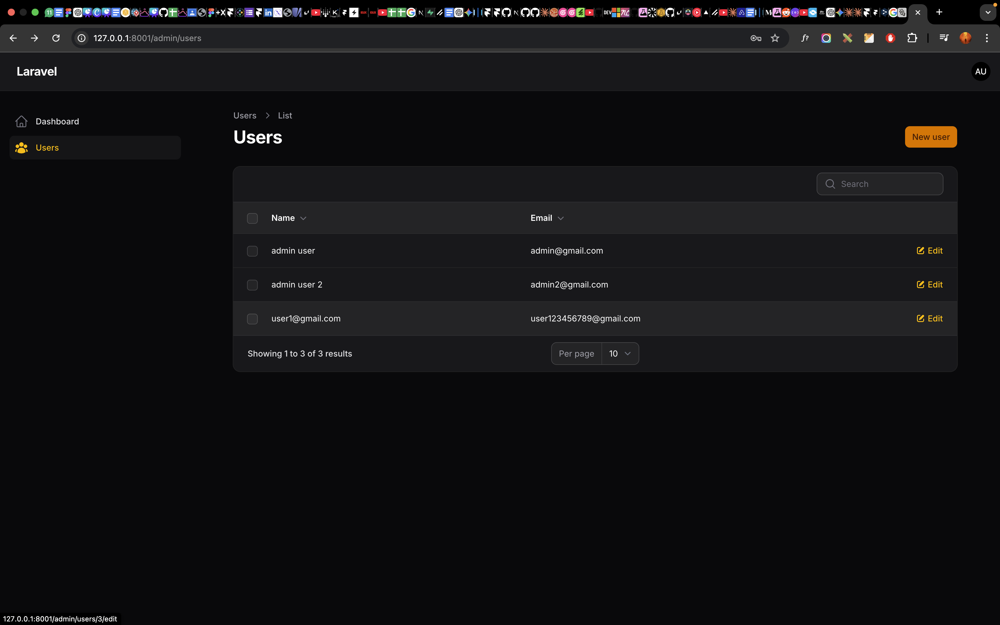
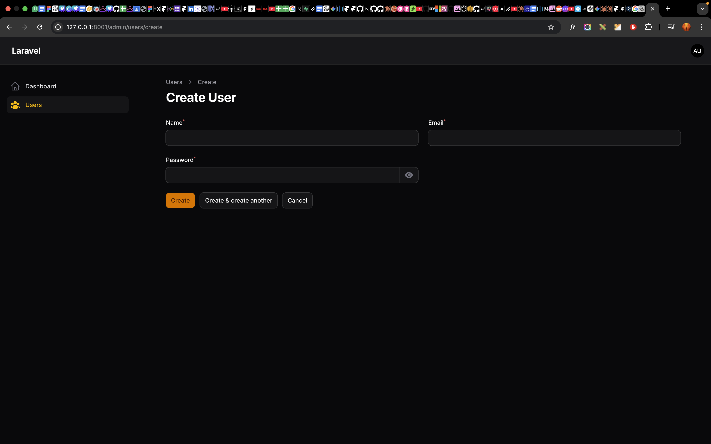
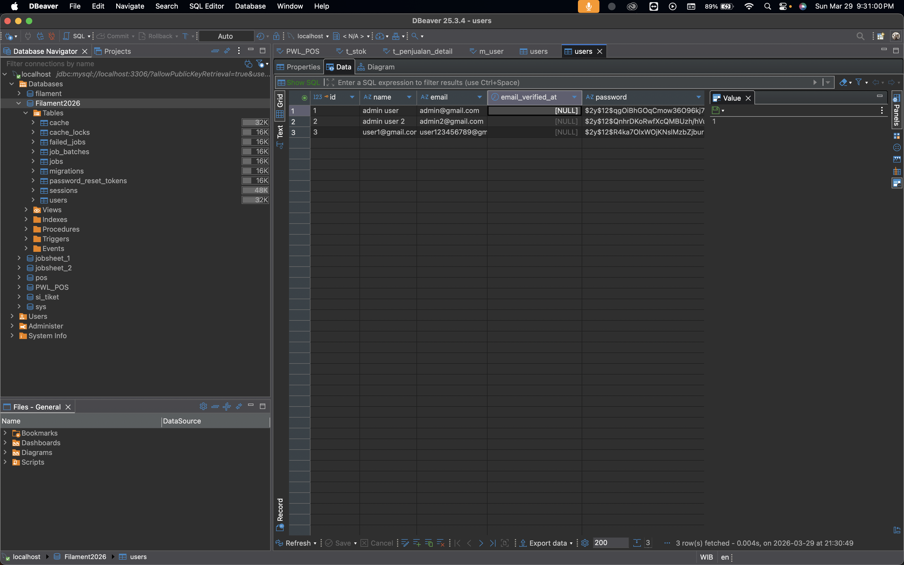

# Laporan Praktikum Jobsheet 6
# Pemrograman Web Lanjut

## Data Diri

| Field | Keterangan |
|-------|------------|
| Nama | Ghazwan Ababil |
| NIM | 244107020151 |
| Kelas | TI-2F |
| Mata Kuliah | Pemrograman Web Lanjut |
| Topik | Membuat CRUD Resource dengan Filament v4 |

---

## Capaian Pembelajaran

Setelah mengikuti praktikum ini, mahasiswa mampu:

1. Memahami konsep Resource pada Filament.
2. Membuat CRUD (Create, Read, Update, Delete) menggunakan perintah artisan.
3. Mengelola Form Builder pada Filament.
4. Mengelola Table Builder pada Filament.
5. Mengubah ikon menu resource.

---

## A. Review Singkat Pertemuan 1

Pada pertemuan sebelumnya telah dilakukan:

1. Instalasi Laravel.
2. Instalasi Filament v4.
3. Pembuatan user admin.
4. Akses panel admin di `/admin`.

Pada pertemuan ini fokus praktikum adalah membuat CRUD User menggunakan Resource Filament.

---

## B. Konsep Resource di Filament

Resource Filament adalah fitur pembangkit halaman CRUD otomatis berbasis Model Laravel.

Saat menjalankan perintah berikut:

```bash
php artisan make:filament-resource User
```

Filament otomatis membuat:

1. File Resource utama.
2. Halaman List.
3. Halaman Create.
4. Halaman Edit.
5. File Form Schema.
6. File Table Schema.

---

## C. Langkah Praktikum

### Langkah 1 - Melihat Daftar Perintah Filament

Menjalankan:

```bash
php artisan list
```

Perintah Filament yang muncul antara lain:

1. make:filament-resource
2. make:filament-user
3. filament:install

### Langkah 2 - Membuat Resource User

Karena model User sudah tersedia dari Laravel, resource dibuat langsung:

```bash
php artisan make:filament-resource User
```

Hasil struktur yang terbentuk:

1. `app/Filament/Resources/Users/UserResource.php`
2. `app/Filament/Resources/Users/Schemas/UserForm.php`
3. `app/Filament/Resources/Users/Tables/UsersTable.php`
4. `app/Filament/Resources/Users/Pages/ListUsers.php`
5. `app/Filament/Resources/Users/Pages/CreateUser.php`
6. `app/Filament/Resources/Users/Pages/EditUser.php`

### Langkah 3 - Menjalankan Aplikasi

Menjalankan:

```bash
php artisan serve
```

Login ke:

http://localhost:8000/admin

Setelah resource dibuat, menu Users muncul pada sidebar panel admin.

### Langkah 4 - Membuat Form Input (Create dan Edit)

File yang dimodifikasi:

1. `app/Filament/Resources/Users/Schemas/UserForm.php`

Field form yang ditambahkan:

1. Name
2. Email
3. Password

Implementasi tambahan pada praktikum ini:

1. Validasi email unik.
2. Validasi password minimal 6 karakter.
3. Password otomatis hash menggunakan `Hash::make()`.

### Langkah 5 - Menampilkan Data pada Tabel

File yang dimodifikasi:

1. `app/Filament/Resources/Users/Tables/UsersTable.php`

Kolom tabel yang ditampilkan:

1. Name
2. Email
3. Created_at

Aksi pada tabel:

1. Edit
2. Delete (bulk action)

### Langkah 6 - Mengganti Icon Menu Resource

File yang dimodifikasi:

1. `app/Filament/Resources/Users/UserResource.php`

Icon resource diubah menjadi:

```php
protected static string|BackedEnum|null $navigationIcon = Heroicon::UserGroup;
```

---

## D. Hasil yang Diharapkan

Hasil implementasi yang sudah tercapai:

1. CRUD User berhasil dibuat.
2. Form input Name, Email, Password tampil dan berjalan.
3. Tabel users menampilkan Name, Email, dan Created_at.
4. Data user dapat di-edit dan dihapus.
5. Icon menu resource berhasil diubah.

Route resource terverifikasi:

1. GET /admin/users
2. GET /admin/users/create
3. GET /admin/users/{record}/edit

---

## E. Analisis dan Diskusi

### 1) Mengapa Filament dapat membuat CRUD tanpa banyak coding?

Karena Filament menyediakan generator resource dan komponen siap pakai untuk form, table, action, dan routing panel admin.

### 2) Apa perbedaan Form Schema dan Table Schema?

1. Form Schema mengatur komponen input untuk create/edit data.
2. Table Schema mengatur tampilan daftar data (kolom, sorting, searching, action).

### 3) Bagaimana jika ingin menambahkan validasi email unik?

Gunakan aturan unik pada field email, misalnya:

```php
->unique(ignoreRecord: true)
```

### 4) Mengapa password tidak perlu hash manual di controller?

Karena proses hashing bisa langsung ditangani di form schema menggunakan `dehydrateStateUsing`, sehingga nilai yang disimpan ke database sudah terenkripsi.

---

## F. Tugas Praktikum

Checklist tugas:

1. Tambahkan validasi email unik: selesai.
2. Tambahkan validasi password minimal 6 karakter: selesai.
3. Tambahkan kolom created_at pada tabel: selesai.
4. Ganti icon resource dengan icon lain Heroicons: selesai (`Heroicon::UserGroup`).
5. Buat laporan berisi screenshot list, create, dan database: selesai pada bagian lampiran.

### Lampiran Screenshot

1. Halaman List Users



2. Halaman Create User



3. Data User pada Database



---

## G. Kesimpulan

Pada praktikum ini mahasiswa telah mempelajari:

1. Konsep Resource pada Filament.
2. Pembuatan CRUD otomatis berbasis model.
3. Penggunaan Form Builder.
4. Penggunaan Table Builder.
5. Kustomisasi icon navigasi resource.

Praktikum lanjutan dapat difokuskan pada:

1. Relasi antar resource (belongsTo, hasMany).
2. Relation Manager Filament.
3. Custom dashboard widget.
4. Role dan permission admin panel.

---

## Referensi

1. https://filamentphp.com
2. https://filamentphp.com/docs
3. https://laravel.com/docs

