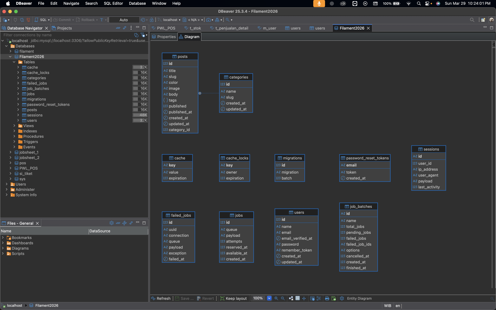
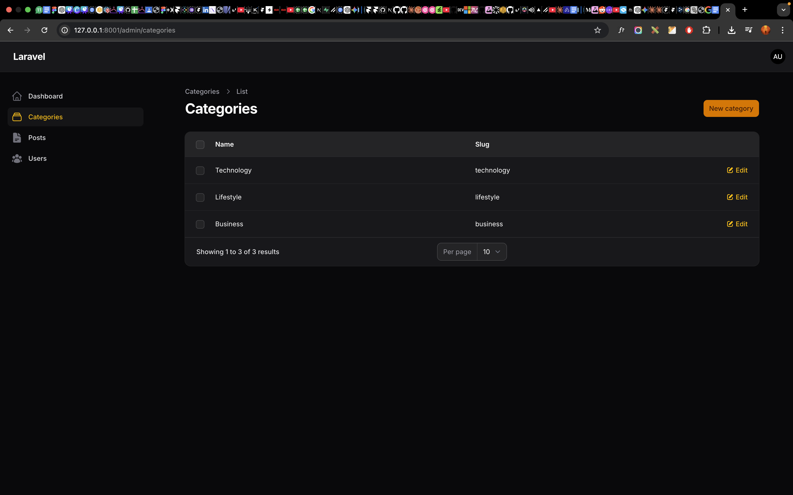
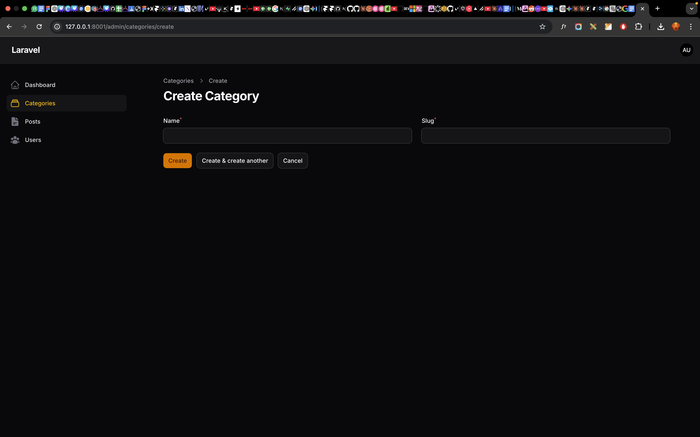

# Laporan Praktikum Pemrograman Web Lanjut
## Pertemuan 3 - Migration, Model, Relasi, Resource Category dan Post

### Data Diri
- Nama: Ghazwan Ababil
- NIM: 244107020151
- Kelas: TI-2F

---

## A. Capaian Pembelajaran
Mahasiswa mampu:
1. Membuat model dan migration dengan Artisan.
2. Mendesain tabel categories dan posts.
3. Mengatur fillable dan casts pada model.
4. Membuat relasi one-to-many Category dan Post.
5. Membuat Resource Category dan Resource Post di Filament.

## B. Review Singkat
Pertemuan sebelumnya: CRUD User dengan Filament.
Pertemuan ini: Category dan Post dari migration sampai CRUD Resource.

## C. Konsep Dasar
Relasi data:
- Satu Category memiliki banyak Post.
- Satu Post milik satu Category.

## D. Langkah Praktikum
### 1) Model dan Migration
```bash
php artisan make:model Category -m
php artisan make:model Post -m
php artisan migrate
```

### 2) Model Category
- fillable: name, slug
- relasi: hasMany(Post::class)

### 3) Model Post
- fillable: title, slug, category_id, color, image, body, tags, published, published_at
- casts:
  - tags => array
  - published => boolean
  - published_at => date
- relasi: belongsTo(Category::class)

### 4) Resource Category
```bash
php artisan make:filament-resource Category --no-interaction
```
- Form: name, slug
- Table: name, slug

### 5) Resource Post
```bash
php artisan make:filament-resource Post --no-interaction
```
- Form: title, slug, category_id (select), color, image, body, tags, published, published_at
- Table: title, category.name, published, published_at

## E. Hasil
- Tabel categories dan posts berhasil dibuat.
- Relasi model berjalan (hasMany dan belongsTo).
- CRUD Category dan Post aktif di panel Filament.
- Data dapat create, read, update, delete.
- Validasi slug unik aktif di form dan database (unique index).
- Kolom `posts.category_id` sudah menjadi foreign key ke `categories.id`.
- Data awal kategori sudah ditambahkan: Technology, Lifestyle, Business.

## J. Analisis & Diskusi
1. **Mengapa kita perlu $fillable?**
`$fillable` dipakai untuk membatasi field yang boleh diisi dengan mass assignment agar data sensitif tidak bisa diubah sembarangan.

2. **Apa fungsi $casts pada Laravel?**
`$casts` mengubah tipe data kolom database menjadi tipe PHP otomatis, misalnya JSON menjadi array, angka menjadi boolean, dan tanggal menjadi objek date.

3. **Apa perbedaan integer biasa dengan foreign key?**
Integer biasa hanya menyimpan angka tanpa validasi relasi. Foreign key menambahkan constraint relasi sehingga nilai harus merujuk ke data parent yang valid.

4. **Bagaimana jika category dihapus tetapi masih ada post?**
Dengan `cascadeOnDelete()`, post terkait akan ikut terhapus otomatis. Tanpa foreign key, bisa terjadi orphan data.

## K. Tugas Praktikum
1. **Tambahkan minimal 3 kategori berbeda**
- [x] Selesai: Technology, Lifestyle, Business

2. **Tambahkan validasi slug harus unik**
- [x] Selesai: validasi `->unique(ignoreRecord: true)` di form Category
- [x] Selesai: unique index `categories_slug_unique` di database

3. **Ubah category_id menjadi foreign key**
- [x] Selesai: `posts.category_id` sudah menjadi foreign key ke `categories.id`
- [x] Selesai: aturan delete menggunakan `cascadeOnDelete()`

4. **Placeholder screenshot laporan**
- [x] Selesai: 6 placeholder screenshot tersedia di folder `screenshot/`

5. **Finalisasi PDF laporan**
- [ ] Belum: dilakukan setelah screenshot asli dimasukkan

## H. Placeholder Screenshot Laporan
### 1) Struktur Database Category dan Post


### 2) Form Category


### 3) List Category


## I. Kesimpulan
Praktikum berhasil mencakup migration, model, relasi, dan resource Filament untuk Category serta Post. Laporan sudah diringkas dan siap diisi screenshot aktual.

---
Status: Selesai.
