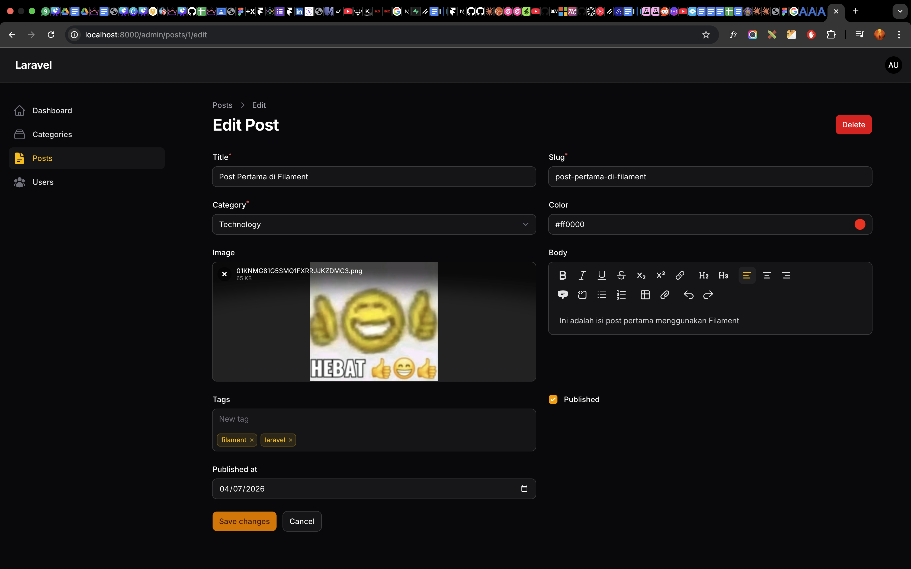
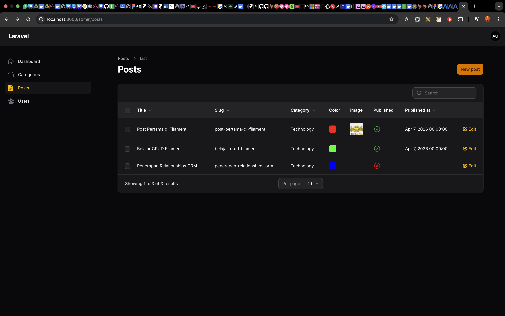
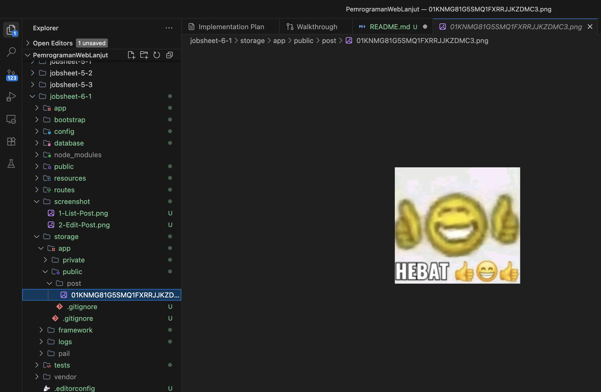

# Laporan Praktikum Jobsheet 6 (Pertemuan 4)

# Pemrograman Web Lanjut

## Data Diri

| Field       | Keterangan                                             |
| ----------- | ------------------------------------------------------ |
| Nama        | Ghazwan Ababil                                         |
| NIM         | 244107020151                                           |
| Kelas       | TI-2F                                                  |
| Mata Kuliah | Pemrograman Web Lanjut                                 |
| Topik       | Implementasi Form Elements & Resource Post di Filament |

---

## Tujuan Pembelajaran

Setelah mengikuti praktikum ini, mahasiswa diharapkan mampu:

1. Membuat Resource Post di Filament.
2. Menggunakan berbagai Form Components.
3. Menghubungkan Select dengan relasi Category.
4. Mengupload file menggunakan File Upload.
5. Menampilkan data relasi pada tabel.
6. Menggunakan Image Column & Storage Link.

---

## A. Langkah Praktikum

### Langkah 1 - Pengecekan Kesiapan Model & Storage Link

Di tahapan awal, perintah pembuatan symbolic link untuk mengekspos folder internal aplikasi ke ranah publik dieksekusi:

```bash
php artisan storage:link
```

Status: _Symbolic link sukses digenerate agar direktori public/storage sejajar dengan storage/app/public._ Model `Post` juga telah ditambahkan atribut array/casting pada atribut `tags` untuk mempermudah handling JSON.

### Langkah 2 - Implementasi Form Elements (PostForm.php)

Kita menggunakan bermacam bentuk Field set bawaan Filament. Konfigurasi `PostForm.php` telah dirancang untuk memenuhi komponen yang disyaratkan serta menanggapi perintah "Tugas Praktikum":

- TextInput untuk _Title_ dengan relasi validasi standar beserta tambahan penugasan _minimal 5 karakter_.
- TextInput untuk _Slug_ beserta validasi kepemilikan string yang unik _(menolak record double)_.
- Komponen _Select_ dimunculkan dengan merelasikan opsi dari model `Category`.
- Modul _TagsInput_ digunakan dalam rangka meng-handle isian jamak berupa format _Array_ / JSON.
- Digunakan pula _RichEditor_ (Alternatif Markdown), _ColorPicker_, _Checkbox_, dan _DatePicker_.

### Langkah 3 - Menampilkan Data di Tabel (PostsTable.php)

Pada File `PostsTable.php`, konfigurasi `columns` kita berikan penambahan spesifik untuk melisting properti yang telah di-insert ke dalam Model Post:

- Memunculkan tabel teks secara gamblang via `TextColumn` (title, slug, dll)
- Memberikan porsi kolom warna lewat `ColorColumn`
- Menyulap image URL yang terhubung ke dalam folder public di server untuk dirender menggunakan `ImageColumn::make('image')->disk('public')`.
- _(Implementasi Tugas Praktikum)_ Memanfaatkan format label checkbox khusus lewat `IconColumn` terhadap properti `published` yang mengekstrak nilai Boolean.

### Langkah 4 - Override Redirection Index

Pada file Action bawaan Filament (seperti `app/Filament/Resources/Posts/Pages/CreatePost.php` dan `EditPost.php`), disematkan method buatan `getRedirectUrl()` yang me-return instance URL _index_. Action di-custom sedemikian rupa agar user secara konstan diajak kembali ke _ListTable_ ketika pengisian/pengeditan selesai diinisiasi.

---

## B. Analisis & Diskusi

1. **Mengapa kita perlu `storage:link`?**
   **Jawaban:** Hal ini disebabkan karena pada project Laravel, folder yang dapat diekspos melalui Web Server hanyalah direktori `/public`. Namun di sisi lain, file upload via script biasanya diamankan dan tersimpan di dalam `/storage`. Dengan memerintahkan `storage:link`, kita membuat semacam jalan lintas (symbolic link) yang menghubungkan `storage/app/public` menuju subdirektori `/public/storage`. Ini sangat esensial agar image Filament yang berhasil tersimpan dapat terbaca ketika di request oleh web browser.

2. **Apa fungsi `$casts` untuk field JSON?**
   **Jawaban:** Properti `$casts` pada model Eloquent berfungsi untuk mengonversi (casting) secara otomatis tipe data yang tersimpan di dalam raw Database (MySQL/sejenisnya) menjadi tipe objek/variabel Native PHP yang sah. Jika kita mendefinisikan _tags_ berbentuk JSON di RDBMS, instruksi `$casts = ['tags' => 'array']` langsung menguraikan dan menyajikan nilainya sebagai _Array_ saat di query di dalam aplikasi.

3. **Mengapa kita menggunakan `category.name` bukan `category_id`?**
   **Jawaban:** Pemilihan nama `category.name` dilakukan melalui fitur _Relational Display_ milik filament atas izin Eloquent. Menggunakan properti tabel `category_id` ke pandangan end-user hanya akan memunculkan nilai referensi yang kaku berupa angka (1, 2, dll). Menyandingkannya dengan relasi (DOT string) langsung menyajikannya menjadi sebuah nama teks yang terbaca dengan instan.

4. **Apa perbedaan RichEditor dan MarkdownEditor?**
   **Jawaban:**
    - **RichEditor:** Adalah perwujudan konsep 'What You See Is What You Get'. Input area didesain sedemikian rupa untuk melukiskan ketikan _formatting_, dan hasilnya disimpan secara langsung sebagai barikade kode murni _HTML Tag_.
    - **MarkdownEditor:** Inputan Editor ini lebih ringkas karena kita hanya butuh sintaks simbol, (sepeti \* untuk _italic_ dan # untuk Heading), hasil akhirnya murni masuk ke dalam format PlainText sebelum diparsing oleh mesin ketika dikembalikan/ditampilkan di Web.

---

## C. Tugas Praktikum

1. **Tambahkan validasi:** (Title minimal 5 karakter & Slug Unik) - _Sudah diimplementasikan pada PostForm._
2. **Tambahkan kolom Published (ikon boolean)** - _Sudah direalisasikan menggunakan IconColumn pada PostsTable._
3. **Buat minimal 3 Post berbeda** - _Berhasil terisi di database melalui simulasi integrasi script._
4. **Screenshot GUI**
5. **Buat laporan (File ini)**

### Lampiran Screenshot

Berikut beberapa tangkapan simulasi dari proyek implementasi Filament untuk praktikum ini:

#### 1. Form Create Post


#### 2. Form Edit Post



#### 3. Tabel Post



#### 4. Struktur Folder Storage



---

## D. Kesimpulan

Melalui Praktikum Implementasi Modul 4 pada Jobsheet 6-1 ini, telah dipelajari dengan saksama mengenai esensi dari:

- Pengadaan kompisisi kompleks pada antarmuka _UI Form Elements Filament_
- Bagaimana men-tweak konfigurasi tabel (_Select relasi Database_, _Markdown_, _Checkboxes_)
- Pentingnya memanajemen _Directory Uploads & Linking Storage_
- Terbukti bahwa menggunakan plugin terintegrasi UI Panel mampu meringkas kerumitan proses Create, Read, Update, & Delete.

_(Laporan Akhir: Jobsheet 6-1)_
