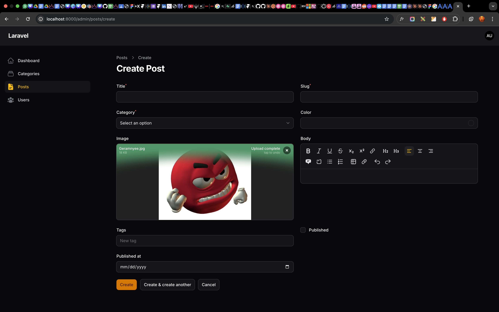
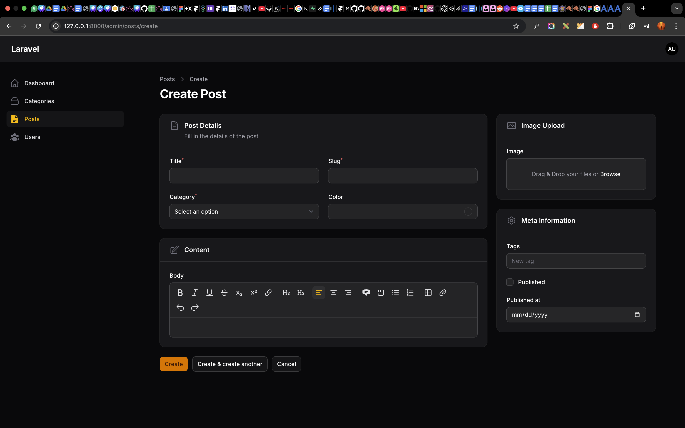

# Laporan Praktikum Jobsheet 6-2 (Pertemuan 5)

# Pemrograman Web Lanjut

## Data Diri

| Field       | Keterangan                                            |
| ----------- | ----------------------------------------------------- |
| Nama        | Ghazwan Ababil                                        |
| NIM         | 244107020151                                          |
| Kelas       | TI-2F                                                 |
| Mata Kuliah | Pemrograman Web Lanjut                                |
| Topik       | Custom Layout Form dengan Section & Group di Filament |

---

## Tujuan Pembelajaran

Setelah mengikuti praktikum ini, mahasiswa diharapkan mampu:

1. Mengatur layout form menggunakan `columns()`.
2. Menggunakan `Section` untuk mengelompokkan field.
3. Menambahkan deskripsi dan icon pada `Section`.
4. Menggunakan `Group` untuk pengaturan layout kompleks.
5. Mengatur `columnSpan()` untuk proporsi lebar form.
6. Mendesain form Post agar terlihat lebih terstruktur dan profesional.

---

## A. Langkah Praktikum

Pada tahapan praktikum ini, form yang pada modul sebelumnya dirender secara linear kebawah _(default vertikal)_ dirapikan sedemikian rupa menggunakan sistem _Grid Tailwind_ (12 Kolom) yang diadaptasi secara langsung oleh fitur Layouting _Filament_.

### Langkah 1 - Konfigurasi Group Kiri (Post Details & Content)

Kami membuat sebuah `Group` berskala lebar `columnSpan(2)` _(mengambil alokasi dua per tiga layar)_. Di dalam _class_ `PostForm.php`, ditambahkan beberapa seksi visual:

```php
use Filament\Schemas\Components\Section;
use Filament\Schemas\Components\Group;

// ...
Group::make([
    Section::make('Post Details')
        ->description('Fill in the details of the post')
        ->icon('heroicon-o-document-text')
        ->schema([
            // Input Fields title, slug, category_id, color
        ])->columns(2), // Membuat isi seksi ini dibagi 2 sejajar

    Section::make('Content')
        ->icon('heroicon-o-pencil-square')
        ->schema([
            RichEditor::make('body')->nullable()->columnSpanFull(),
        ]),
])->columnSpan(2),
```

### Langkah 2 - Konfigurasi Group Kanan / Sidebar (Images & Meta Data)

Grup sebelah kanan mengambil porsi minimum `columnSpan(1)` _(satu per tiga sisa layar)_ sebagai wadah elemen-elemen atribut sekunder seperti Cover dan Tanggal Terbit.

```php
Group::make([
    Section::make('Image Upload')
        ->icon('heroicon-o-photo')
        ->schema([
            // FileUpload image
        ]),

    Section::make('Meta Information')
        ->icon('heroicon-o-cog-6-tooth')
        ->schema([
            // Tags, Checkbox published, DatePicker
        ]),
])->columnSpan(1),
```

### Langkah 3 - Finalisasi Parent Grid

Keseluruhan grup akhirnya diikat dalam skema hirarki form menggunakan pembagian total tiga blok _Grid_ `->columns(3)`.

---

## B. Analisis & Diskusi

1. **Mengapa layout form penting dalam aplikasi admin?**
   **Jawaban:** Layout form yang tertata dengan rapi (misalnya memisahkan isi konten utama dan sidebar opsi metadata) sangat membantu fungsional pengguna (terutama _Content Writer/Operator_), selain karena lebih indah, pembagian area pandang memangkas waktu navigasi dan mencegah kesalahan input (human error).

2. **Apa perbedaan `Section` dan `Group`?**
   **Jawaban:**
    - `Section`: Menghasilkan wujud fisik berwujud "Kotak / Card Layout" lengkap dengan garis pinggir _(border)_, tempat menaruh Judul Utama, Ikon, serta _Description_.
    - `Group`: Merupakan alat _(wrapper)_ transparan (tak berwujud antarmuka). Biasanya diaplikasikan sebatas sarana penyatuan sejumlah field atau seksi _(Section)_ agar dapat mematuhi paksaan instruksi Grid seperti merespon rasio pelebaran `columnSpan()` dalam satu kontainer sekaligus.

3. **Kapan kita menggunakan `columnSpanFull()`?**
   **Jawaban:** Instruksi bentang dimensi secara mutlak ini dimanfaatkan saat sebuah inputan membutuhkan wadah kanvas yang maksimum menyentuh rasio mentok pinggiran kiri ke kanan penampungnya. Kasus ideal di antaranya adalah Field _RichEditor_ ataupun _MarkdownEditor_ untuk membebaskan ruang ketikan pengarang agar tidak terdesak.

4. **Apa keuntungan sistem grid 12 kolom?**
   **Jawaban:** Menawarkan fleksibilitas matematis tingkat tinggi dalam melokasikan kompartemen. Angka 12 sangat memanjakan developer karena mudah dibagi utuh menjadi komposisi layar setengah (6, 6), layar sepertiga (4, 4, 4 / 8, 4 / 2, 1), hingga responsibilitas per seperempat (3, 3, 3, 3). Ini persis seperti kerangka utilitas _grid Tailwind CSS_.

---

## C. Tugas Praktikum

Sesuai instruksi _Tugas Praktikum_, modifikasi `PostForm.php` telah dirampungkan untuk:

1. Membelah tampilan post menggunakan layout Fields Kiri (2/3) & Meta Kanan (1/3).
2. Membubuhkan bermacam Ikon seperti (📝 `heroicon-o-document-text` pada _Details_, 📷 `heroicon-o-photo` pada _Upload_ dan ⚙️ `heroicon-o-cog-6-tooth` pada _Meta_).
3. Field area disekat menjadi proporsi 2 kolom untuk memadatkan kerangka utama.

Silakan perhatikan hasil akhir pembaharuan layout berikut:

### Lampiran Screenshot

#### 1. Form Sebelum Menerapkan Layout (Default Vertikal - Pertemuan 4)


_(Contoh wujud form sebelum dipasang container Layout)_

#### 2. Form Sesudah Modifikasi Custom Layout Section & Group (Pertemuan 5)



---

## D. Kesimpulan

Praktikum Pertemuan 5 berhasil memusatkan fokus pada pengolahan hierarki tata letak Layout Filament. Telah dipahami bahwasanya melalui penempatan modul `Section` dan kompilasi berbalut `Group`, sebuah input form kompleks dan monoton dapat disihir layaknya dashboard Content Management System modern taraf profesional.

_(Laporan Praktikum: Jobsheet 6-2)_
