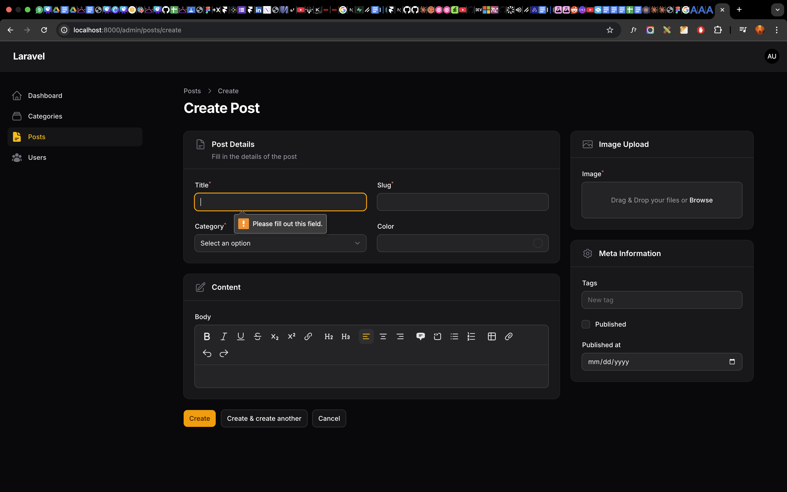
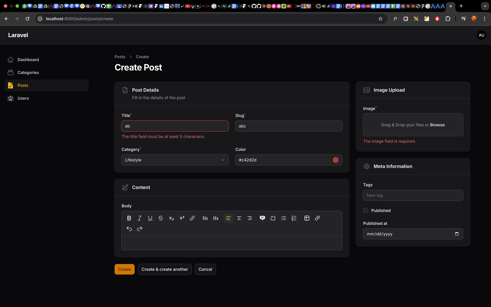
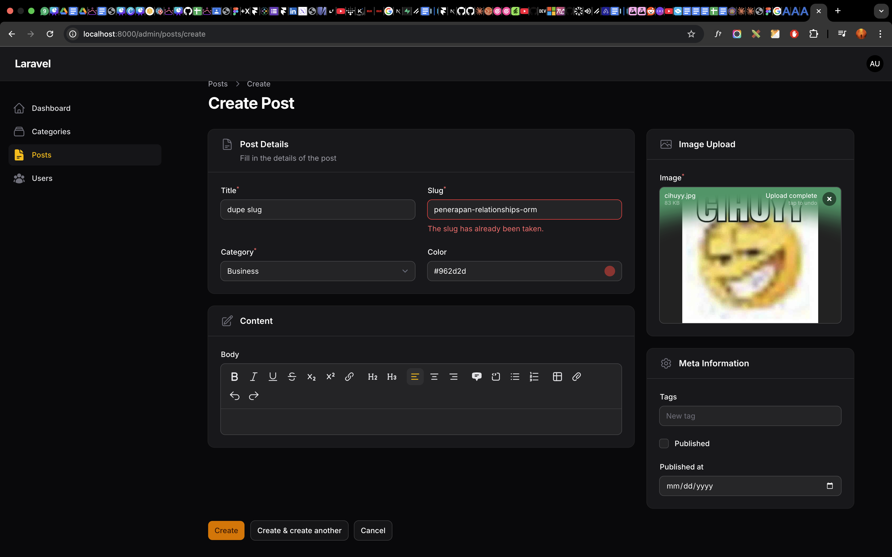
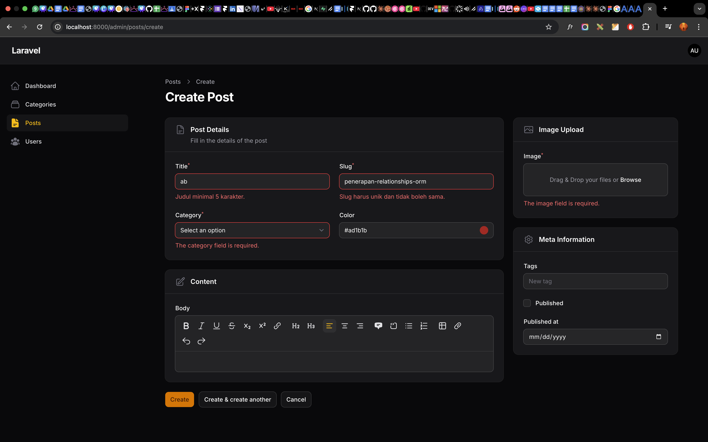

# Laporan Praktikum Jobsheet 6-3 (Pertemuan 6)

# Pemrograman Web Lanjut

## Data Diri

| Field       | Keterangan                                 |
| ----------- | ------------------------------------------ |
| Nama        | Ghazwan Ababil                             |
| NIM         | 244107020151                               |
| Kelas       | TI-2F                                      |
| Mata Kuliah | Pemrograman Web Lanjut                     |
| Topik       | Implementasi Form Validation pada Filament |

---

## Tujuan Pembelajaran

Setelah mengikuti praktikum ini, mahasiswa diharapkan mampu:

1. Menerapkan aturan validasi form pada Filament secara terstruktur.
2. Menggunakan pemanggilan metode wajib `required()`.
3. Menggunakan fungsionalitas `rule()` maupun jamak `rules()`.
4. Menerapkan kontrol parameter antiduplikasi `unique`.
5. Merakit teks _custom validation message_.
6. Memahami korelasi antara komponen validasi Filament dengan validasi inti milik framework Laravel.

---

## A. Langkah Praktikum

Pada segmen ini, komponen input yang mulanya tak terbatas dimodifikasi sedemikian rupa agar menolak masukan hampa, ganda, dan melanggar parameter di file `PostForm.php`.

### Langkah 1 - Penambahan Rules & Validation Messages

Kita menyarangkan ketentuan batasan karakter dan instruksi keabsahan _(required)_ ke _fields_ yang ada, diiringi pesan custom.

```php
TextInput::make('title')
    ->required()
```

Hal yang sama diterapkan pada isian `slug` agar ia menjadi rujukan URL yang tertata, unik, serta mencegah perulangan fatal:

```php
TextInput::make('slug')
    ->required()
    ->unique(ignoreRecord: true)
    ->rules(['min:3'])
    ->maxLength(255)
    ->validationMessages([
        'unique' => 'Slug harus unik dan tidak boleh sama.',
        'min' => 'Slug minimal 3 karakter.',
    ]),
```

### Langkah 2 - Strict Selection (Kategori & Image)

Memastikan form yang bersinggungan degan relasi Database dan _File System_ tidak terlewatkan (Null/Kosong) yang bisa berakhir merusak tampilan front-end.

```php
Select::make('category_id')->required(), //...
// dan
FileUpload::make('image')->required(), //...
```

Instruksi tambahan seperti penetapan disk `->disk('public')` pada _upload_ tetap dipertahankan per modul sebelumnya.

---

## B. Analisis & Diskusi

1. **Mengapa validasi penting pada admin panel?**
   **Jawaban:** Validasi teramat genting karena ia bertindak sebagai tembok pelindung terakhir (Garda Terdepan Input) untuk menolak anomali yang bisa membobol basis data. Contoh, ketika data relasi tidak dimasukkan dengan logis maka ekosistem web aplikasi akan pecah (_Null Reference_), atau bisa juga mencegah eksploitasi SQL Injection maupun celah spam massal. Admin panel memiliki kapabilitas besar untuk menulis ulang seluruh database kita.

2. **Apa perbedaan validasi client-side dan server-side?**
   **Jawaban:**
    - **Client-Side:** Validasi instan yang dikelola oleh HTML5 interaktif di sisi Browser pengunjung, fungsinya mempercepat _feeback_ pengguna sebelum form disubmit tanpa perlu ke backend `(misal type="email" atau tag required)`. Kekurangannya mudah diretas sekedar lewat Developer Tools Inspeksi.
    - **Server-Side:** Proses _cross-checking_ berulang murni di jantung infrastruktur kode kita (dalam hal ini engine Laravel PHP) usai form dirikues (submit). Bersifat final, otoriter, tak mudah diterobos dan aman merepresentasikan data absolut, namun membutuhkan jeda _request_-respon HTTP.

3. **Mengapa `unique` otomatis bekerja saat edit data?**
   **Jawaban:** Kemutakhiran _helper_ model Filament yang menyertai instruksi `ignoreRecord: true` (atau passing _state binding_) dapat mendeteksi dengan spesifik Row ID milik data yang sedang dioperasikan (proses pengubahan). Hasilnya, saat divalidasi ke sisi tabel, record asli diabaikan supaya ia tidak divonis menduplikasi string/slug miliknya sendiri.

4. **Kapan kita perlu menggunakan `rules` array dibanding string?**
   **Jawaban:** Penulisan string berformat baris pemisah _(Pipes)_ `'required|min:3|max:10'` memang jauh lebih cepat diimplementasi, namun penulisan berwujud array `['required', 'min:3']` adalah pakem andalan **MANAKALA** berhadapan dengan _rule_ gubahan kompleks yang mungkin memuat spasi, simbol, _Regular Expression / Regex_, atau menampung rujukan logika spesifik Object Class _(misal: Rule::unique...)_ yang rawan bentrok bilamana dipisah semata-mata dengan karakter pipe gari lurus `|`.

---

## C. Tugas Praktikum

Penerapan _Constraint Forms_ ini telah sukses dibunyikan dalam komponen UI yang bersangkutan.

1. Validasi `Title` minimal 5 karakter, kategori wajib ada, image wajib ada, dan pembatasan `Slug` secara _unik_ berbatas min 3 frasa.
2. Form menolak submisi data jika input tak layak, dan melontarkan _Error Validation Response_ sesuai tulisan Custom di metode `validationMessages`.

Untuk meninjau wujud fisik peringatannya, berikut lampirannya:

### Lampiran Screenshot

#### 1. Validasi Tanggapan Error Saat Input Kosong (Required)



#### 2. Validasi Tanggapan Error Saat Minimum Karakter Tak Terpenuhi (Min Length)



#### 3. Validasi Tanggapan Error Saat Terjadi Duplikasi Data Label (Unique Slug)



#### 4. Validasi Keseluruhan



## D. Kesimpulan

Intisari pertemuan kali ini menitikberatkan pada perlindungan kualitas dan kohesi barisan Data Entry yang terjadi lewat instrumen Filament. Di samping sekadar me-_render_ tampilan form input secara praktis, kita difasilitasi cara yang semudah mungkin untuk mengintegrasikan mesin _Validation native_ dari ekosistem sistem Laravel. Praktik integrasi Validation Messages ini menjamin kemudahan pemeliharaan aplikasi (Maintainability) berdimensi luas.

_(Laporan Praktikum: Jobsheet 6-3)_
