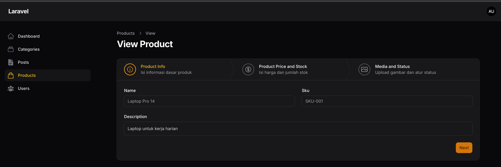
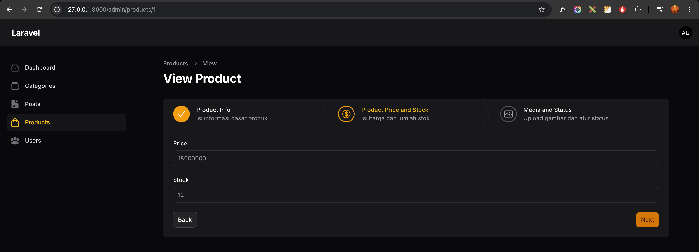
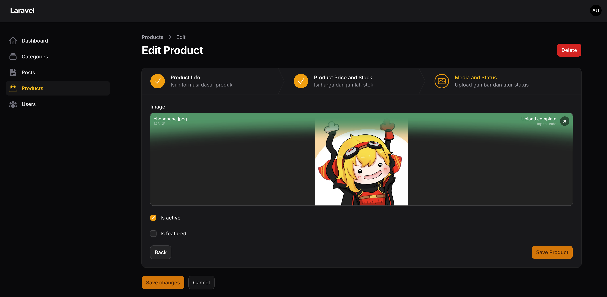
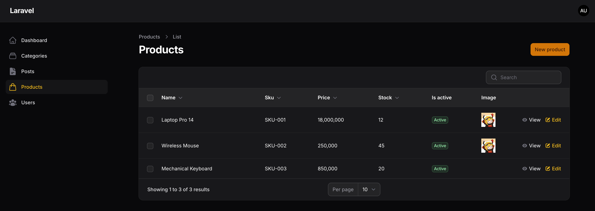
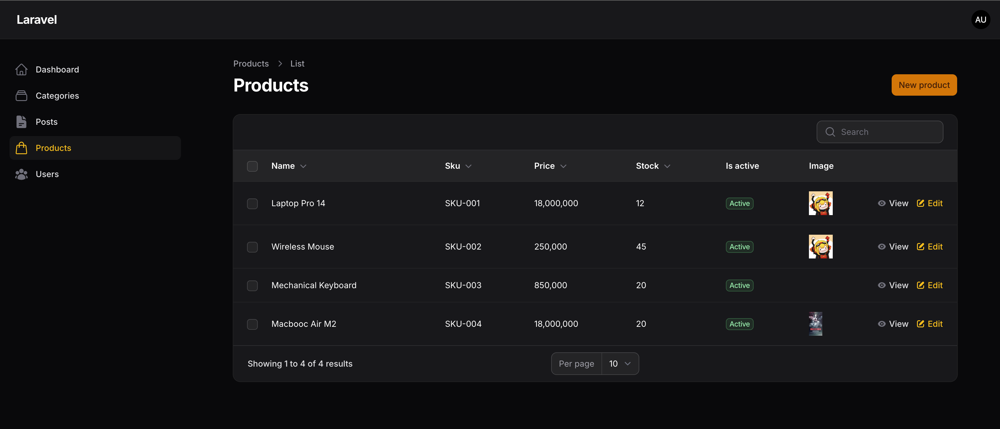
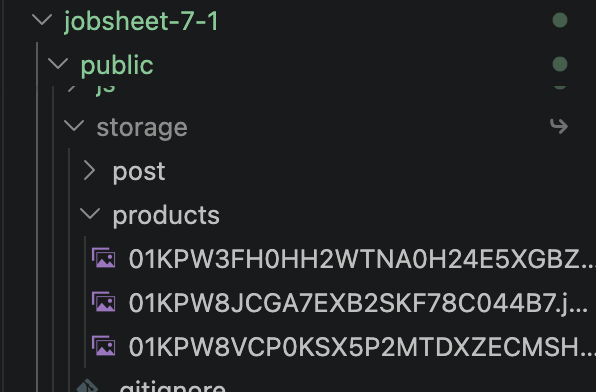

# Laporan Praktikum Jobsheet 7-1 (Pertemuan 7)

# Pemrograman Web Lanjut

## Data Diri

| Field | Keterangan |
| --- | --- |
| Nama | Ghazwan Ababil |
| NIM | 244107020151 |
| Kelas | TI-2F |
| Mata Kuliah | Pemrograman Web Lanjut |
| Topik | Implementasi Wizard Form (Multi Step Form) di Filament |

---

## Capaian Pembelajaran

Setelah mengikuti praktikum ini, mahasiswa mampu:
1. Membuat Resource Product.
2. Menggunakan Wizard Form pada Filament.
3. Membagi form menjadi beberapa step.
4. Menambahkan validasi pada setiap step.
5. Mengatur tombol submit pada Wizard.
6. Menampilkan data Product pada tabel.

Framework yang digunakan: Filament.

---

## A. Studi Kasus

Pada sistem e-commerce, form produk cenderung panjang. Agar lebih ramah pengguna, form dibagi menjadi beberapa tahap:
- Product Info
- Pricing and Stock
- Media and Status

Pendekatan ini disebut Wizard Form (Multi Step Form).

---

## B. Struktur Database Product

Field yang digunakan pada tabel products:
- name (string)
- sku (string, unique)
- description (text)
- price (integer)
- stock (integer)
- image (string, nullable)
- is_active (boolean)
- is_featured (boolean)

Migration dibuat dan dijalankan dengan perintah:

```bash
php artisan make:migration create_products_table
php artisan migrate
```

Implementasi migration sudah disesuaikan pada file:
- database/migrations/2026_04_23_022524_create_products_table.php

---

## C. Membuat Resource Product

Perintah yang dijalankan:

```bash
php artisan make:model Product
php artisan make:filament-resource Product --no-interaction
```

Model Product telah diisi:
- fillable untuk semua field produk
- casts untuk integer dan boolean

Resource Product berhasil dibuat dan aktif di panel /admin.

---

## D. Implementasi Wizard Form

File yang diubah:
- app/Filament/Resources/Products/Schemas/ProductForm.php

Wizard dibagi menjadi 3 step:

1. Product Info
- name (required)
- sku (required, unique)
- description (required)

2. Product Price and Stock
- price (numeric, required, minValue 1)
- stock (numeric, required, minValue 0)

3. Media and Status
- image (FileUpload, disk public, directory products)
- is_active (Checkbox)
- is_featured (Checkbox)

Tambahan implementasi:
- icon di setiap step wizard
- submitAction custom dengan label Save Product

---

## E. Menambahkan Tombol Submit

Custom submit action ditambahkan pada komponen Wizard:
- label: Save Product
- style: button primary
- action: submit save

Sehingga tombol submit bawaan create form tidak dipakai sebagai aksi utama.

---

## F. Menghilangkan Default Button

File yang diubah:
- app/Filament/Resources/Products/Pages/CreateProduct.php

Method yang di-override:

```php
protected function getFormActions(): array
{
    return [];
}
```

Tujuan: hanya menampilkan tombol Save Product dari Wizard.

---

## G. Menambahkan Validasi per Step

Validasi yang diterapkan:
- name required
- sku required + unique
- price numeric + required + minimal 1
- stock numeric + required + minimal 0

Implementasi ini memastikan setiap step tervalidasi sebelum lanjut atau simpan.

---

## H. Menampilkan Data pada Table

File yang diubah:
- app/Filament/Resources/Products/Tables/ProductsTable.php

Kolom yang ditampilkan:
- name
- sku
- price
- stock
- status aktif (badge: Active/Inactive)
- image (ImageColumn, disk public)

Action yang aktif:
- View
- Edit
- Delete (bulk)

Tambahan:
- halaman view dibuat di app/Filament/Resources/Products/Pages/ViewProduct.php
- route view ditambahkan ke ProductResource.

---

## I. Pengujian

Langkah uji:
1. Buat produk baru dari /admin/products/create.
2. Isi Step 1 lalu klik Next.
3. Isi Step 2 lalu klik Next.
4. Isi Step 3 dan klik Save Product.

Hasil uji:
- Data tersimpan ke database.
- Storage link berhasil dibuat (`php artisan storage:link`).
- Data tampil di tabel produk.
- Route Product aktif: index, create, view, edit.

---

## J. Hasil yang Diharapkan

Target praktikum yang tercapai:
- Multi Step Form berhasil dibuat.
- Layout setiap step berhasil diatur.
- Validasi per step berjalan.
- Data Product tampil pada tabel.
- Upload dan tampil gambar produk siap digunakan.

---

## K. Analisis and Diskusi

1. Mengapa Wizard Form lebih baik untuk form panjang?
Wizard memecah form menjadi bagian kecil sehingga pengguna lebih fokus, tidak cepat lelah, dan error input berkurang.

2. Kapan menggunakan skippable()?
Digunakan saat step tertentu opsional, misalnya media tambahan yang boleh diisi nanti.

3. Kelebihan multi step dibanding single form panjang?
Navigasi lebih jelas, validasi lebih terarah per bagian, dan pengalaman pengguna lebih baik.

4. Apakah wizard cocok untuk semua form?
Tidak. Untuk form sederhana dengan sedikit field, single form lebih cepat dan efisien.

---

## L. Tugas Praktikum

1. Tambahkan icon pada setiap Step
- [x] Selesai

2. Tambahkan validasi minimal harga > 0
- [x] Selesai (price minValue 1)

3. Tambahkan badge kolom untuk status aktif di tabel
- [x] Selesai (Active or Inactive badge)

4. Buat minimal 3 produk
- [x] Selesai (3 produk sudah dibuat)

5. Screenshot:
- [x] Wizard Step 1 (placeholder)
- [x] Wizard Step 2 (placeholder)
- [x] Wizard Step 3 (placeholder)
- [x] Tabel Product (placeholder)

---

## M. Lampiran Screenshot (Placeholder)

### 1. Wizard Step 1



### 2. Wizard Step 2



### 3. Wizard Step 3



### 4. List Product



### 5. Save Product Success



### 6. Storage Products



---

## N. Kesimpulan

Pada pertemuan ini mahasiswa telah mempelajari:
- Konsep Wizard Form di Filament.
- Pembagian form menjadi beberapa step yang terstruktur.
- Validasi per step agar input konsisten.
- Custom submit action pada wizard.
- Implementasi tabel Product termasuk image dan status badge.

Dengan ini, alur input data produk menjadi lebih terarah, rapi, dan mudah digunakan.
