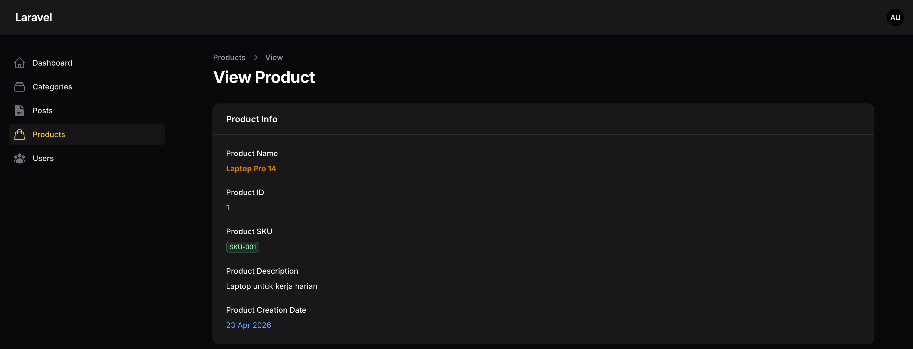
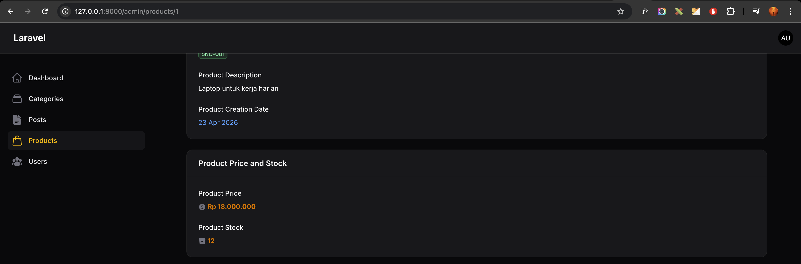
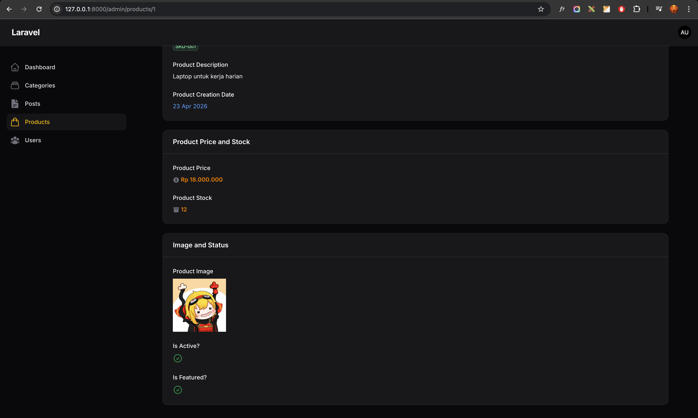
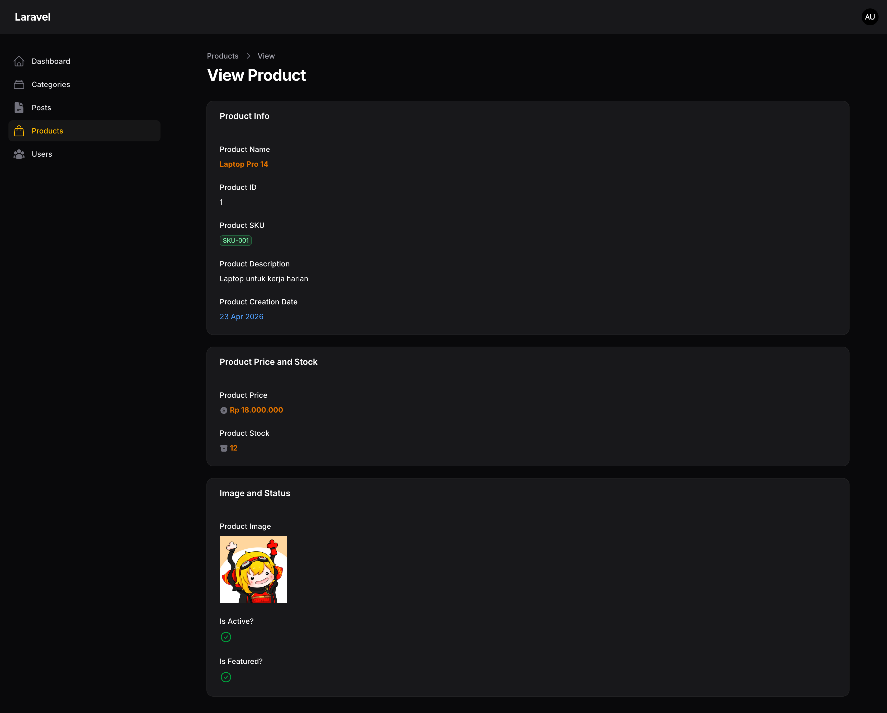

# Laporan Praktikum Jobsheet 7-2 (Pertemuan 8)

# Pemrograman Web Lanjut

## Data Diri

| Field | Keterangan |
| --- | --- |
| Nama | Ghazwan Ababil |
| NIM | 244107020151 |
| Kelas | TI-2F |
| Mata Kuliah | Pemrograman Web Lanjut |
| Topik | Implementasi Info List (View Page) di Filament |

---

## Capaian Pembelajaran

Setelah mengikuti praktikum ini, mahasiswa mampu:
1. Memahami konsep Info List pada Filament.
2. Mengubah tampilan View Page dari form menjadi display informasi.
3. Menggunakan TextEntry, ImageEntry, dan IconEntry.
4. Menggunakan Badge, Color, Icon, dan Format Date.
5. Mendesain halaman detail (show page) yang lebih profesional.

Framework yang digunakan: Filament.

---

## A. Latar Belakang

Pada pertemuan sebelumnya, modul Product sudah menggunakan Wizard Form.
Namun pada halaman View, detail data perlu ditampilkan sebagai informasi read-only, bukan form input.

Solusi: menggunakan Info List agar tampilan detail menjadi lebih profesional dan informatif.

---

## B. Konsep Info List

Info List digunakan untuk:
- Menampilkan detail record.
- Mengganti tampilan input menjadi display-only.
- Menyusun halaman View lebih terstruktur.

Perbandingan komponen:
- Form: TextInput, FileUpload, Checkbox
- Table: TextColumn, ImageColumn, IconColumn
- Info List: TextEntry, ImageEntry, IconEntry

---

## C. Mengedit Product Info List

File baru yang dibuat:
- app/Filament/Resources/Products/Schemas/ProductInfolist.php

Resource yang diubah:
- app/Filament/Resources/Products/ProductResource.php

Tambahan pada ProductResource:
- method `infolist(Schema $schema): Schema`
- memanggil `ProductInfolist::configure($schema)`

---

## D. Membuat Section Product Info

Section pertama menampilkan data utama produk:
- Product Name (bold, primary)
- Product ID
- Product SKU (badge)
- Product Description
- Product Creation Date (format `d M Y`)

Komponen yang digunakan:
- TextEntry
- badge()
- color()
- weight()
- date()

---

## E. Section Pricing and Stock

Section kedua menampilkan harga dan stok:
- Product Price
  - icon currency
  - format Rupiah dengan `formatStateUsing()`
- Product Stock
  - icon stock

Contoh format harga:
- dari integer `18000000` menjadi `Rp 18.000.000`

---

## F. Section Media and Status

Section ketiga menampilkan media dan status boolean:
- Product Image (ImageEntry, disk public)
- Is Active? (IconEntry boolean)
- Is Featured? (IconEntry boolean)

Hasil:
- true tampil icon check
- false tampil icon silang

---

## G. Ilustrasi Tampilan Detail Product

Halaman View Product kini menampilkan informasi read-only dalam 3 section:
- Product Info
- Product Price and Stock
- Image and Status

Dengan struktur ini, halaman detail menjadi lebih rapi dan profesional dibanding tampilan form biasa.

---

## H. Ringkasan Komponen Info List

| Komponen | Fungsi |
| --- | --- |
| TextEntry | Menampilkan teks |
| ImageEntry | Menampilkan gambar |
| IconEntry | Menampilkan boolean/icon |
| badge() | Menampilkan gaya badge |
| color() | Memberi warna teks/badge |
| weight() | Menebalkan teks |
| icon() | Menambah ikon visual |
| date() | Format tanggal |
| formatStateUsing() | Format nilai custom |

---

## I. Perbandingan Sebelum dan Sesudah

| Sebelum | Sesudah |
| --- | --- |
| View masih terasa seperti form | View menjadi display profesional |
| Fokus edit field | Fokus baca informasi |
| Kurang informatif | Lebih rapi dan terstruktur |

---

## J. Hasil yang Diharapkan

Target praktikum yang tercapai:
- Mengubah View Page menjadi Info List.
- Menggunakan TextEntry.
- Menggunakan ImageEntry.
- Menggunakan IconEntry untuk boolean.
- Menggunakan badge, icon, color.
- Mengatur format tanggal dan format harga.

---

## K. Latihan Praktikum

1. Tambahkan badge untuk SKU dengan warna berbeda
- [x] Selesai (SKU badge warna success)

2. Tambahkan icon pada Stock
- [x] Selesai (icon archive-box)

3. Tambahkan format harga menjadi Rp dengan formatStateUsing()
- [x] Selesai

4. Buat minimal 2 product untuk pengujian
- [x] Selesai (tersedia 4 product)

5. Screenshot:
- [x] Section Product Info (placeholder)
- [x] Section Pricing and Stock (placeholder)
- [x] Section Media and Status (placeholder)

---

## L. Analisis and Diskusi

1. Mengapa View Page tidak cocok menggunakan form input?
Karena halaman detail fokus menampilkan informasi, bukan mengubah data. Form input di halaman view membuat UX tidak konsisten.

2. Apa perbedaan TextColumn dan TextEntry?
TextColumn digunakan di tabel/listing, sedangkan TextEntry digunakan di detail Info List (show page).

3. Kapan kita menggunakan badge?
Saat ingin menonjolkan nilai tertentu agar cepat dibaca, misalnya SKU, status, atau label penting.

4. Apa keuntungan menggunakan IconEntry untuk boolean?
Status true/false lebih cepat dipahami secara visual lewat ikon check/silang dibanding teks biasa.

---

## M. Lampiran Screenshot (Placeholder)

### 1. Section Product Info

### 2. Section Pricing and Stock

### 3. Section Media and Status

### 4. Full View Page Product

---

## N. Kesimpulan

Pada pertemuan ini mahasiswa telah mempelajari:
- Konsep Info List.
- Mengubah View Page menjadi display data read-only.
- Menampilkan image dan icon boolean.
- Formatting data dengan color, badge, icon, date, dan formatStateUsing.

Dengan Info List, halaman detail Product menjadi lebih profesional, informatif, dan nyaman dibaca.
