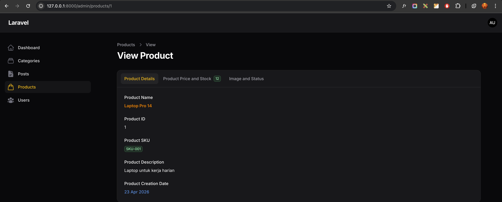
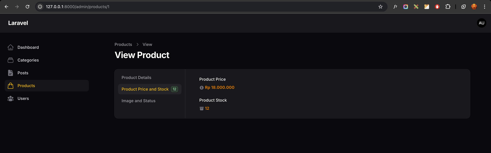
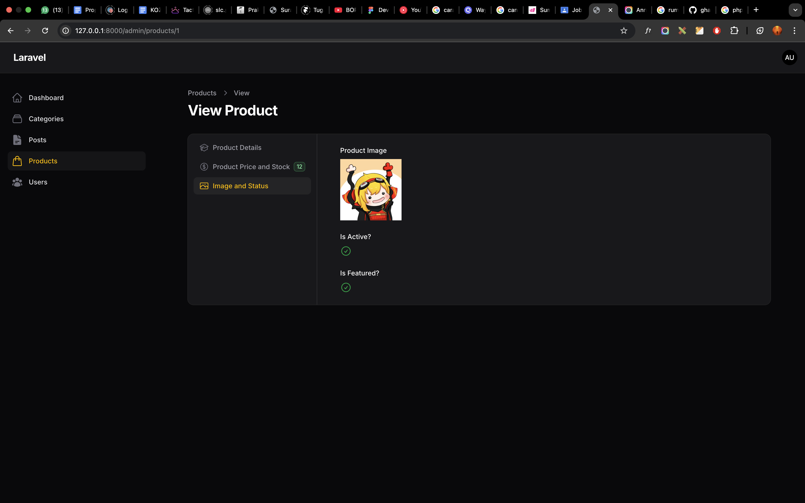
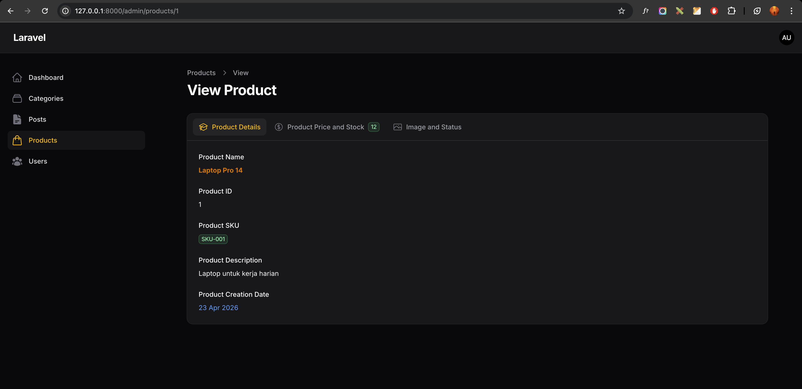

# Laporan Praktikum Jobsheet 7-3 (Pertemuan 9)

# Pemrograman Web Lanjut

## Data Diri

| Field | Keterangan |
| --- | --- |
| Nama | Ghazwan Ababil |
| NIM | 244107020151 |
| Kelas | TI-2F |
| Mata Kuliah | Pemrograman Web Lanjut |
| Topik | Implementasi Tabs pada Info List di Filament |

---

## Capaian Pembelajaran

Setelah mengikuti praktikum ini, mahasiswa mampu:
1. Menggunakan komponen Tabs pada Info List.
2. Mengelompokkan informasi detail ke dalam beberapa tab.
3. Menambahkan icon dan badge pada tab.
4. Mengubah orientasi tab (horizontal dan vertical).
5. Mendesain halaman View agar lebih ringkas dan user-friendly.

Framework yang digunakan: Filament.

---

## A. Latar Belakang

Pada pertemuan sebelumnya, detail Product sudah ditampilkan melalui Info List berbasis Section. Saat data semakin banyak, halaman detail menjadi panjang dan perlu banyak scroll.

Solusi praktikum ini adalah mengganti Section menjadi Tabs agar informasi dibagi per kategori dan bisa diakses dengan klik.

Pembagian tab:
- Tab 1: Product Details
- Tab 2: Product Price and Stock
- Tab 3: Image and Status

---

## B. Konsep Tabs di Info List

Tabs dipakai untuk:
- Membagi informasi ke beberapa halaman kecil.
- Mengurangi scrolling panjang.
- Meningkatkan pengalaman pengguna pada halaman View.

---

## C. Mengubah Section Menjadi Tabs

File yang diubah:
- app/Filament/Resources/Products/Schemas/ProductInfolist.php

Perubahan inti:
- Struktur Section diganti ke `Tabs::make('Product Tabs')`.
- Setiap kelompok data ditempatkan dalam `Tab::make(...)`.

Import tambahan:
- Filament\Schemas\Components\Tabs
- Filament\Schemas\Components\Tabs\Tab

---

## D. Implementasi Tabs

### Tab Product Details
- icon: heroicon-o-academic-cap
- menampilkan: name, id, sku (badge), description, created_at (date format)

### Tab Product Price and Stock
- icon: heroicon-o-currency-dollar
- badge dinamis berdasarkan stock
- badgeColor dinamis (success atau warning)
- menampilkan: price (format Rupiah), stock (dengan icon)

### Tab Image and Status
- icon: heroicon-o-photo
- menampilkan: image, is_active (boolean icon), is_featured (boolean icon)

---

## E. Tampilan Tabs Horizontal

Secara default tabs tampil horizontal, cocok untuk jumlah tab sedikit.

## F. Mengubah Tabs Menjadi Vertical

Method yang ditambahkan:
- `->vertical()`

Hasil:
- Navigasi tab tampil vertikal.
- Halaman detail lebih ringkas untuk data panjang.

---

## G. Fitur Tambahan Tabs

| Method | Fungsi |
| --- | --- |
| icon() | Menambahkan icon pada tab |
| badge() | Menambahkan badge pada tab |
| badgeColor() | Mengubah warna badge |
| columnSpanFull() | Membuat area full width |
| vertical() | Mengubah orientasi tab |

---

## H. Perbandingan Section vs Tabs

| Section | Tabs |
| --- | --- |
| Scroll panjang | Navigasi klik |
| Semua tampil sekaligus | Terpisah per kategori |
| Kurang ringkas | Lebih profesional |

---

## I. Hasil yang Diharapkan

Target praktikum tercapai:
- Section berhasil diganti menjadi Tabs.
- 3 tab berbeda berhasil dibuat.
- Icon pada tiap tab aktif.
- Badge pada tab aktif.
- Orientasi vertical aktif.

---

## J. Latihan Praktikum

1. Tambahkan badge dinamis berdasarkan jumlah stok
- [x] Selesai

2. Tambahkan warna badge berbeda
- [x] Selesai

3. Ubah tampilan menjadi vertical
- [x] Selesai

4. Tambahkan icon berbeda pada tiap tab
- [x] Selesai

5. Screenshot:
- [x] Tabs horizontal (placeholder)
- [x] Tabs vertical (placeholder)
- [x] Tab dengan badge (placeholder)

Data uji:
- Product tersedia 4 data.

---

## K. Analisis and Diskusi

1. Kapan menggunakan Tabs dibanding Section?
Saat detail data panjang dan perlu pengelompokan agar navigasi lebih nyaman.

2. Apa kelebihan Tabs untuk data panjang?
Mengurangi scroll dan meningkatkan fokus pembacaan per kategori data.

3. Apakah Tabs bisa digunakan pada Form juga?
Bisa, Tabs juga cocok dipakai untuk memecah field form menjadi beberapa kelompok.

4. Bagaimana jika tab terlalu banyak?
Gabungkan kategori yang mirip atau pecah data dengan pendekatan lain agar UI tidak membingungkan.

---

## L. Lampiran Screenshot (Placeholder)

### 1. Tabs Horizontal

### 2. Tabs Vertical

### 3. Tab dengan Badge

---

## M. Kesimpulan

Pada pertemuan ini mahasiswa telah mempelajari:
- Penggunaan Tabs pada Info List.
- Pengelompokan detail Product dalam beberapa tab.
- Penambahan icon dan badge pada tab.
- Pengaturan orientasi horizontal dan vertical.

Dengan Tabs, halaman View Product menjadi lebih interaktif, ringkas, dan user-friendly.
