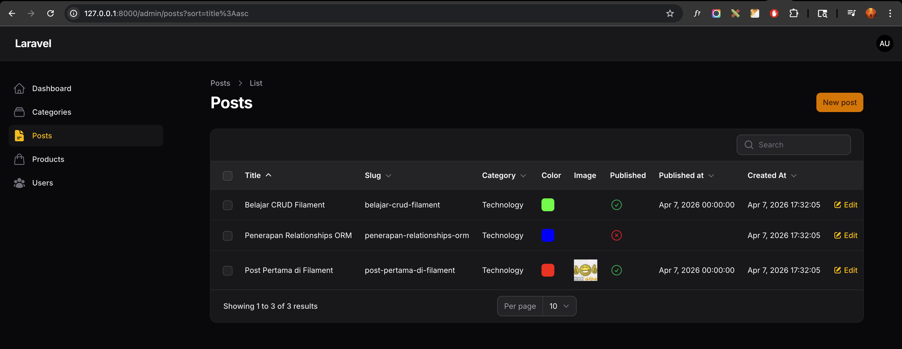
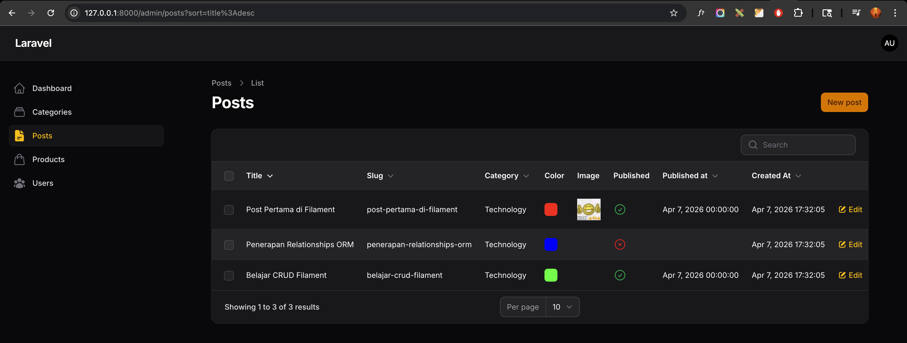
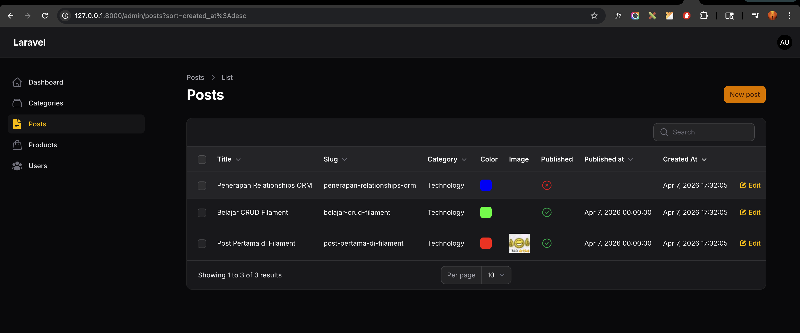

# Laporan Praktikum Jobsheet 8 (Pertemuan 10)

# Pemrograman Web Lanjut

## Data Diri

| Field | Keterangan |
| --- | --- |
| Nama | Ghazwan Ababil |
| NIM | 244107020151 |
| Kelas | TI-2F |
| Mata Kuliah | Pemrograman Web Lanjut |
| Topik | Implementasi Sorting pada Table Filament |

---

## Capaian Pembelajaran

Setelah mengikuti praktikum ini, mahasiswa mampu:
1. Menambahkan fitur sorting kolom pada tabel Filament
2. Menggunakan method `sortable()`
3. Menerapkan sorting pada kolom relasi
4. Menerapkan sorting pada kolom tanggal
5. Mengatur default sorting tabel

Framework yang digunakan: Filament

---

## A. Latar Belakang

Pada modul Post, kita sudah memiliki tabel dengan kolom:
- Image
- Title
- Slug
- Category
- Created At

Namun saat data bertambah banyak, pengguna membutuhkan fitur:
- Urut berdasarkan Title (A–Z / Z–A)
- Urut berdasarkan Tanggal terbaru
- Urut berdasarkan Category

Filament menyediakan fitur sorting yang sangat sederhana.

---

## B. Konsep Sorting di Filament

Pada Laravel biasa, sorting membutuhkan:
- Query manual
- Kondisi orderBy
- Parameter request

Namun di Filament cukup dengan satu method:
- `->sortable()`

---

## C. Implementasi Sorting pada Kolom Title

Buka file:
- `app/Filament/Resources/Posts/Tables/PostsTable.php`

Ubah kolom Title menjadi:

- `TextColumn::make('title')
	->sortable(),`

Simpan dan refresh halaman.

Hasil
Klik header Title:
- Klik 1 → Ascending (A–Z)
- Klik 2 → Descending (Z–A)

---

## D. Sorting pada Kolom Slug

`TextColumn::make('slug')
	->sortable(),`

Refresh → Kolom Slug bisa diurutkan.

---

## E. Sorting pada Relasi (Category)

Jika ingin mengurutkan berdasarkan nama kategori:

`TextColumn::make('category.name')
	->sortable(),`

Filament otomatis menangani join relasi.

---

## F. Sorting pada Kolom Tanggal

Tambahkan kolom:

`TextColumn::make('created_at')
	->label('Created At')
	->dateTime()
	->sortable(),`

Hasil:
- Bisa diurutkan berdasarkan tanggal terbaru atau terlama.

---

## G. Mengatur Default Sorting

Jika ingin tabel otomatis urut berdasarkan Created At (Descending):

Tambahkan pada konfigurasi table:

`->defaultSort('created_at', 'desc')`

Contoh lengkap:

`public static function table(Table $table): Table
{
	return $table
		->defaultSort('created_at', 'desc')
		->columns([
			TextColumn::make('title')->sortable(),
			TextColumn::make('slug')->sortable(),
		]);
}`

Artinya: Data terbaru tampil paling atas.

---

## H. Opsi Default Sort Lain

| Opsi | Fungsi |
| --- | --- |
| asc | Urut naik (A–Z / 0–9) |
| desc | Urut turun (Z–A / 9–0) |

Contoh:
`->defaultSort('created_at', 'desc')`

---

## I. Ringkasan Method Sorting

| Method | Fungsi |
| --- | --- |
| `sortable()` | Mengaktifkan sorting kolom |
| `defaultSort()` | Mengatur sorting default |
| `dateTime()` | Format tanggal |
| `label()` | Mengubah nama kolom |

---

## J. Hasil yang Diharapkan

Mahasiswa berhasil:
- Mengaktifkan `sortable` pada Title
- Mengaktifkan `sortable` pada Slug
- Mengaktifkan `sortable` pada relasi Category
- Mengaktifkan `sortable` pada Created At
- Mengatur default sorting (Created At desc)

---

## K. Latihan Praktikum

1. Aktifkan sorting pada semua kolom teks
- [x] Selesai

2. Buat default sorting berdasarkan Created At descending
- [x] Selesai

3. Uji sorting ascending dan descending
- [x] Selesai

4. Screenshot:
- [x] Sorting Title Asc (placeholder)
- [x] Sorting Title Desc (placeholder)
- [x] Sorting Date Desc (placeholder)

---

## L. Analisis & Diskusi

1. Mengapa sorting penting pada admin panel?
Sorting penting untuk mempermudah administrator dalam mencari maupun mengorganisir data dalam jumlah besar agar lebih efisien dan cepat.

2. Apa perbedaan `sortable()` biasa dengan `defaultSort()`?
`sortable()` membuat kolom tertentu bisa diklik oleh user untuk diurutkan (ascending/descending), sedangkan `defaultSort()` mengatur pengurutan data otomatis pertama kali tabel dimuat sebelum ada interaksi user.

3. Mengapa relasi tetap bisa di-sort?
Karena Filament secara otomatis di belakang layar menangani `join` query antar tabel database untuk mengeksekusi order by berdasarkan kolom relasi tersebut.

4. Kapan kita menggunakan `desc` sebagai default?
`desc` biasanya digunakan pada kolom waktu, seperti `created_at`, agar data atau entri yang paling baru ditambahkan muncul paling atas dan langsung terlihat oleh pengguna.

---

## M. Lampiran Screenshot (Placeholder)

### 1. Sorting Title Asc

### 2. Sorting Title Desc

### 3. Sorting Date Desc

---

## N. Kesimpulan

Pada pertemuan ini mahasiswa telah mempelajari:
- Implementasi sorting tabel
- Sorting relasi database
- Sorting kolom tanggal
- Default sorting pada Filament

Fitur ini sangat penting untuk manajemen data dalam skala besar.
